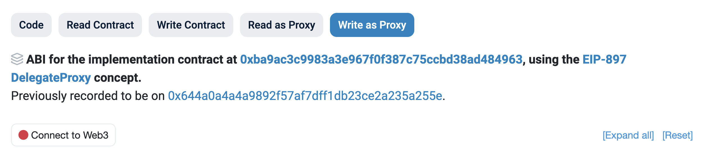
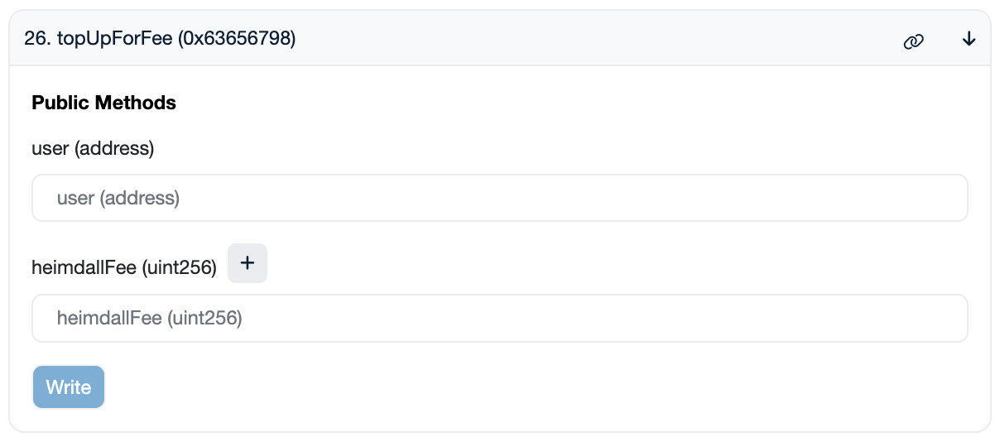

This document provides instructions on how to top up the Heimdall fee for a PoS validator. 

The easiest way is via the [Polygon Staking UI](https://staking.polygon.technology/account).

You can also do it manually by following the steps below. This requires basic Etherscan knowledge and key details like the validator signer address.

1. Head over to [Etherscan.io](https://etherscan.io)

2. Enter the `StakeManagerProxy` contract address in the search box: [0x5e3Ef299fDDf15eAa0432E6e66473ace8c13D908](https://etherscan.io/address/0x5e3Ef299fDDf15eAa0432E6e66473ace8c13D908)

3. Under the **Code** menu, select the **Write as Proxy** tab. Connect your Web3 wallet using the **Connect to Web3** button.

    

4. Scroll down to the `topUpForFee` method (#26 in the list) and select it. You will then see a display similar to the screenshot below..

    

5. Fill in the details:

    - `user`: Validator's Signer Address
    - `heimdallFee`: Top-up fee (**minimum 1 POL**)

6. After filling in the details, select **Write** to sign the transaction.

Your Heimdall fee will be updated soon after the transaction completes.
