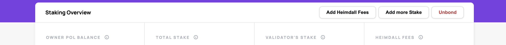
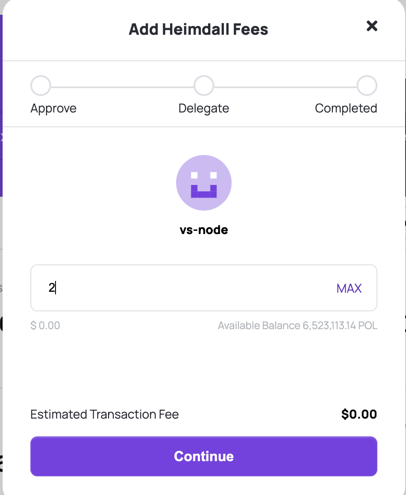
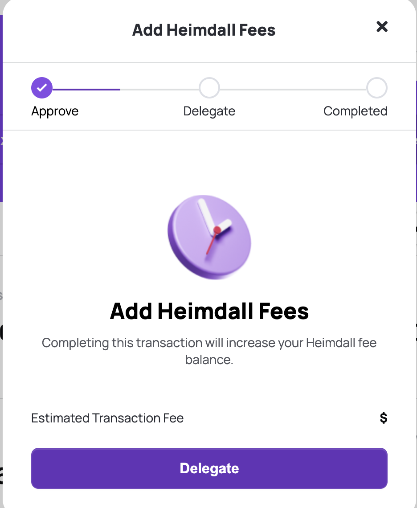
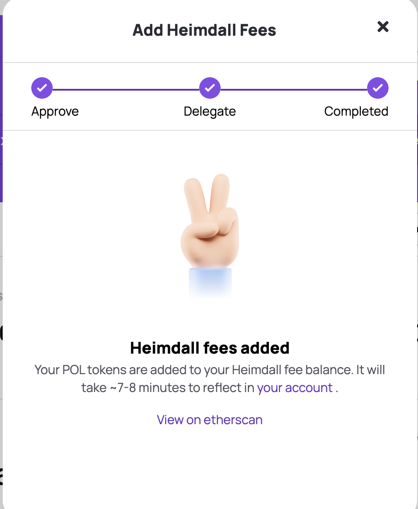
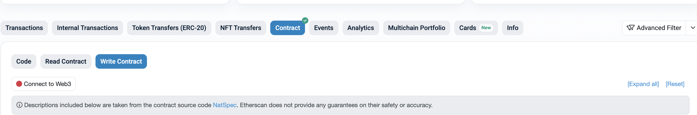
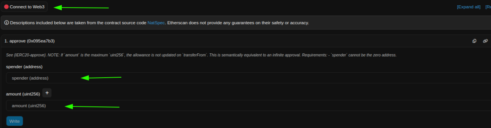

<!--
---
comments: true
---
-->

This document provides instructions on how to top up the Heimdall fee for a PoS validator. 

The easiest way is via the [Polygon Staking UI](https://staking.polygon.technology/account).

1. Go to  https://staking.polygon.technology/ and login using your owner address.

2. Go to My Account Section and click on Add Heimdall Fees.

    

3. Enter the amount you want to add and click on continue.

    

4. Click on Delegate.

    

5. Approve the transaction on your wallet and you will see a message when your heimdall fee is added. Please note that it takes some time to reflect the fee in the account.

    

Alternatively, you can also do it manually by following the steps below. This requires basic Etherscan knowledge and key details like the validator signer address.

1. Head over to [Etherscan.io](https://etherscan.io)

2. Goto `POL Ecosystem Token` Contract. Mainnet - [0x455e53CBB86018Ac2B8092FdCd39d8444aFFC3F6](https://etherscan.io/address/0x455e53CBB86018Ac2B8092FdCd39d8444aFFC3F6#code), Amoy - [0x44499312f493F62f2DFd3C6435Ca3603EbFCeeBa](https://sepolia.etherscan.io/address/0x44499312f493F62f2DFd3C6435Ca3603EbFCeeBa#code)

3. Under the **Code** menu, select **Write Contract** and connect your web3 wallet using **Connect to Web3** button.

    

4. Goto `approve` function, enter the spender as the address you want to use to topup your heimdall fee, and the amount.

     

5. Select **Write** to sign the transaction.

6. Now enter the `StakeManagerProxy` contract address in the search box: Mainnet - [0x5e3Ef299fDDf15eAa0432E6e66473ace8c13D908](https://etherscan.io/address/0x5e3Ef299fDDf15eAa0432E6e66473ace8c13D908), Amoy - [0x4AE8f648B1Ec892B6cc68C89cc088583964d08bE](https://sepolia.etherscan.io/address/0x4AE8f648B1Ec892B6cc68C89cc088583964d08bE#code)

7. Under the **Code** menu, select the **Write as Proxy** tab. Connect your Web3 wallet using the **Connect to Web3** button.

    

8. Scroll down to the `topUpForFee` method (#26 in the list) and select it. You will then see a display similar to the screenshot below.

    

9. Fill in the details:

    - `user`: Validator's Signer Address
    - `heimdallFee`: Top-up fee (**minimum 1 POL**)

10. After filling in the details, select **Write** to sign the transaction.

Your Heimdall fee will be updated soon after the transaction completes.
