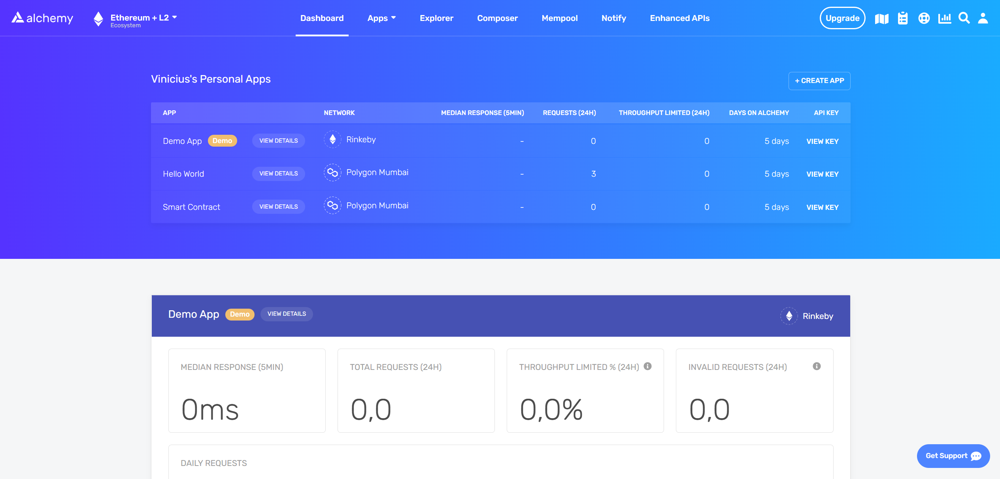
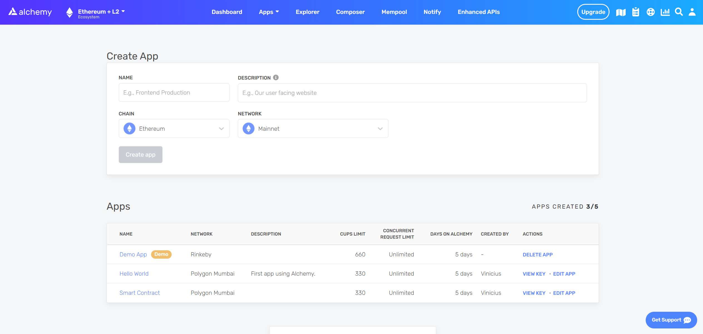
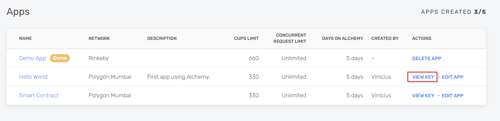
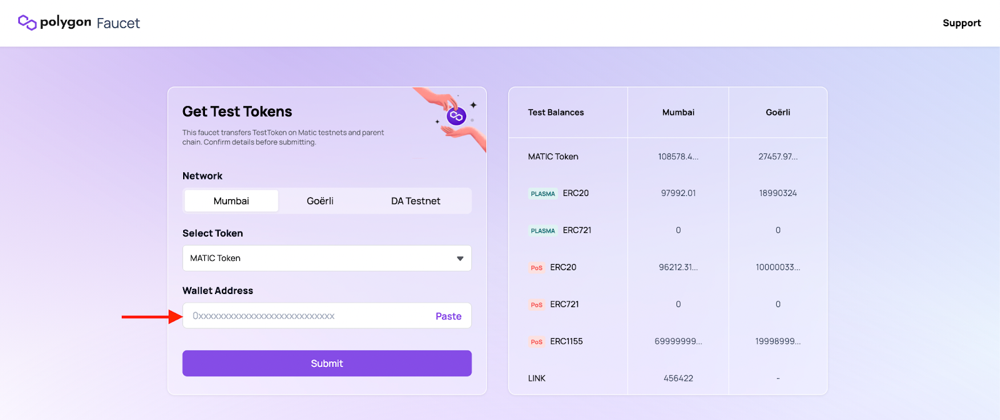
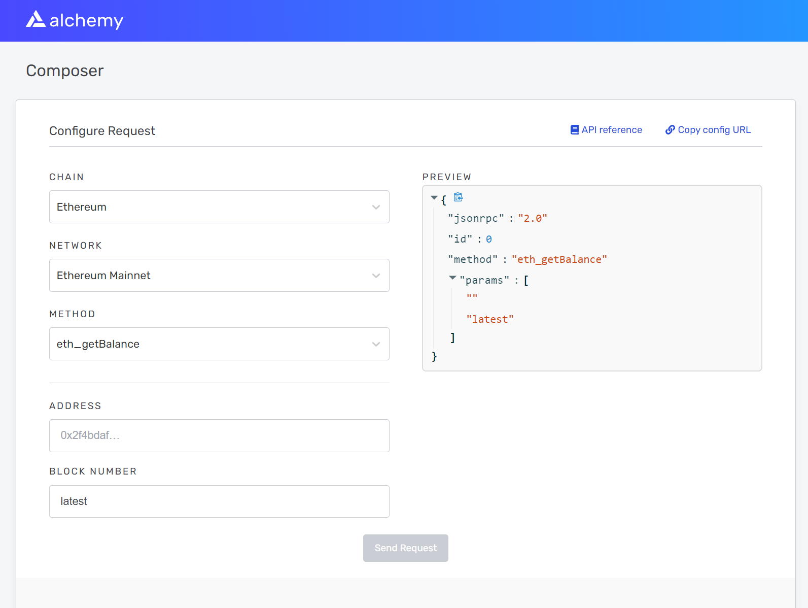
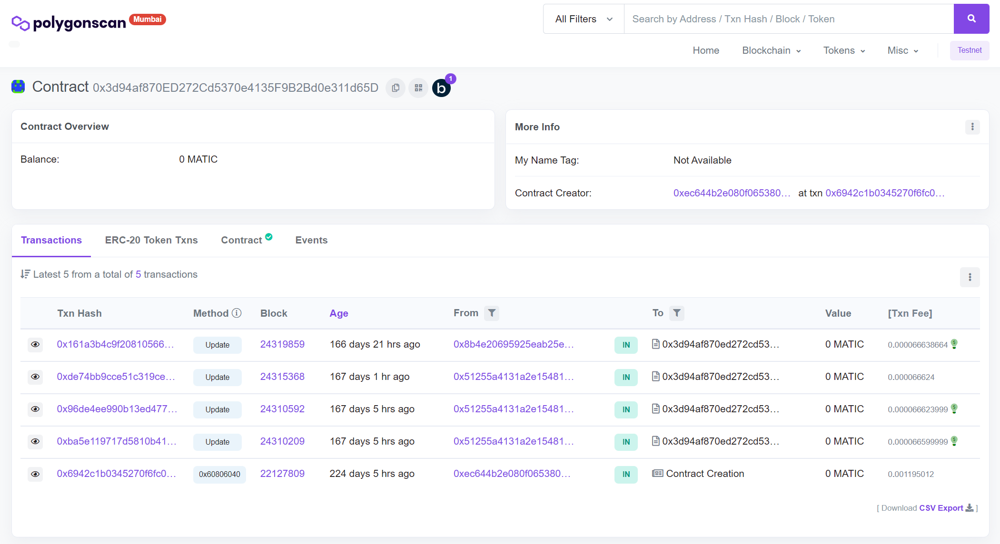
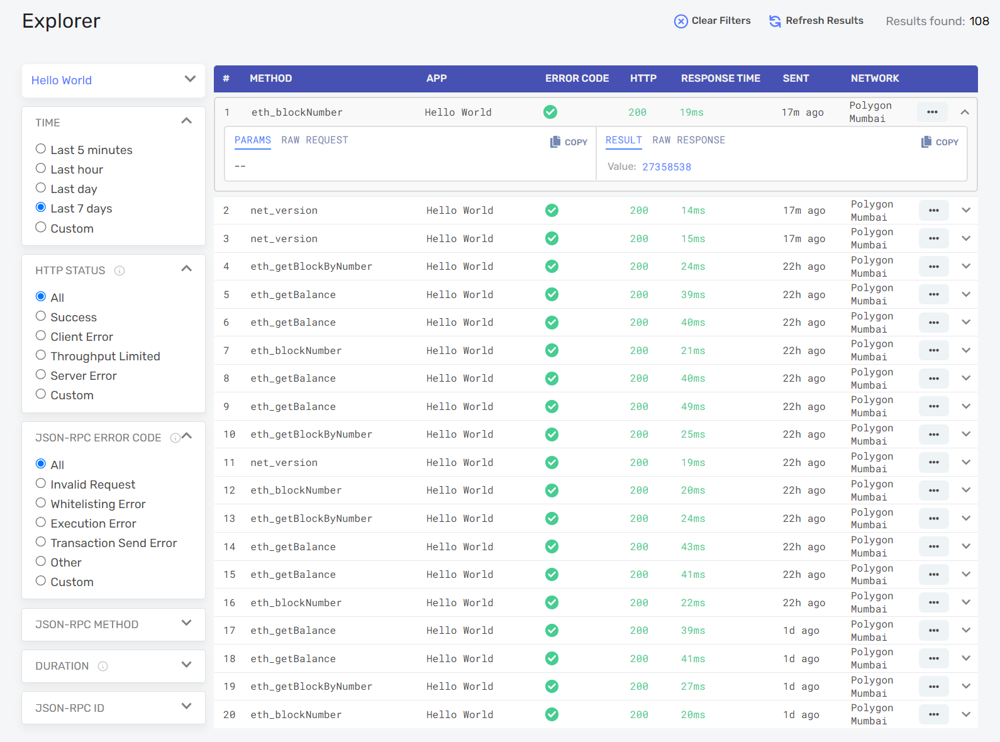

!!! warning "Third-party content"

    Polygon technical documentation may contain third-party content, including websites, products, and services, that are provided for informational purposes only.

    Polygon Labs does not endorse, warrant, or make any representations regarding the accuracy, quality, reliability, or legality of any third-party websites, products, or services. If you decide to access any third-party content, you do so entirely at your own risk and subject to the terms and conditions of use for such websites. Polygon Labs reserves the right to withdraw such references and links without notice.

    Polygon technical documentation serves as an industry public good and is made available under the [MIT License](https://opensource.org/license/mit/). In addition, please view the official [Polygon Labs Terms of Use](https://polygon.technology/terms-of-use).

## What you will learn

To create a smart contract in this tutorial, you will learn how to use Alchemy's platform to:

- Create a smart contract application
- Check a wallet's balance
- Verify contract calls in a blockchain explorer

## What you will do

Following the tutorial, you will:

1. Get started creating an app on Alchemy
2. Create a wallet address with Metamask
3. Add balance to the wallet (using test tokens)
4. Use Hardhat and Ethers.js to compile and deploy the project
5. Check contract status on Alchemy's platform

## Create and Deploy your Smart Contract

### Connect to the Polygon network

There are several ways to make requests to the Polygon PoS chain. Rather than running your own node, you will use a free account on Alchemy's developer platform and interact with the Alchemy Polygon PoS API to communicate with the Polygon PoS chain. The platform consists of a full suite of developer tooling – this includes the ability to monitor requests, data analytics that demonstrates what happens under the hood during smart contract deployment, enhanced APIs (Transact, NFTs, etc), and an ethers.js SDK.

If you don’t already have an Alchemy account, start by signing up for a free account [here](https://www.alchemy.com/polygon/?a=polygon-docs). After creating your account, you have the option of immediately creating your first app before reaching the dashboard.



### Create your App (and API key)

After successfully creating an Alchemy account, you will need to generate an API key by creating an app. This authenticates the requests made to the Polygon Mumbai testnet. If you’re not familiar with testnets, check out [this testnet guide](https://docs.alchemyapi.io/guides/choosing-a-network).

To generate a new API key, navigate to the **Apps** tab on the Alchemy dashboard navigation bar and select the **Create App** sub-tab.



Name your new app **Hello World**, offer a short description, select **Polygon** for the chain, and choose **Polygon Mumbai** for your network.

Finally, click on **Create app**. Your new app should appear in the table below.

### Create a Wallet address

Polygon PoS is a layer 2 scaling solution for Ethereum. Therefore, we need an Ethereum wallet and add a custom Polygon URL to send and receive transactions on the Polygon Mumbai testnet. For this tutorial, we will use MetaMask, a browser-compatible cryptocurrency wallet used to manage your wallet address. If you want to understand more about how transactions on Ethereum work, check out [this transactions guide](https://ethereum.org/en/developers/docs/transactions/) by the Ethereum Foundation.

To get your custom Polygon RPC URL from Alchemy, go to your **Hello World** app in your Alchemy dashboard and click **View Key** in the top right corner. Then go ahead and copy your Alchemy HTTP API key.



You can download and create a MetaMask account for free [here](https://metamask.io/download/). Once you've created an account, follow these steps to set up the Polygon PoS network on your wallet.

1. Select **Settings** from the drop-down menu in the top right corner of your MetaMask wallet.
2. Select **Networks** from the menu to the left.
3. Connect your wallet to the Mumbai Testnet using the following parameters:

   **Network Name:** Polygon Mumbai Testnet

   **New RPC URL:** <https://polygon-mumbai.g.alchemy.com/v2/your-api-key>

   **ChainID:** 80001

   **Symbol:** MATIC

   **Block Explorer URL:** <https://mumbai.polygonscan.com/>

### Add Polygon Mumbai Test MATIC

You'll need a few testnet tokens to deploy your smart contract to the Mumbai testnet. To obtain testnet tokens, go to the [Polygon Mumbai Faucet](https://faucet.polygon.technology/), select **Mumbai**, select **MATIC Token**, and enter your Polygon wallet address, then click **Submit**. Due to network traffic, it may take some time to receive your testnet tokens.

You can also use Alchemy's [free Mumbai faucet](https://mumbaifaucet.com/?a=polygon-docs).



You will see the testnet tokens in your MetaMask account soon after.

### Check your Wallet Balance

To double-check our balance is there, let’s make an [eth\_getBalance](https://docs.alchemy.com/reference/eth-getbalance-polygon) request using [Alchemy’s composer tool](https://composer.alchemyapi.io/). Select **Polygon** as the chain, **Polygon Mumbai** as the network, `eth_getBalance` as the method, and input your address. This will return the amount of MATIC in our wallet. Check out [this video](https://youtu.be/r6sjRxBZJuU) for instructions on how to use the composer tool.



After you input your MetaMask account address and click **Send Request**, you should see a response that looks like this:

```json
{ "jsonrpc": "2.0", "id": 0, "result": "0xde0b6b3a7640000" }
```

!!! info

    This result is in Wei, not ETH. Wei is the smallest denomination of Ether. The conversion from Wei to Ether is: 1 Ether = 10^18 Wei. So, if we convert "0xde0b6b3a7640000" to decimal, we get 1\*10^18, which equals 1 ETH. This can be mapped to 1 MATIC based on denomination.

### Initialize your project

First, we’ll need to create a folder for our project. Navigate to your [command line](https://www.computerhope.com/jargon/c/commandi.htm) and type:

```bash
mkdir hello-world
cd hello-world
```

Now that we’re inside our project folder, we’ll use `npm init` to initialize the project. If you don’t already have npm installed, follow [these instructions](https://docs.alchemyapi.io/alchemy/guides/alchemy-for-macs#1-install-nodejs-and-npm) (we’ll also need Node.js so download that too!).

```bash
npm init # (or npm init --yes)
```

It doesn’t really matter how you answer the installation questions, here is how we did it for reference:

```
package name: (hello-world)
version: (1.0.0)
description: hello world smart contract
entry point: (index.js)
test command:
git repository:
keywords:
author:
license: (ISC)

About to write to /Users/.../.../.../hello-world/package.json:

{
   "name": "hello-world",
   "version": "1.0.0",
   "description": "hello world smart contract",
   "main": "index.js",
   "scripts": {
      "test": "echo \"Error: no test specified\" && exit 1"
   },
   "author": "",
   "license": "ISC"
}
```

Approve the package.json and we’re good to go!

### Download [Hardhat](https://hardhat.org/getting-started/#overview)

Hardhat is a development environment to compile, deploy, test, and debug your Ethereum software. It helps developers when building smart contracts and dApps locally before deploying to the live chain.

Inside our `hello-world` project, run:

```bash
npm install --save-dev hardhat
```

Check out this page for more details on [installation instructions](https://hardhat.org/getting-started/#overview).

### Create Hardhat project

Inside our `hello-world` project folder, run:

```bash
npx hardhat
```

You should see a welcome message and option to select what you want to do. Select **create an empty hardhat.config.js**:

```bash
888    888                      888 888               888
888    888                      888 888               888
888    888                      888 888               888
8888888888  8888b.  888d888 .d88888 88888b.   8888b.  888888
888    888     "88b 888P"  d88" 888 888 "88b     "88b 888
888    888 .d888888 888    888  888 888  888 .d888888 888
888    888 888  888 888    Y88b 888 888  888 888  888 Y88b.
888    888 "Y888888 888     "Y88888 888  888 "Y888888  "Y888

👷 Welcome to Hardhat v2.0.11 👷‍

What do you want to do? …
Create a sample project
❯ Create an empty hardhat.config.js
Quit
```

This will generate a `hardhat.config.js` file for us, which is where we’ll specify all of the set up for our project.

### Add project folders

To keep our project organized, we’ll create two new folders. Navigate to the root directory of your `hello-world` project in your command line and type:

```bash
mkdir contracts
mkdir scripts
```

- `contracts/` is where we’ll keep our hello world smart contract code file
- `scripts/` is where we’ll keep scripts to deploy and interact with our contract

### Write the contract

Open up the **hello-world** project in your favorite editor, such as [VSCode](https://code.visualstudio.com). Smart contracts are written in a language called Solidity which is what we will use to write our `HelloWorld.sol` smart contract.‌

1. Navigate to the `contracts` folder and create a new file called `HelloWorld.sol`
2. Below is a sample Hello World smart contract from the [Ethereum Foundation](https://ethereum.org/en/) that we will be using for this tutorial. Copy and paste in the contents below into your `HelloWorld.sol` file, and be sure to read the comments to understand what this contract does:

```solidity
// SPDX-License-Identifier: None

// Specifies the version of Solidity, using semantic versioning.
// Learn more: https://solidity.readthedocs.io/en/v0.5.10/layout-of-source-files.html#pragma
pragma solidity >=0.8.9;

// Defines a contract named `HelloWorld`.
// A contract is a collection of functions and data (its state). Once deployed, a contract resides at a specific address on the Ethereum blockchain. Learn more: https://solidity.readthedocs.io/en/v0.5.10/structure-of-a-contract.html
contract HelloWorld {

   //Emitted when update function is called
   //Smart contract events are a way for your contract to communicate that something happened on the blockchain to your app front-end, which can be 'listening' for certain events and take action when they happen.
   event UpdatedMessages(string oldStr, string newStr);

   // Declares a state variable `message` of type `string`.
   // State variables are variables whose values are permanently stored in contract storage. The keyword `public` makes variables accessible from outside a contract and creates a function that other contracts or clients can call to access the value.
   string public message;

   // Similar to many class-based object-oriented languages, a constructor is a special function that is only executed upon contract creation.
   // Constructors are used to initialize the contract's data. Learn more:https://solidity.readthedocs.io/en/v0.5.10/contracts.html#constructors
   constructor(string memory initMessage) {

      // Accepts a string argument `initMessage` and sets the value into the contract's `message` storage variable).
      message = initMessage;
   }

   // A public function that accepts a string argument and updates the `message` storage variable.
   function update(string memory newMessage) public {
      string memory oldMsg = message;
      message = newMessage;
      emit UpdatedMessages(oldMsg, newMessage);
   }
}
```

This is a super simple smart contract that stores a message upon creation and can be updated by calling the `update` function.

### Connect with MetaMask & Alchemy

We’ve created a MetaMask wallet, Alchemy account, and written our smart contract, now it’s time to connect the three.

Every transaction sent from your virtual wallet requires a signature using your unique private key. To provide our program with this permission, we can safely store our private key (and Alchemy API key) in an environment file.

First, install the dotenv package in your project directory:

```bash
npm install dotenv --save
```

Then, create a `.env` file in the root directory of our project, and add your MetaMask private key and HTTP Alchemy API URL to it.

!!! warning

    Your environment file must be named `.env` or it won't be recognized as an environment file. Do not name it `process.env` or `.env-custom` or anything else.

    Also, if you are using a version control system like git to manage your project, please **DO NOT** track the `.env` file. Add `.env` to your `.gitignore` file to avoid publishing secret data.

- Follow [these instructions](https://metamask.zendesk.com/hc/en-us/articles/360015289632-How-to-Export-an-Account-Private-Key) to export your private key
- To get your Alchemy HTTP API key (RPC URL), navigate to your **Hello World** app on your account's dashboard and click **View Key** in the top right corner.

Your `.env` should look like this:

```
API_URL = "https://polygon-mumbai.g.alchemy.com/v2/your-api-key"
PRIVATE_KEY = "your-metamask-private-key"
```

To actually connect these to our code, we’ll reference these variables in our `hardhat.config.js` file later in this tutorial.

### Install Ethers.js

Ethers.js is a library that makes it easier to interact and make requests to Ethereum by wrapping [standard JSON-RPC methods](https://docs.alchemyapi.io/alchemy/documentation/alchemy-api-reference/json-rpc) with more user-friendly methods.

Hardhat makes it easy to integrate [plugins](https://hardhat.org/plugins/) for additional tooling and extended functionality. We’ll be taking advantage of the [Ethers plugin](https://hardhat.org/plugins/nomiclabs-hardhat-ethers.html) for contract deployment. [Ethers.js](https://github.com/ethers-io/ethers.js/) has useful contract deployment methods.

In your project directory, type:

```bash
npm install --save-dev @nomiclabs/hardhat-ethers "ethers@^5.0.0"
```

We’ll also require ethers in our `hardhat.config.js` in the next step.

### Update hardhat.config.js

We’ve added several dependencies and plugins so far. Now we need to update `hardhat.config.js` so that our project recognizes those dependencies.

Update your `hardhat.config.js` to look like this:

```javascript
/**
* @type import('hardhat/config').HardhatUserConfig
*/

require('dotenv').config();
require("@nomiclabs/hardhat-ethers");

const { API_URL, PRIVATE_KEY } = process.env;

module.exports = {
   solidity: "0.8.9",
   defaultNetwork: "polygon_mumbai",
   networks: {
      hardhat: {},
      polygon_mumbai: {
         url: API_URL,
         accounts: [`0x${PRIVATE_KEY}`]
      }
   },
}
```

### Compile our Smart Contract

To make sure everything is working so far, let’s compile our contract. The `compile` task is one of the built-in hardhat tasks.

From the command line run:

```bash
npx hardhat compile
```

You might get a warning about `SPDX license identifier not provided in source file` , but the application might still be working fine. If not, you can always message in the [Alchemy discord](https://discord.gg/u72VCg3).

### Write our deploy script

Now that our contract is written and our configuration file is good to go, it’s time to write our contract deploy script.

Navigate to the `scripts/` folder and create a new file called `deploy.js`, adding the following contents to it:

```javascript
async function main() {
   const HelloWorld = await ethers.getContractFactory("HelloWorld");

   // Start deployment, returning a promise that resolves to a contract object
   const hello_world = await HelloWorld.deploy("Hello World!");
   console.log("Contract deployed to address:", hello_world.address);
}

main()
  .then(() => process.exit(0))
  .catch(error => {
    console.error(error);
    process.exit(1);
  });
```

We’ve adopted the Hardhat team explanations to what each of these lines of code does from their [Contracts tutorial](https://hardhat.org/tutorial/testing-contracts.html#writing-tests) here.

```javascript
const HelloWorld = await ethers.getContractFactory("HelloWorld");
```

A `ContractFactory` in ethers.js is an abstraction used to deploy new smart contracts, so `HelloWorld` here is a [factory](https://en.wikipedia.org/wiki/Factory_(object-oriented_programming)) for instances of our hello world contract. When using the `hardhat-ethers` plugin `ContractFactory` and `Contract`, instances are connected to the first signer (owner) by default.

```javascript
const hello_world = await HelloWorld.deploy();
```

Calling `deploy()` on a `ContractFactory` will start the deployment, and return a `Promise` that resolves to a `Contract` object. This is the object that has a method for each of our smart contract functions.

### Deploy our Smart Contract

Navigate to the command line and run:

```bash
npx hardhat run scripts/deploy.js --network polygon_mumbai
```

You should see something like this:

```bash
Contract deployed to address: 0x3d94af870ED272Cd5370e4135F9B2Bd0e311d65D
```

If we go to the [Polygon Mumbai explorer](https://mumbai.polygonscan.com/) and search for our contract address, we should be able to see that it has been deployed successfully.

The `From` address should match your MetaMask account address and the `To` address will say **Contract Creation**. But if we click into the transaction, we’ll see our contract address in the `To` field.



### Verify the Contract

Alchemy provides an [explorer](https://dashboard.alchemyapi.io/explorer) where you can find information about the methods deployed along with the smart contract, such as response time, HTTP status, error codes among others. It is a good environment to verify your contract and check whether the transactions went through.



**Congratulations! You just deployed a smart contract to the Polygon Mumbai network.**

## Additional Resources

- [How to Develop an NFT Smart Contract](https://docs.alchemy.com/docs/how-to-develop-an-nft-smart-contract-erc721-with-alchemy) – Alchemy has a written tutorial with a Youtube video on this topic. This is week 1 of its free 10 week **Road to Web3** dev series
- [Polygon API Quickstart](https://docs.alchemy.com/reference/polygon-api-quickstart) – Alchemy's developer docs guide to getting up and running with Polygon
