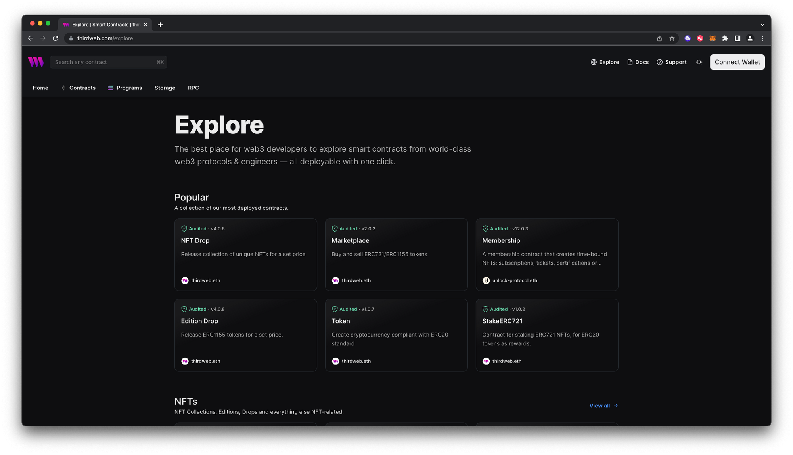

!!! warning "Third-party content"

    Polygon technical documentation may contain third-party content, including websites, products, and services, that are provided for informational purposes only.

    Polygon Labs does not endorse, warrant, or make any representations regarding the accuracy, quality, reliability, or legality of any third-party websites, products, or services. If you decide to access any third-party content, you do so entirely at your own risk and subject to the terms and conditions of use for such websites. Polygon Labs reserves the right to withdraw such references and links without notice.

    Polygon technical documentation serves as an industry public good and is made available under the [MIT License](https://opensource.org/license/mit/). In addition, please view the official [Polygon Labs Terms of Use](https://polygon.technology/terms-of-use).

thirdweb is a complete web3 development framework that provides everything you need to connect your apps and games to decentralized networks.

## Create a contract using thirdweb

To create a new smart contract using thirdweb CLI, follow the step below.

1. In your CLI, run the following command to create a contract:

   ```
   npx thirdweb create contract
   ```

2. Enter your preferred values for the command line prompts:
   i. Give your project a name.
   ii. Choose your preferred framework: [Hardhat](https://hardhat.org/) or [Foundry](https://getfoundry.sh/).
   iii. Name your smart contract.
   iv. Choose the type of base contract: Empty, [ERC20](https://portal.thirdweb.com/solidity/base-contracts/erc20base), [ERC721](https://portal.thirdweb.com/solidity/base-contracts/erc721base), or [ERC1155](https://portal.thirdweb.com/solidity/base-contracts/erc1155base).
   v. Add any desired [extensions](https://portal.thirdweb.com/solidity/extensions).
3. Once created, navigate to your project’s root directory and open your project in your preferred code editor.
4. If you open the `contracts` folder, you will find your smart contract; the contract you see is your smart contract written in Solidity.

   The following code is for an ERC721Base contract without specified extensions. It implements all of the logic inside the `[ERC721Base.sol](https://github.com/thirdweb-dev/contracts/blob/main/contracts/base/ERC721Base.sol)` contract, which implements the `[ERC721A](https://github.com/thirdweb-dev/contracts/blob/main/contracts/eip/ERC721A.sol)` standard. You can [view the full code](https://github.com/thirdweb-dev/contracts/blob/main/contracts/base/ERC721Base.sol) for this sample contract on thirdweb's GitHub.

   ```bash
   // SPDX-License-Identifier: MIT
   pragma solidity ^0.8.0;

   import "@thirdweb-dev/contracts/base/ERC721Base.sol";

   contract Contract is ERC721Base {
       constructor(
           string memory _name,
           string memory _symbol,
           address _royaltyRecipient,
           uint128 _royaltyBps
       ) ERC721Base(_name, _symbol, _royaltyRecipient, _royaltyBps) {}
   }
   ```

   This contract inherits the functionality of ERC721Base through the following steps:

   - Imports the ERC721Base contract.
   - Inherits the contract by declaring that our contract is an ERC721Base contract.
   - Implements the required methods, including the constructor.

5. After modifying your contract with your desired custom logic, you may deploy it to [Polygon PoS mainnet](https://thirdweb.com/polygon) using [Deploy](https://portal.thirdweb.com/deploy).

---

Alternatively, you can deploy a prebuilt contract an NFTs, token, or marketplace directly from the thirdweb Explore page. To do so, follow the steps below.

1. Navigate to the [thirdweb Explore page:](https://thirdweb.com/explore)

   

2. Choose the type of contract you want to deploy from the available options.
3. Follow the on-screen prompts to configure and deploy your contract.

> For more information on different contracts available on Explore, check out [thirdweb’s documentation](https://portal.thirdweb.com/pre-built-contracts).

## Deploy a contract using thirdweb

Deploy allows you to deploy a smart contract to any EVM-compatible network without configuring RPC URLs, exposing your private keys, writing scripts, and other additional setup such as verifying your contract.

1. To deploy your smart contract using deploy, navigate to the root directory of your project and execute the following command:

   ```bash
   npx thirdweb deploy
   ```

   Executing this command will trigger the following actions:

   - Compiles all the contracts in the current directory.
   - Provides the option to select which contract(s) you wish to deploy.
   - Uploads your compiled smart contract code (in the form of an Application Binary Interface, or ABI) to IPFS.

2. When deployment is complete, a dashboard interface will open to fill out the remaining parameters.
   - `_name`: contract name
   - `_symbol`: symbol or "ticker"
   - `_royaltyRecipient`: wallet address to receive royalties from secondary sales
   - `_royaltyBps`: basis points (bps) that will be given to the royalty recipient for each secondary sale, e.g. 500 = 5%
3. Select [Polygon](https://thirdweb.com/polygon) as the network.
4. Once your smart contract is deployed, you can manage additional settings and functionalities through its dashboard. For example, you can upload NFTs, configure permissions and access control, add new features.

For additional information on Deploy, please reference [thirdweb’s documentation](https://portal.thirdweb.com/deploy).

## Verify the Contract

Contracts deployed to [Polygon](https://thirdweb.com/polygon) are automatically verified by thirdweb. You can check the status on the "Sources" view in the thirdweb dashboard.

---

### Need help?

If you have any questions or encounter any issues during the process, **please reach out to the [official thirdweb support](https://support.thirdweb.com)**.
