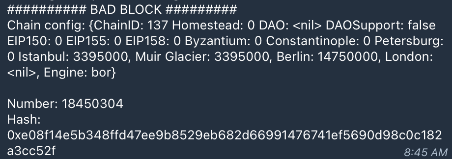

This resource is designed to help you efficiently diagnose and resolve common issues encountered while interacting with the Polygon PoS network as a validator.

## Bor

### Bor is unable to connect to peers

Bor stops importing new blocks, with logs displaying messages similar to the following:

```js
Aug 19 13:33:35 polygon-mainnet-validator-backup-4 bor[124475]: INFO [08-19|13:33:35.123] Looking for peers                        peercount=0 tried=0 static=7
Aug 19 13:33:36 polygon-mainnet-validator-backup-4 bor[124475]: INFO [08-19|13:33:36.916] Whitelisting milestone deferred          err="chain out of sync"
Aug 19 13:33:48 polygon-mainnet-validator-backup-4 bor[124475]: INFO [08-19|13:33:48.916] Whitelisting milestone deferred          err="chain out of sync"
```

##### Solution

- Increase `maxpeer` count to 200
- Add the bootnodes under static and trusted nodes
- If this doesn’t resolve the issue, try adding the peers manually using the IPC console

### Error: Bad block/Invalid Merkle

A bad block or invalid Merkle root error occurs when the Heimdall and Bor layers are not in sync. Heimdall, as the consensus layer for Polygon POS chain, directs Bor to create blocks accordingly. A bad block error occurs when the Bor moves ahead to create a block which has not been directed by Heimdall. This causes an invalid hash being created, and hence results in an invalid Merkle root.

##### Solution 1

Restart the Bor service using the following command:

```bash
sudo service bor restart
```

Typically a restart of the Bor service should resolve the problem, and that's because restarting causes Bor to reconnect with Heimdall, start syncing, and create blocks correctly.

If restarting the Bor service does not fix the problem, try the next option.

##### Solution 2 

Make the following checks:

- Check if your Heimdall and REST servers are running. The Heimdall service might have stopped, and thus causing the bad block issue on Bor.
- Check the logs for your Heimdall first using the following command:

    ```bash
    journalctl -u heimdalld -f
    ```

- Check if everything is working correctly.
- Restart the services that are not running. This should cause Bor to automatically resolve the problem

If restarting both the Bor and Heimdall services doesn't solve the problem, it could be that Bor is stuck on a particular block.

##### Solution 3 

Check the bad block in logs for Bor.

- Check Bor logs with this command:
    ```bash
    journalctl -u bor -f
    ```
    The bad block is typically displayed in the logs as shown in the below figure:

    

- Note the bad block number.
- Convert the block number to a hexadecimal number.

!!! info
    
    Use this [tool](https://www.rapidtables.com/convert/number/decimal-to-hex.html) to convert the block number to a hexadecimal number. 


- Roll back the chain by a few hundred blocks, i.e., set Bor at the right block height using the `debug.setHead()` function. Use the following command:

```bash
bor attach ./.bor/data/bor.ipc
> debug.setHead("0xE92570")
```

The `debug.setHead()` function allows Bor to set the tip at a particular block height, resyncing from a previous block.

The command should return a `null` upon successful execution. Once this occurs, you can resume monitoring Bor to verify whether the chain progresses beyond the previously problematic block.

If none of these solutions work for you, please contact the Polygon Support team immediately.

### Issue: Bor synchronization is slow

If Bor synchronization is slow, it may be caused by one or more of the following factors:

- The node is running on a fork - means at certain point the block production was done by forking on a different block and that has impacted the further block production.
- The machine is not working at optimum levels and could be with insufficient resources. This can be addressed by checking the following:
    - IOPS
        - IOPS stands for Input/Output state of cycle.
        - The rate of reading is usually higher than write speed.
        - 6000 is the recommended range for IOPS.
    - Processing power
        - Processor has to be 8 or 16 core.
        - RAM: 32 GB is the minimum; 64 GB is recommended.
        - Block import should be more than 2 block for every second.
    - Node sync rate should be at 15-20 blocks every 8 secs.

##### Solution

Since the issue is likely due to insufficient hardware resources, consider upgrading to double the current specs.

### Validator Bor is stuck on a block for a long time

This implies that the Bor service on your sentry node is also stuck because your validator gets information from your sentry.

##### Solution

- Please check the Bor logs on your sentry and see if everything is normal and functional.
- Restart the Bor service on your sentry node, then simultaneously restart the Bor service on your validator.

### Retrying again in 5 seconds to fetch data from Heimdall path=bor/span/1

These logs in Bor mean that it cannot connect to Heimdall. Heimdall appears to be out of sync, and thus it lacks the data needed by Bor.

##### Solution

The recommended approach is to clear the historical data from both Heimdall and Bor, then [resync using a snapshot](../snapshots.md).

Verify the following:

1. Are Heimdall logs normal, or do they show any errors?
2. Confirm Heimdall is fully synced by running: curl localhost:26657/status
3. Check whether Heimdall is connected to other peers.

```bash
curl localhost:26657/net_info? | jq .result.n_peers
```

If there are no peers, verify that the *seeds or persistent peers are correctly configured on Heimdall*, and ensure that *port 26656 is open*.

### etherbase missing: etherbase must be explicitly specified

To fix this issue, the signer address that is used to mine must be added in the `miner.etherbase` section in the `config.toml` file.

### Error: Failed to unlock account (0x…) No key for given address or file

This error occurs because the path to the `password.txt` file is incorrect. Follow the steps below to resolve this issue.

##### Solution

1. Kill the Bor process.
2. Copy the Bor keystore file to: `/var/lib/bor/keystore/`
3. And the `password.txt` file to: `/var/lib/bor/password.txt`
4. Ensure that the user 'Bor' has permission to access the password.txt file. You can do this by running the following command: `sudo chown -R bor:nogroup /var/lib/bor/`

### Steps to prune the node

Follow the steps below to prune your node:

1. Check your Bor data size before pruning using the following command:
    
    ```bash
    du -sh /usr/bin/bor
    ```

2. Stop Bor.
    
    ```bash
    sudo service bor stop
    ```

3. Start `tmux` to ensure that even if your SSH connection is reset, the process is running on the remote machine using `tmux`.

4. Start pruning.
    
    ```bash
    sudo bor snapshot prune-state --datadir  /usr/bin/bor
    ```
    The default --datadir is `/usr/bin/bor`.

5. Once the pruning is completed, you will see success logs and details. Then start Bor again using:
    
    ```bash
    sudo service bor start
    ```

6. Check your Bor data size after pruning using:
    
    ```bash
    du -sh  /usr/bin/bor
    ```

## Heimdall

### Log: Error dialing seed/Looking for peers or stopping peer for error/Dialing failed

This log is expected when you first start Heimdall, as it takes some time to find and connect to peers. If the issue persists, check the following:

- Verify that your Heimdall node is configured with the latest seeds as listed in the [node setup documentation](../full-node/full-node-binaries.md#configure-heimdall-seeds-mainnet).

If the error persists after updating to the latest seeds or confirming that you are using the correct ones, follow these steps:

1. Increase `max_num_inbound_peers` and `max_num_outbound_peers` in `/var/lib/heimdall/config/config.toml`:
    
    ```toml
    max_num_inbound_peers = 300
    max_num_outbound_peers = 100
    ```

2. Start `heimdalld` service using the following command: 

    ```bash
    sudo service heimdalld start
    ```

### Issue: Validator Heimdall is unable to connect to peers

This typically means that your sentry Heimdall is running into issues.

##### Solution

- Check your sentry Heimdall to ensure that the service is running properly.
- If the service is stopped, restarting it on your sentry node should resolve the issue.
- Likewise, after addressing any issues with your sentry, restarting your Heimdall service should also help resolve the problem.