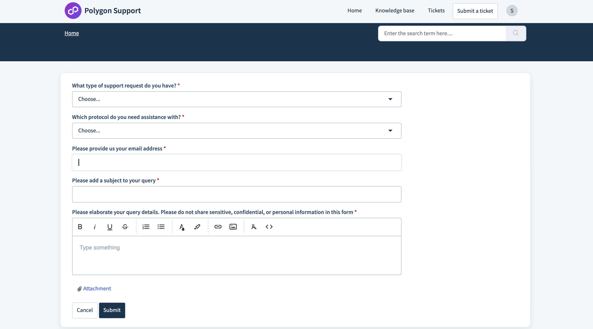

## Where to report a bug

Any discovered bugs or vulnerabilities related to our Bug Bounty Program should be reported as follows:

- For websites and applications: https://hackerone.com/polygon-technology
- For smart contracts: https://immunefi.com/bounty/polygon
- For security inquiries, please contact us at security@polygon.technology. (Please disclose vulnerabilities through the bug bounty program)

!!! info

    Performing an attack and not providing submission of your proof will result in disqualification of your attempt.

Make sure you add all relevant details such as your email address and Discord ID. Providing ample details creates a rapport of communication, and helps the Polygon team evaluate your submission appropriately.

## What happens after submitting a report

Once an issue is reported, the Polygon team reviews it, comments, and updates on the status of the issue. After evaluation, the Polygon team reports the outcome of the submission. The severity of the issue also gets tagged as per the evaluation.

## Contact us for all other questions

### Via E-mail

- For node operators: node-support@polygon.technology
- For validators: validator-support@polygon.technology

### Via support portal

- Visit the support portal at [support.polygon.technology](https://support.polygon.technology/).
- Sign in using your email address and select **Submit a Ticket** located in the top right corner.

- Tha above page appears. To ensure an accurate response, please include the following details when submitting your ticket:
    - The versions of Bor and Heimdall you are using.
    - At least one hour of logs related to the affected services.
    - The `config.toml` files for the affected services.

### Via Discord

- Please visit the **#pos-full-node-queries** channel on our [Discord](https://discord.com/invite/0xPolygonCommunity) server and feel free to post your questions there. We will address your queries directly in that channel.