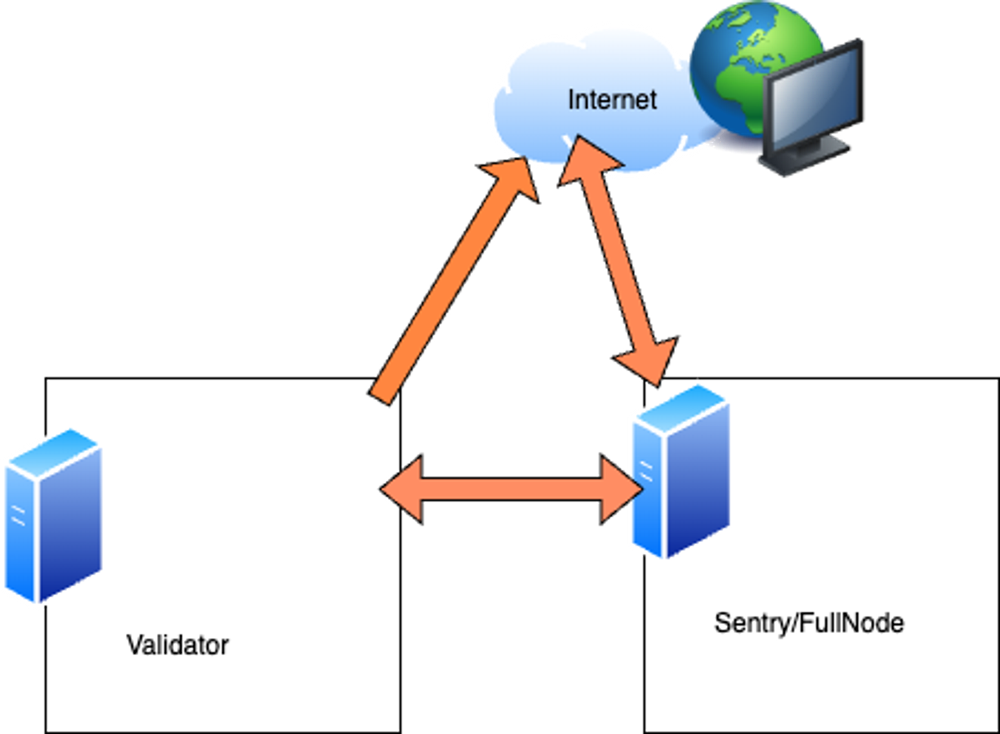

This document explores best practices for running a Polygon PoS validator node.

!!! info "Deploying a validator node"

    Get started with the process of deploying a validator node by reading the doc on [node deployment prerequisites](../prerequisites.md).

## Owner and signer wallets

The *signer wallet* is an address that is used for signing Heimdall blocks, checkpoints, and other signing-related activities. This wallet's private key is on the validator node for signing purposes. It cannot manage staking, rewards, or delegations.

The validator must keep two types of balances in this wallet:

- POL tokens on Heimdall (through top-up transactions) to perform validator responsibilities on Heimdall.
- ETH on Ethereum to send checkpoints on Ethereum.

The *owner wallet* is an address that is used for staking, re-staking, changing the signer key, withdrawing rewards, and managing delegation related parameters on the Ethereum chain. 

!!! warning

    The private key for this address *MUST* be kept secure.

All transactions through this key happen on the Ethereum chain.

!!! tip

    Validators are advised to take all precautions to safely generate and store wallet keys. It is important to not expose key details to anyone that does not require the information.

## Wallet setup and maintenance

- Key storage and maintenance are critically important. Use a secrets manager, or password manager for key management when setting up a wallet for your validator. If you choose to use another method, please ensure you have a solid understanding of the associated processes.
- Refer to [OWASP's key management cheat sheet](https://cheatsheetseries.owasp.org/cheatsheets/Key_Management_Cheat_Sheet.html).
- Hardware wallets can provide an additional layer of security, but do not rely on them to be completely fault proof, or to protect you in case your key is compromised.
- Rotate keys at least once a year. Also, it is important to rotate your keys if, at any point, you believe them to be compromised.
- Please do your own research for your specific needs.

## Operating system

The operating system of your choice is also a key factor in securing your validator node and preventing exploitation. 

- Please keep your system up to date using common practices like using your operating system package manager, such as `yum`, `apt`, `brew`, `pacman`, etc. There are many package managers, and each one has its own best practices guide and suggestions that you can refer to.
- *NEVER* run unnecessary software on your node. Limit the number of services and applications running on your node.
- Run single-purpose nodes. For example, you should not run a validator as an RPC endpoint for the public to consume. This is a known issue which you can avoid by not using the node for multiple purposes.
- Validator nodes should only be running the required Bor, Heimdall, and RabbitMQ services. Anything else running on the host, outside of a monitoring tool or firewall, could open you up to exploits.
- Limit access to your validator node to as few people as possible. This includes limiting SSH access only to selected people, or having no access to the host at all. The fewer people with access to the nodes, the fewer potential key disclosures, accidental events, and attack surfaces.
- Accessing your machine can be accomplished in a couple of ways. On AWS, you could use an SSM or GCP cloud shell. You can also use Docker containers if you wish to rely on SSH. Please understand the risks of key and credential disclosure and any accounts that have access to the host(s).

If you require SSH access, and need to expose the port publicly, the following best practices can increase security:

- Use IP-restricted SSH access on a different port.
- Use SSH keys and not passwords.
- Disable password login.
- Disable all root access; use individual accounts with sudo.
- Add brute-force SSH protection: Fail2Ban.
- Add 2FA for SSH access.

## Networking

- Do not expose any ports publicly for your validator node. Instead, use a sentry/full node configured with port `30303` for Bor and port `26656` for Heimdall available publicly.
- Configure your validator to operate as a static node in the Bor `config.toml` file and as a seed node/persistent peer in the Heimdall config. This allows your validator node to be isolated from the public internet and uses your sentry/full node instead of relying on unknown peers, which allows for greater security.

An example of this looks like the following:



In this example, the validator sends outbound requests to the network but does not allow any inbound connections, except for the sentry/full node we already configured. Note that this does not mean you can be careless with your network configurations and operating system maintenance for the Sentry node. It is just a way to avoid and mitigate against common attack vectors. 

There are a number of ways to achieve this. If you are using AWS, you can set up your security groups to only allow traffic from the sentry node to your validator, and vice versa. In this scenario, you _must_ make sure that you have proper monitoring and observability tools for your network.

!!! warning "Docker and UFW"

    Be careful when using UFW to restrict ports if your services are using Docker, as Docker automatically opens the Linux firewall for ports it "maps" to the host, therefore bypassing UFW rules. For more information, check [this post addressing the Docker published ports ignoring firewall rules](https://www.baeldung.com/linux/docker-container-published-port-ignoring-ufw-rules).

Every cloud provider offers a number of tools for this type of networking, including VPC, Security Group, or equivalent. This method, while more secure than leaving the hosts exposed on the Internet, has overheads of engineering time, resource management, and observability.

!!! warning "Public ports"

    A validator node, under no circumstances, should have any ports reachable by the public internet. 

In your topology, you may have other scenarios to consider. Beware of the risks involved with what ports or nodes have access to your host(s).

## Validator backup

There is also now a validator backup playbook available from the `node-ansible` repo. This tool allows you to backup your current configuration for your validator. This can be quite useful for migrating to a new host. To use this tool, run the following command: 

```bash
ansible-playbook -i $inventory playbooks/validator-backup.yml -e "destination=$WHERE_YOU_WANT_TO_SAVE_LOCALLY bor_path=PATH_TO_YOUR_BOR_INSTALL heimdall_path=PATH_TO_YOUR_HEIMDALL_PATH"
```

This tool requires you to define a destination variable, the path to your Bor config location, and the path to your Heimdall config location. It then creates a tarball and stores it locally on your machine in the directory path you have provided. 

## Host migration

If you are migrating a host, you may want to create an existing snapshot of your chain data for Bor and Heimdall. You can do this by running the following commands: 

```bash
ansible-playbook -i $inventory playbooks/bor/snapshot-create -e "chaindata=$path target=$target_save_dir"
ansible-playbook -i $inventory playbooks/heimdall/snapshot-create -e "data=$path target=$target_save_dir"
```

This starts a screen session while generating the tarball, which also implies that you have enough disk space on the host that you defined as your target variable to store the output. From here, you can copy the tarball to any host. 

## Monitoring and observability

If you already ship your logs to Coralogix, Datadog, or Splunk, then your monitoring uses this information. You could also be using Nagios or another similar tool to actively monitor your validator nodes. Here are some scenarios and data to consider logging when monitoring a node:

- Is the Bor service up?
- Is the Heimdall service up?
- Is the chain out of sync?
- Traffic inbound (RPC calls to your sentry).
- Disk space usage.
- Memory usage.
- Network usage.

How to best monitor these depends on your logging set up and requirements. Monitoring is a cost that may ultimately provide you peace of mind as a node operator. Make sure to balance the signal-to-noise ratio for the alerts. This usually takes some fine-tuning.