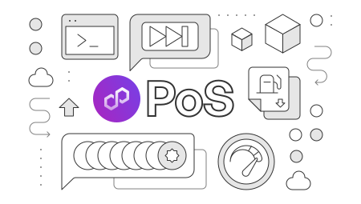

---
hide:
- toc
---

    

    

       <h1 class="hero-heading">Polygon PoS</h1>
       
Polygon PoS is an EVM-compatible, proof-of-stake sidechain for Ethereum, with high throughput and low costs.

    

     

    

       <a href="./get-started/building-on-polygon">
          

             
Get started with PoS

          

          
Get started with building on Polygon PoS.

       </a>
    

    

       <a href="./how-to/choose-node-type">
          

             
Run a PoS node

          

          
Find out the differences between types of PoS nodes and how to set up, run, and deploy them.

       </a>
    

    

       <a href="./architecture/">
          

             
PoS architecture

          

          
Find out about the PoS architecture and its Heimdall and Bor layers.

       </a>
    

