# How to delegate

This is a step-by-step guide to help you become a delegator on the Polygon Network.

The only prerequisite is to have your MATIC tokens and ETH on the Ethereum mainnet address.

## Access the dashboard

  1. In your wallet (e.g. MetaMask), choose the Ethereum mainnet.
    
    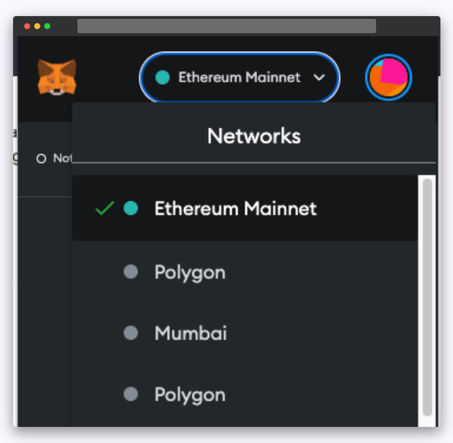
  
  2. Log in to [Polygon Staking](https://staking.polygon.technology/).

  3. Once you log in, you will see overall statistics along with the list of validators.
    
    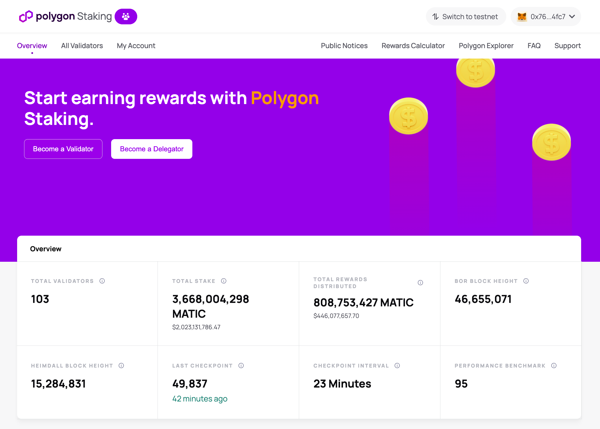

    

!!!note
    If you are a validator, use a different non-validating address to log in as delegator.

## Delegate to a validator

  1. Click "Become a Delegator" or scroll down to a specific validator and click "Delegate".
    
    

  2. Provide the amount of MATIC to delegate.
    
    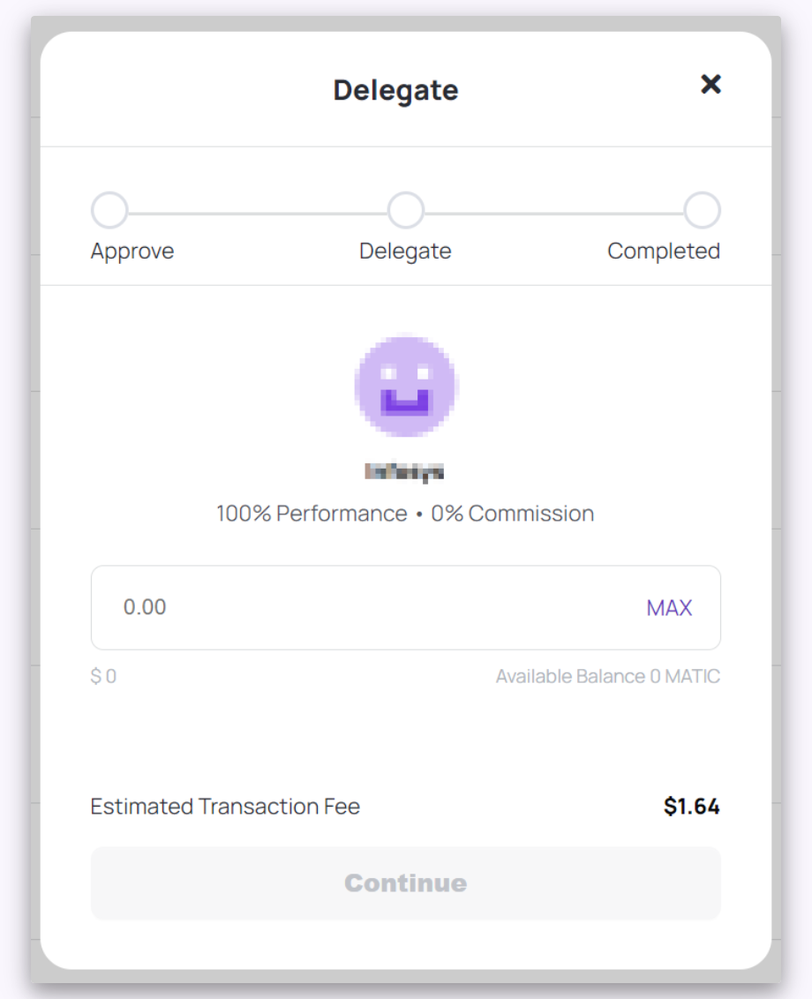

    
  3. Approve the delegation transaction and click "Delegate".
    
    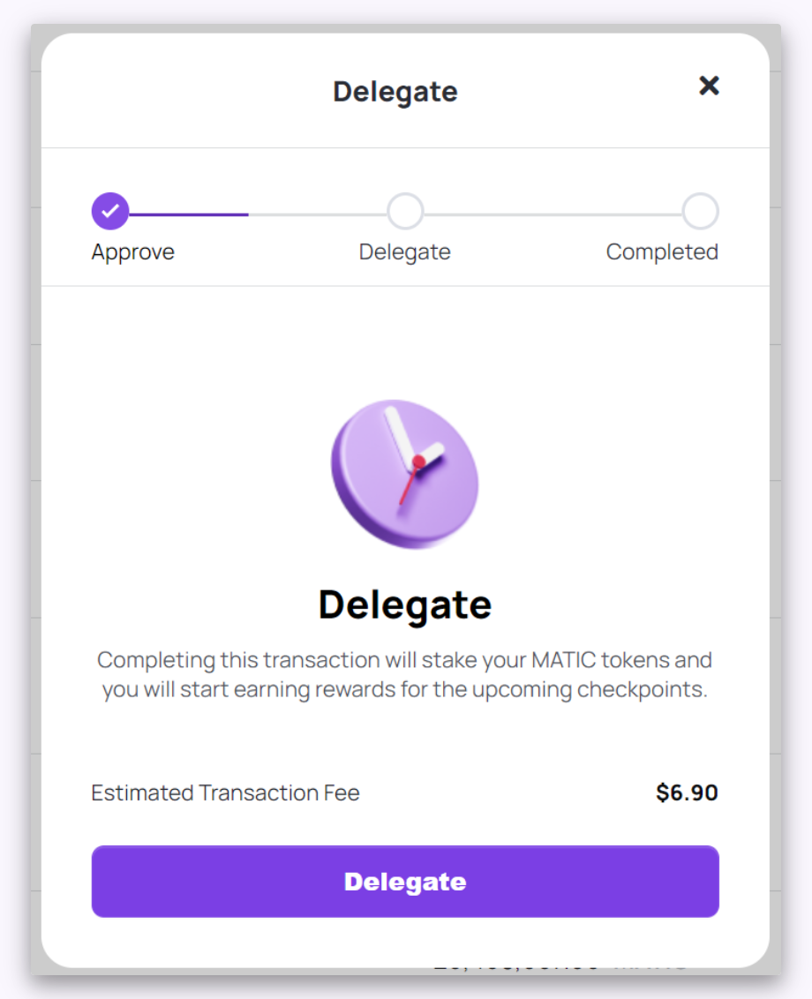

    
After the delegation transaction completes, you will see the `Delegation Completed` message.
  
  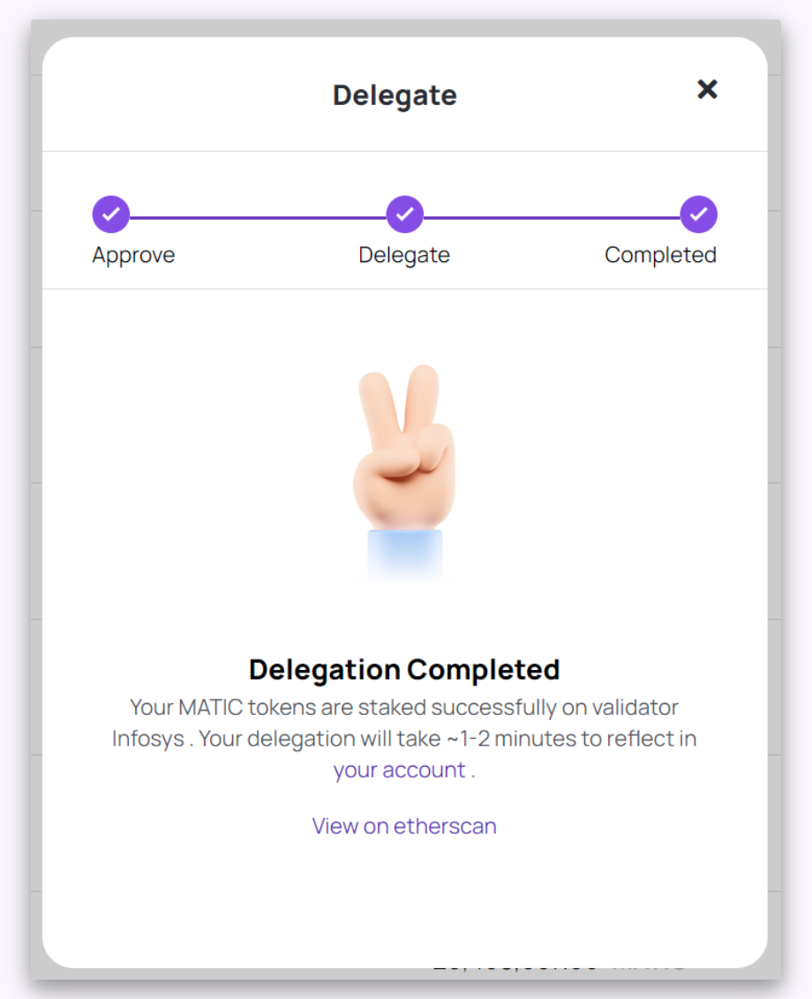
  

## View your delegations

To view your delegations, click "My Account".

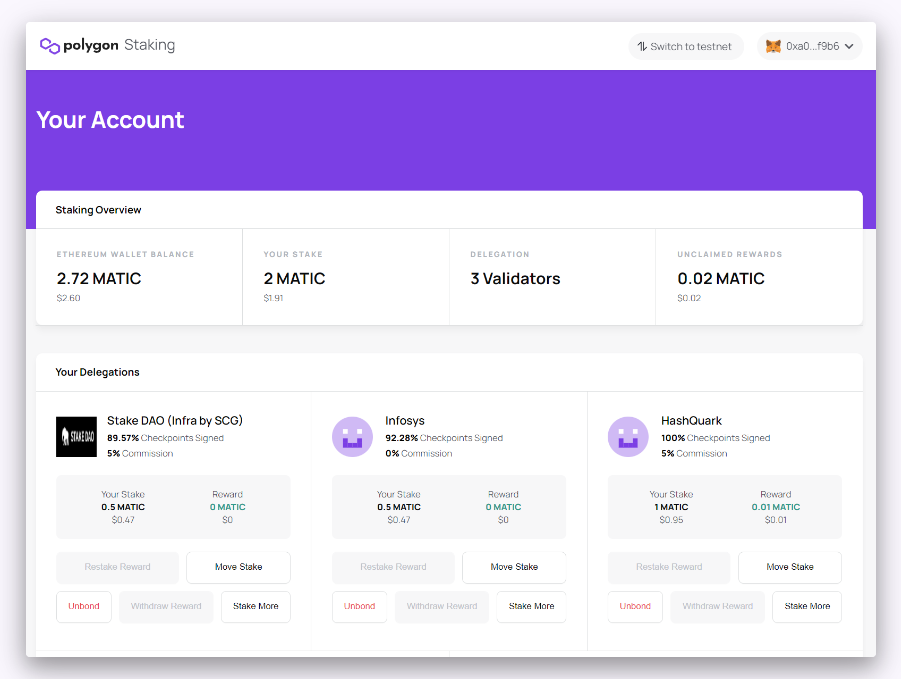

## Withdraw rewards

  1. Click "My Account".
    
    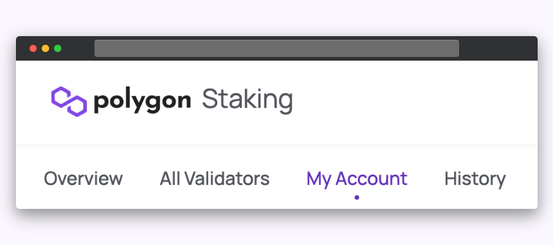

    
  2. Under your delegated validator, click "Withdraw Rewards".
    
    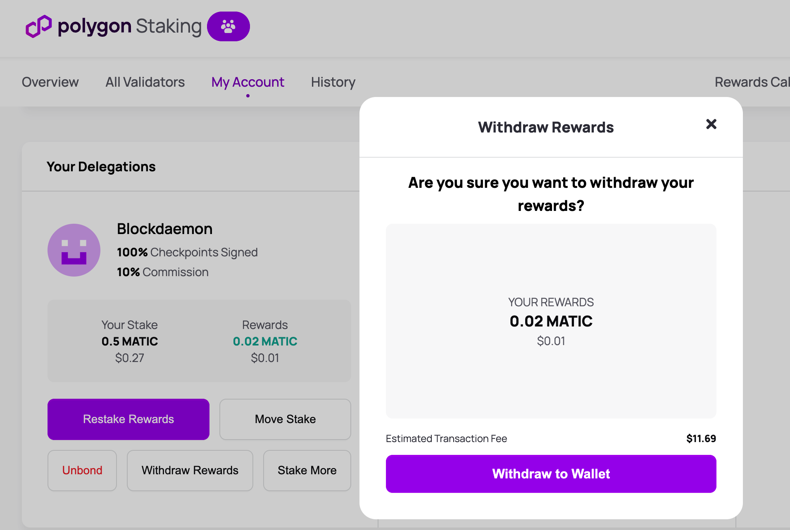
    

This will withdraw the MATIC token rewards to your Ethereum address.

## Restake rewards

  1. Click "My Account".
    
    

  2. Under your delegated validator, click "Restake Reward".
    
    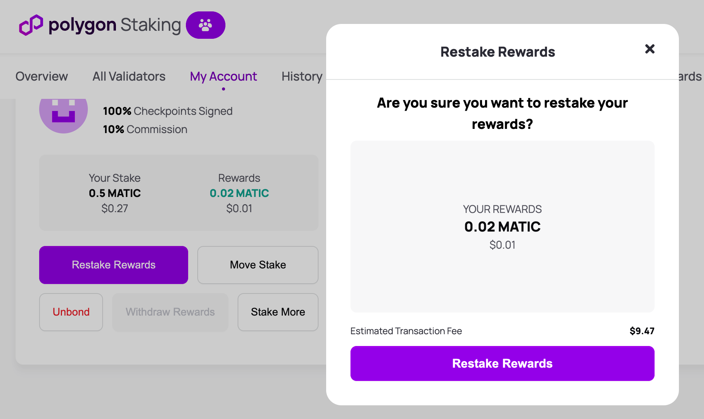

    

This will restake the MATIC token rewards to the validator and increase your delegation stake.

## Unbond from a validator

  1. Click "My Account".
    
    

  2. Under your delegated validator, click "Unbond".
    
    

  This will withdraw your rewards from the validator and your entire stake from the validator.

  Your withdrawn rewards will show up immediately on your Ethereum account.

  Your withdrawn stake funds will be locked for 80 checkpoints.
    
    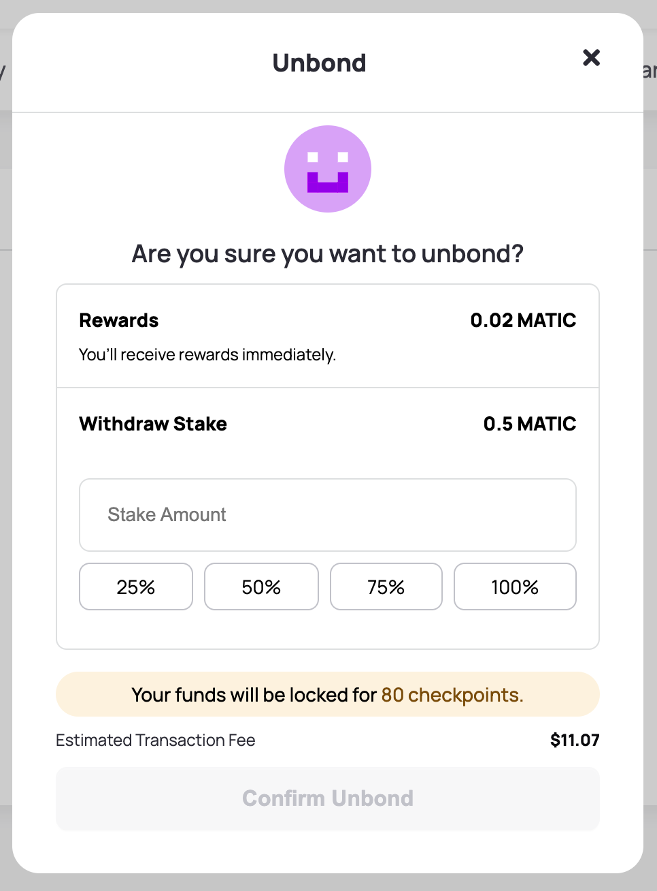

!!!note
    
    The fund locking for the unbonding period is in place to ensure there is no malicious behaviour on the network.

## Move stake from one node to another node

Moving stake from one node to another node is a single transaction. There are no delays or unbonding periods during this event.
  
  1. Log in to the "My Account" on the Staking dashboard.

  2. Click "Move Stake" under your delegated validator.

  3. Select an external validator and click "Stake here".
    
    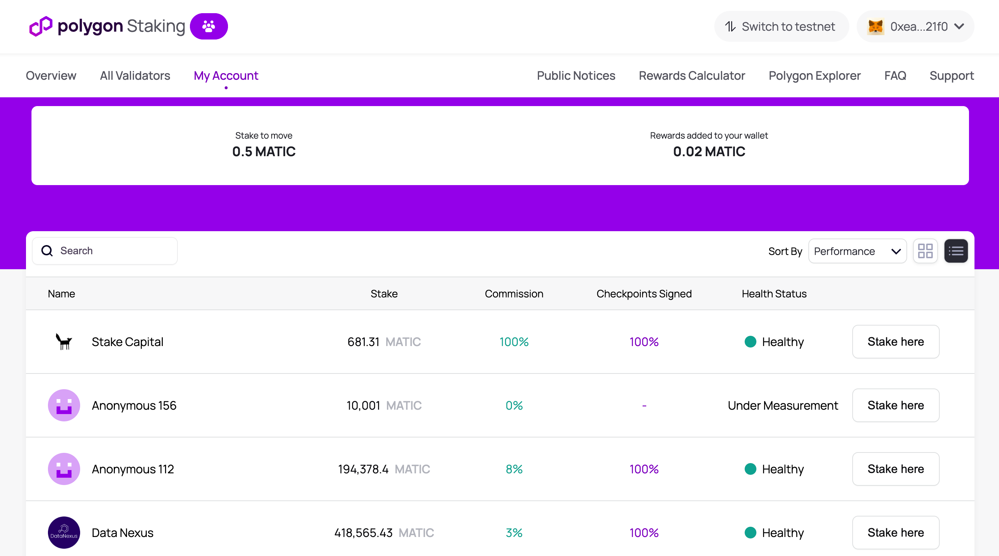

  4. Provide the stake amount and click "Move Stake".
    
    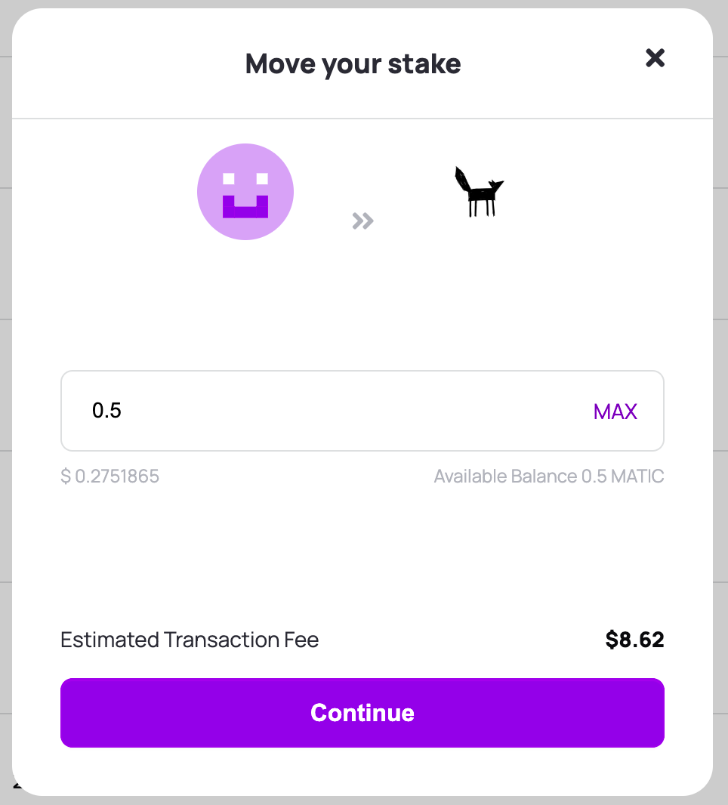
    

This will move the stake. The dashboard will update after 12 block confirmations.
