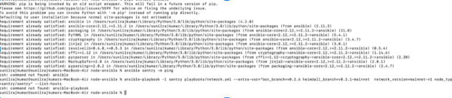
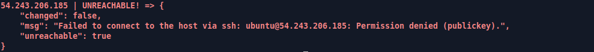
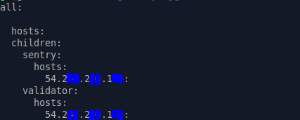
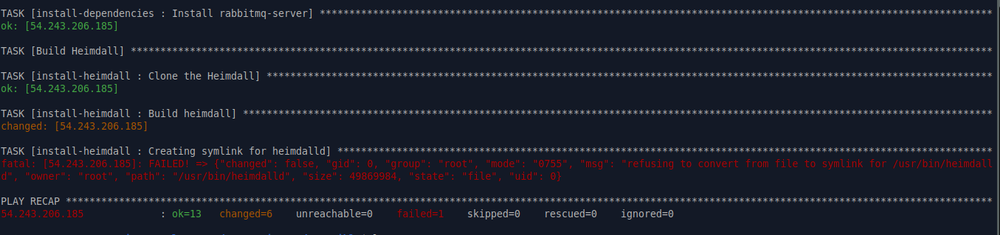
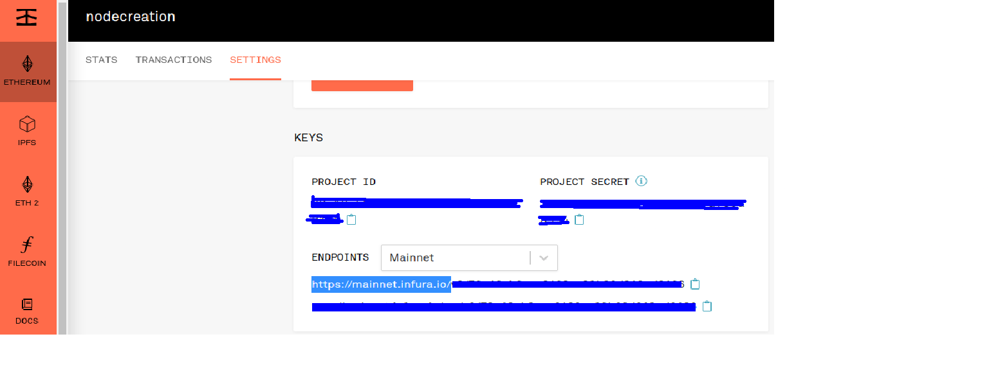

## Before setting up the Validator node

!!!caution
    
    We recommend running the Validator node with Sentry. Otherwise, you may encounter security concerns and issues with your Validator node.

### Downloading the Snapshot

It is recommended that you keep your snapshots handy before setting up the Validator node. Link to download and extract the snapshots: https://snapshots.polygon.technology/

### RPC Endpoint for Node Setup

Validator nodes require an Ethereum-based RPC endpoint. You may use your own Ethereum node or utilize external infrastructure providers in our list. In order to see the list, click on the dropdown menu labeled **Infra Providers** in the navigation bar.

### Open necessary ports

- **Port 26656** &rarr; Heimdall service will connect your node to another node's Heimdall service using this port.

- **Port 30303** &rarr; Bor service will connect your node to another node's Bor service using this port.

- **Port 22** &rarr; for the Validator to be able to SSH from wherever they are.

### Install RabbitMQ

It is recommended to install the **RabbitMQ** service before setting up your Validator node. Please utilize the below commands to set up RabbitMQ (if not already installed):

```bash
sudo apt-get update
sudo apt install build-essential
sudo apt install erlang
wget https://github.com/rabbitmq/rabbitmq-server/releases/download/v3.10.8/rabbitmq-server_3.10.8-1_all.deb
sudo dpkg -i rabbitmq-server_3.10.8-1_all.deb
```

## Mandatory Checklist for Validator Setup

1. Please follow the below checklist in order to set up your Validator node using Binaries, Ansible or Packages.

    | Checklist | Binaries | Ansible | Packages |
    |----------------------------|---------------|--------------|-----------|
    | **Machines Required** | 2 Machines - **Sentry** & **Validator** | 3 Machines - **Local Machine**, **Sentry** and **Validator** | 2 Machines - **Sentry** & **Validator** |
    | **Install Go Packages** | Yes | No | No |
    | **Install Python** | No | Yes (only on the **Local Machine** where the **Ansible Playbook** runs) | No |
    | **Install Ansible** | No | Yes (only on one machine) | No |
    | **Install Bash** | No | No | Yes |
    | **Run Build Essential** | Yes | No | No |
    | **Node Setup** | [Using Binaries](../run-validator/binaries.md) | [Using Ansible](../run-validator/ansible.md) | [Using Packages](../run-validator/packages.md) |

2. Once your Sentry and Validator nodes are synced and running, head over to our [Discord server](https://discord.com/invite/0xPolygon) and ask the community to health-check your nodes. You may check the logs by using the following commands:

    - **Heimdall logs &rarr;** ```journalctl -u heimdalld.service -f```
    - **Bor logs &rarr;** ```journalctl -u bor.service -f```

3. It is highly recommended to maintain a backup of the key files on your local machine. These might be needed in the situation of migration or outage. You may access the files using the commands below:

    ```bash
    vi ~/.heimdalld/config/priv_validator_key.json
    vi ~/.bor/keystore/UTC--XXXXX
    vi ~/.bor/password.txt
    vi /etc/matic/metadata
    ```

4. Ensure that Bor and Heimdall are on their right versions. Commands to verify the versions are provided below:

    ```bash
    heimdalld version
    bor version
    ```

5. It is recommended to always maintain 2 sentries to maximize your node uptime.

6. Constantly keep checking the peer count on Heimdall and Bor service using the following commands:

    ```bash
    # Heimdall
    curl localhost:26657/net_info? | jq .result.n_peers

    # Bor
    bor attach .bor/data/bor.ipcadmin.peers.length
    ```

    !!!info
        
        For Validators, **the output should be only one peer, which has to be a Sentry**. Validators should connect only to the Sentry and not with external peers.

        Sentry can connect with multiple peers.


### 1. How to: New node setup

!!!note
    
    Below are some additional information to the official documentation which might help while setting up a new node.


This document gives some additional details for setting up a new node based on [full node deployment](/operate-node/operate/full-node-binaries) guide.

- VPN setup is required before proceeding with any of these steps.
- If you are using Macbook, it has native Python 2.7 available which **needs to be replaced by with anything Python 3.x**.
- Make sure if pip3 packages are installed correctly

    If the above 3 steps are not done correctly then even though Ansible is installed, it can’t recognize the Ansible packages. You might face something like the below screenshot:

    

- Also make sure there are no Go packages and any previous setup of Bor or Heimdall.

    You can use the below commands to check whether these packages are existing or not;

    1. Go version
    2. Heimdall version
    3. Bor version

    If anything of that sort, please run the below command to delete and clean the whole setup;

    ```bash
    ansible-playbook -l sentry playbooks/clean.yml
    ```

    Otherwise there will be error like below image whenever you try to run `ansible sentry -m ping`

    


- Example of **inventory.yml**

    

- Sentry Host IP and Validator Host IP have to be the same and colons should be provided at the end of the lines including IPs

- Before connecting the remote machine using the below command, you must be added to the remote machine and it will provided by DevOps team

    ```bash
    ssh -i <downloaded_key_file.key> <remote_user>@<ip/host>
    ```

- Once they have confirmed the server access, you should be able to SSH to the remote machine.

- You may face this error if there is any issue with Heimdall's config

    

    This can be fixed by following steps:

    - Run the below commands(inside the 'node-ansible' folder):

        ```bash
        git checkout fixing_symlinks_on_clean
        git pull https://github.com/maticnetwork/node-ansible/tree/fixing_symlinks_on_
        ```

    - Cross check `clean.yml` on your machine with [clean.yml in the github repo](https://github.com/maticnetwork/node-ansible/blob/fixing_symlinks/playbooks/clean.yml)

    - If there are any differences, replace the one on your machine with the one in the repo

    - You should be able to run the clean script now and then also be able to run the installation script

- `moniker=enter unique identifier`
    - the unique identifier asked as per the document (it can be anything, ex: your name)

- `eth_rpc_url =insert Infura or any full node RPC URL to Ethereum`
    - For this step, sign in to https://infura.io (signup if you already don't have an account)

    - Copy the **https** endpoint provided under **ethereum → keys → endpoints**

        

        - Provide the copied **https** endpoint as `eth_rpc_url` in `/var/lib/heimdall/config/heimdall-config.toml`

### 2. Why do I have to keep ETH in my signer account?

ETH is required on your signer account because for submitting checkpoints to Ethereum, all transactions require ETH to be used as Gas. Hence, ETH is required in your Signer Account.

### 3. For a Polygon Validator, do I need to setup a Sentry and Validator node or can I just run the Validator node only?

For a Polygon Validator, our ecosystem and architecture demands that you run a **Sentry + Validator** setup. This is to ensure that your Validator node is not exposed to the public and only your Sentry node is.

Your Sentry node gleans information / blocks from the network and then relays them to the Validator for validation.

### 4. How to migrate to new nodes and then cut over?

1. Provision nodes and install all software as per the instructions.

2. Download the latest Heimdall and Bor snapshots on both nodes.

3. Move the Key and Keystore files to the new validator.

4. Shut down the current validator and sentry node.

5. Start all services on sentry, then the validator.

### 5. How to check the Heimdall version?

Run: `heimdalld version`

### 6. Which Private Key should we add when we generate validator key?

The Private key to be used is your Wallet's ETH address where your Matic testnet Tokens are stored. You can complete the setup with one public-private key pair tied to the address submitted on the form.

### 7. Where can we find Heimdall account info location?

For Binaries: `~/.heimdalld/config folder`

```jsx
/var/lib/heimdall/config folder
```

For Linux package:

```jsx
/etc/heimdall/config
```

### 8. Which file do we add the API key?

Once you have created the API key, you need to add the API key in `heimdall-config.toml` file.

### 9. Which file do we add the `persistent_peers`?

You can add the `persistent_peers` in the following file:

```jsx
/var/lib/heimdall/config/config.toml
```

### 10. How to stop Heimdall and Bor services?

**For Linux packages**:

Stop Heimdall: `sudo service heimdalld stop`

Stop Bor: `sudo service bor stop` or

1. `ps -aux | grep bor`. Get the PID for Bor and then run the following command.
2. `sudo kill -9 PID`

**For Binaries**:

Stop Heimdall: `pkill heimdalld`

Stop Bridge: `pkill heimdalld-bridge`

Stop Bor:  `bash stop.sh`

### 11. How to remove Heimdall and Bor directories?

**For Linux packages**:

Delete Heimdall: `sudo rm -rf /etc/heimdall/*`

Delete Bor: `sudo rm -rf /etc/bor/*`

**For Binaries**:

Delete Heimdall: `sudo rm -rf /var/lib/heimdall/`

Delete Bor: `sudo rm -rf /var/lib/bor`

### 12. How to reduce cache in Bor?

Bor supports the `--cache` parameter which can reduce the cache to avoid running out of memory.

### 13. How to delete the Bor DB data?

```
bor --datadir  /var/lib/bor/data removedb
cd ~/node/bor
bash setup.sh
service bor start
```

