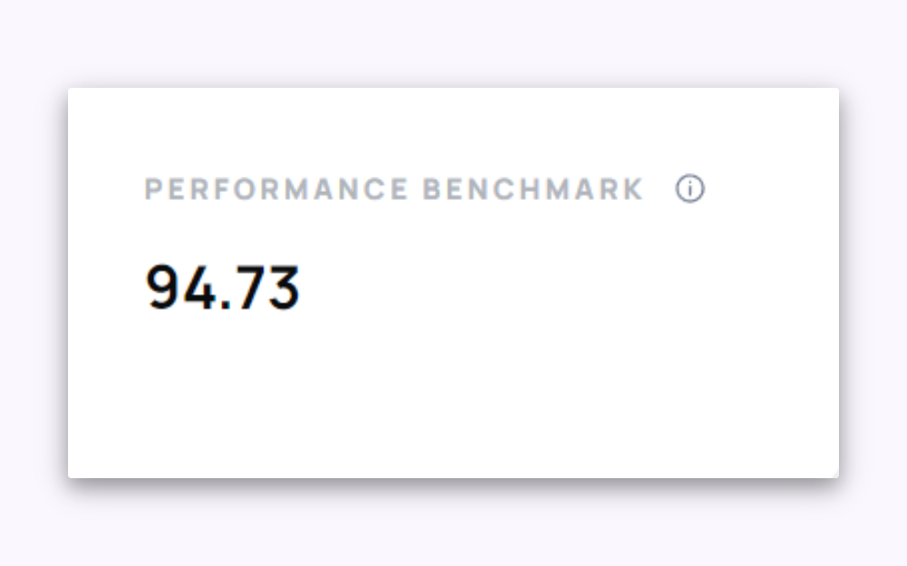
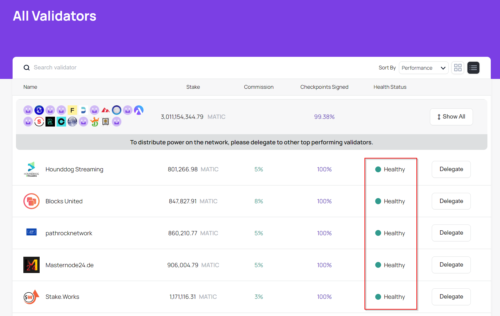
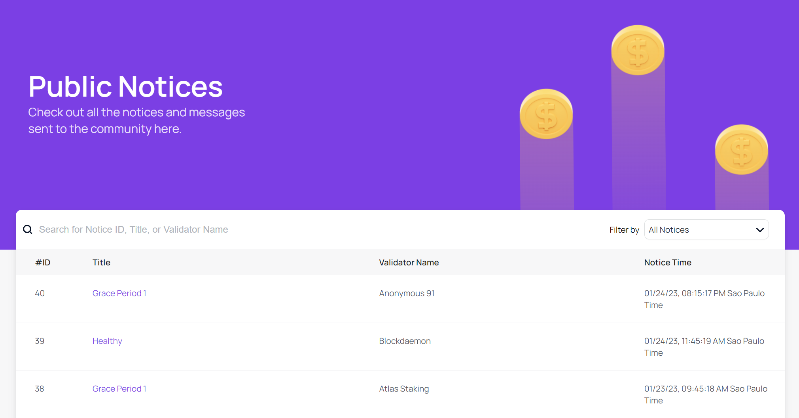
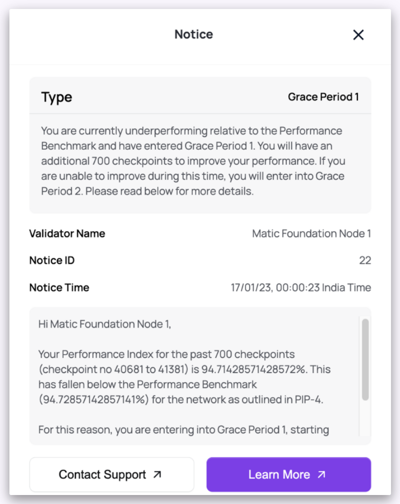

# Validator performance framework

This is a guide to help users understand the validator performance parameters the community agreed to in [PIP-4](https://snapshot.org/#/polygonvalidators.eth/proposal/0x1e9d79b6406870ebd0b66ac256b59012f97f3f4d652052681c6fb1077e251804).

These parameters and the related health statuses help provide information about validator performance against a defined performance benchmark.

### Parameters

A validator’s performance is measured based on checkpoints it signed over a monitoring period. Performance is measured on a rolling basis at each new checkpoint to provide an objective figure. This figure is then measured against a benchmark of the total network performance in the monitoring period, as detailed below.

* Monitoring Period (“MP") = previous 700 checkpoints, updated every new checkpoint.
* Take % of checkpoints signed by each validator in the MP and find the median.
* Multiply the median average by an agreed multiple = Performance Benchmark (“PB”).
* At each checkpoint, calculate the % of checkpoints signed in the MP by single validators and measure against the PB.

### Performance Benchmark

To facilitate the transition, there will be a slightly lower benchmark around the first two months while validators become accustomed to the parameters.

* PB1 → 95% of the median average of the last 700 checkpoints signed by the validator set (first 2,800 checkpoints))
* PB2 → 98% of the median average of last checkpoints signed by validator set (continues thereafter)

### Deficient Validator Process

* If validator <PB in the MP → Grace Period 1 (“GP1”).
* If validator is in GP and <PB after 700 checkpoints → Notice of Deficiency (“NOD”), validator enters into Grace Period 2 (“GP2”).
* If validator is in GP2 and <PB after 700 checkpoints → Final Notice (“FN”), the validator will be unstaked per PIP-4.

Each GP is an additional 700 checkpoints, allowing a validator to bring their performance back above the PB. If the deficiency is corrected within the GP, there will be no further action. Failure to match, or out perform the performance benchmark, at the end of GP2 will result in a public NOD that will be displayed on the staking dashboard.

The validator will have a 700 checkpoint period to correct the deficiency in GP2. If the deficiency is fixed within the NOD period, then no further action will occur. However, the NOD would remain public. Failure to improve after GP2 would result in the issuance of an FN of the community's intent to implement a forced exit procedure by offboarding the validator from the network by unbonding their stake.

!!!tip
    Health Status

    You can quickly check a validator's health status, whether it is **Healthy**, on **Grace Period** or **Final Notice** on the **All Validators** table or on each validator page.

    

    
    

### Public Notices

The Public Notices page shows the recent notices and messages sent to the community of validators.

This is how a Notice message should look like:

### Forced Unstaking

The unstaking of the deficient validator would be done as follows:

Call the `ForceUnstake` function in Polygon Commitchain Contract: 0xFa7D2a996aC6350f4b56C043112Da0366a59b74c
