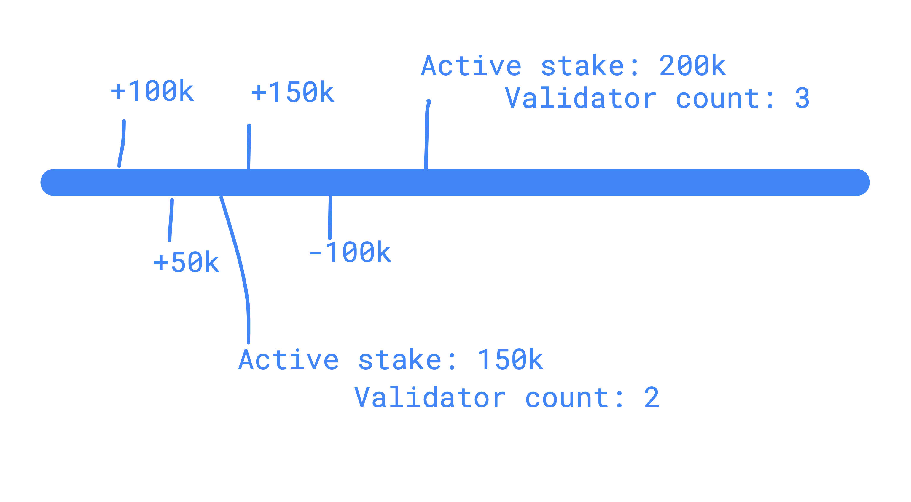

For the Polygon's Proof of Security based consensus, all the ⅔+1 proof verification and handling of staking, rewards are executed on the Ethereum smart contract. The whole design follows this philosophy of doing less on the Mainnet contract. It does information verification and pushes all the computation-heavy operations to L2 (read about [Heimdall](https://docs.polygon.technology/pos/architecture/heimdall/)).

**Stakers** are divided into **validators**, **delegators**, and **watchers** (for fraud reporting).

[**StakeManager**](https://github.com/maticnetwork/contracts/blob/develop/contracts/staking/stakeManager/StakeManager.sol) is the main contract for handling validator related activities like `checkPoint` signature verification, reward distribution, and stake management. Since the contract is using **NFT ID** as a source of ownership, change of ownership and signer won't affect anything in the system.

!!!tip
    
    From one Ethereum address, a **Staker can only be a validator or delegator** (it's just a design choice, no hard reasons).


## Validator admissions / replacement

### Admissions
At present, there are no open validator slots available on Polygon PoS. There is also a waitlist to become a validator. In the future, if slots become available, validators may apply to be considered and removed off of the waitlist.


### Replacement
PIP4 introduced the concept of showcasing validator performance for community visibility. If a validator is in an unhealthy state for an extended period of time as outlined in PIP4, they are off-boarded from the network. The validator slot is then made available to those coming off of the waitlist.

!!!info
    
    Currently, [<ins>Phase 2 of PART C in PIP4</ins>](https://forum.polygon.technology/t/pip-4-validator-performance-management/9956/24) is being implemented. This is where the community decides on validator prospect evaluation criteria. In time, this exercise will produce an application and admissions process.


## Methods and variables

!!!caution
    Slashing Implementation

    `jail`, `unJail`, and `slash` functions are not used currently as part of the slashing implementation.


### validatorThreshold

It stores the maximum number of validators accepted by the system, also called slots.

### AccountStateRoot

- For various accounting done on Heimdall for validators and delegator, account root is submitted while submitting the `checkpoint`.
- accRoot is used while `claimRewards` and `unStakeClaim`.

### stake / stakeFor

```solidity title="StakeManager.sol"
function stake(
    uint256 amount,
    uint256 heimdallFee,
    bool acceptDelegation,
    bytes calldata signerPubkey
) public;

function stakeFor(
    address user,
    uint256 amount,
    uint256 heimdallFee,
    bool acceptDelegation,
    bytes memory signerPubkey
) public;
```

- Allows anyone with amount (in MATIC tokens) greater than `minDeposit`, if `currentValidatorSetSize` is less then `validatorThreshold`.
- Must transfer `amount+heimdallFee`, puts validator into auction period for an auctionInterval (more in Auction section).
- `updateTimeLine` updates special timeline data structure, which keeps track of active validators and active stake for given epoch / checkpoint count.
- One unique `NFT` is minted on each new `stake` or `stakeFor` call, which can be transferred to anyone but can be owned 1:1 Ethereum address.
- `acceptDelegation` set to true if validators want to accept delegation, `ValidatorShare` contract is deployed for the validator.

### unstake

- Remove validator from validator set in next epoch (only valid for current checkpoint once called `unstake`)
- Remove validator's stake from timeline data structure, update count for validator's exit epoch.
- If validator had delegation on, collect all rewards and lock delegation contract for new delegations.

### unstakeClaim

```solidity
function unstakeClaim(uint256 validatorId) public;
```

- After `unstaking`, validators are put into withdrawal period so that they can be slashed, if any fraud found after `unstaking`, for past frauds.
- Once `WITHDRAWAL_DELAY` period is served, validators can call this function and do settlement with `stakeManager` (get rewards if any, get staked tokens back, burn NFT, etc).

### restake

```solidity
function restake(uint256 validatorId, uint256 amount, bool stakeRewards) public;
```

- Allows validators to increase their stake by putting new amount or rewards or both.
- Must update timeline (amount) for active stake.

### withdrawRewards

```solidity
function withdrawRewards(uint256 validatorId) public;
```

This method allows validators to withdraw accumulated rewards, must consider getting rewards from delegation contract if validator accepts delegation.

### updateSigner

```solidity
function updateSigner(uint256 validatorId, bytes memory signerPubkey) public
```

This method allows validators to update signer address (which is used to validate blocks on Polygon blockchain and checkpoint signatures on `stakeManager`).

### topUpForFee

```solidity
function topUpForFee(uint256 validatorId, uint256 heimdallFee) public;
```

Validators can top-up their balance for Heimdall fee by invoking this method.

### claimFee

```solidity
function claimFee(
        uint256 validatorId,
        uint256 accumSlashedAmount,
        uint256 accumFeeAmount,
        uint256 index,
        bytes memory proof
    ) public;
```

This method is used to withdraw fees from Heimdall. `accountStateRoot` is updated on each checkpoint, so that validators can provide proof of inclusion in this root for account on Heimdall and withdraw fee.

Note that `accountStateRoot` is re-written to prevent exits on multiple checkpoints (for old root and save accounting on `stakeManager`). `accumSlashedAmount` is unused at the moment and will be used for slashing on Heimdall if needed.

### StakingNFT

Standard ERC721 contract with few restrictions like one token per user and minted in sequential manner.

### startAuction

```solidity
function startAuction(
    uint256 validatorId, /**  auction for validator */
    uint256 amount /**  amount greater then old validator's stake */
    ) external;
```

In order to start a bid or bid higher on already running auction, this function is used. Auction period runs in cycles like `(auctionPeriod--dynasty)--(auctionPeriod--dynasty)--(auctionPeriod--dynasty)` so it **must check for correct auction period**.

`perceivedStakeFactor` is used to calculate exact factor*old stake (note currently it is by default 1 WIP for picking the function). **Must check for auction from last auction period if any still going on** (one can choose to not call `confirmAuction` in order to get their capital out in the next auction). Normally continuous english auction is going on in a `auctionPeriod`.

### confirmAuctionBid

```solidity
function confirmAuctionBid(
        uint256 validatorId,
        uint256 heimdallFee, /** for new validator */
        bool acceptDelegation,
        bytes calldata signerPubkey
    ) external
```

- **Must check that this is not an auctionPeriod.**
- If last bidder is owner of `validatorId`, behaviour should be similar to restake.
- In second case unStake `validatorId` and add new user as validator from next checkpoint, for the new user behaviour should be similar to stake/stakeFor.

### checkSignatures

```solidity
function checkSignatures(
        uint256 blockInterval,
        bytes32 voteHash,
        bytes32 stateRoot,
        bytes memory sigs
    ) public;
```

- Writes are meant only for RootChain contract when submitting checkpoints
- `voteHash` on which all validators sign (BFT ⅔+1 agreement)
- This function validates only unique sigs and checks for ⅔+1 power has signed on checkpoint root (inclusion in `voteHash` verification in RootChain contract for all data) `currentValidatorSetTotalStake` provides current active stake.
- Rewards are distributed proportionally to validator's stake. More on rewards in [Rewards Distribution](https://docs.polygon.technology/pos/how-to/operating/validator-node/#reward-distribution)
<!-- (https://www.notion.so/Rewards-Distribution-127d586c14544beb9ea326fd3bb5d3a2). -->

### isValidator

Checks if a given validator is active validator for the current epoch.

## Timeline data structure

```solidity
struct State {
    int256 amount;
    int256 stakerCount;
}

mapping(uint256 => State) public validatorState;
```




## StakingInfo

Centralized logging contract for both validator and delegation events, includes few read only functions. You can check out the source code of the [StakingInfo.sol](https://github.com/maticnetwork/contracts/blob/develop/contracts/staking/StakingInfo.sol) contract on GitHub.

## ValidatorShareFactory

A factory contract to deploy `ValidatorShare` contract for each validator who opt-in for delegation. You can check out the source code of the [ValidatorShareFactory.sol](https://github.com/maticnetwork/contracts/blob/develop/contracts/staking/validatorShare/ValidatorShareFactory.sol) contract on GitHub.
