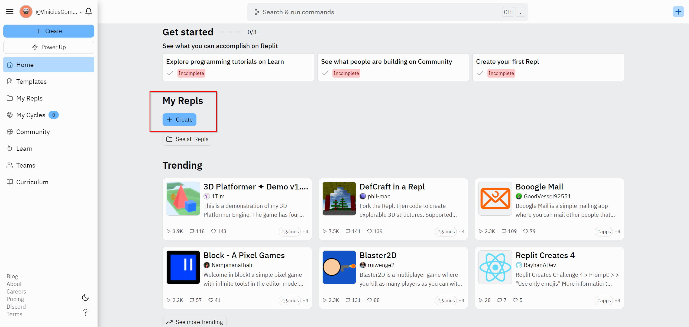
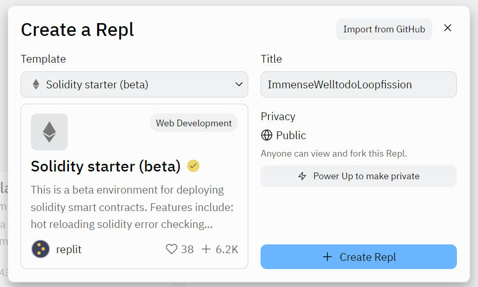
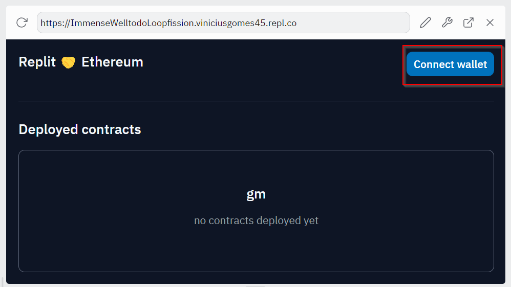

## Overview

[Replit](https://docs.replit.com/) is a coding platform that allows you to write code and host apps. Replit supports Solidity so it provides all of the features and functionality for Web3 developers to create and deploy smart contracts.

This article guides you to build and deploy a solidity smart contract on Polygon using [Replit IDE](https://replit.com/signup) and [Replit Solidity development template (Solidity starter beta)](https://replit.com/@replit/Solidity-starter-beta?v=1).

## What you will do

- Create a Replit account.
- Create a Repl environment.
- Deploy a sample project on the Polygon Amoy network.
- Verify the contract.
- Publish your project to a personal Replit profile.

!!! tip

    For additional examples about Solidity with Replit, you can read the article [Get started with Replit](https://blog.replit.com/solidity).

## Prerequisites

You do not need any local environment setup to deploy your solidity smart contract on Polygon using Replit.

You need a browser-based web3 wallet to interact with the Polygon Amoy testnet and deployed contracts. If you are already using MetaMask, we recommend creating a new account for testing with Replit. You can do this from the account menu, which appears when you click on the account avatar in the top right corner of the MetaMask interface.

You must set up all of the following prerequisites to be able to deploy your solidity smart contract on Polygon:

1. [Create a Replit account](https://replit.com/signup).
2. [Download MetaMask wallet](https://support.metamask.io/getting-started/getting-started-with-metamask/).
3. [Configure Polygon on MetaMask](../../wallets/metamask/add-polygon-network.md).
4. [Get testnet tokens](https://faucet.polygon.technology).

## Working with a Repl

Every Repl that you create is a fully functional development and production environment. Follow the steps to create a solidity starter Replit:

1. [Log in](https://replit.com/login) or [create an account](https://replit.com/signup). After creating your account, your home screen will include a dashboard where you can view, create projects, and manage your account.

    

2. Once logged in, create a Solidity starter repl, Select **+ Create Repl** from the left panel or **+** in the top right corner of the screen.

    

3. Select the [**Solidity starter (beta)**](https://replit.com/@replit/Solidity-starter-beta?v=1) template and give your project a title.

4. Click on **+ Create Repl** to create your project.

    !!! note

        The Solidity starter repl comes with a browser-friendly interface, built using the **[Web3 Ethereum JavaScript API](https://web3js.readthedocs.io/en/v1.5.2/)**, which you can use to deploy and interact with our contracts. We will deploy to Replit’s testnet, a custom version of the Ethereum blockchain managed by Replit and optimised for testing.

## Deploy on Polygon

Make sure that you have followed the list of [prerequisites](#prerequisites) above so that you are ready to deploy and interact with your smart contract.

1. Click on **Run** (at the top) to install all relevant packages and start up the contract deployment UI.

2. Connect your MetaMask wallet to the web interface and switch to the [Amoy testnet](../../wallets/metamask/add-polygon-network.md).

    

3. Click on **Connect wallet**, select your account, then choose **Connect**.

    

4. From the dropdown list, select the contract that you want to deploy. Click on **Deploy**.

5. You will see a MetaMask popup window asking for your confirmation. Approve the transaction from your wallet to deploy your contract.

## Verifying and testing your contract

When the contract is deployed, [navigate to Polygonscan](https://amoy.polygonscan.com/) to search for your account, view your deployed contract, and copy your account address.

Once your contract has been deployed, it will show up as expandable boxes below the dropdown box. Expand it and take a look at all the different functions available. You can now interact with your contract using the provided user interface or from a sharable URL shown on the interface.

## Publish to Replit​

Replit allows you to publish your projects to a personal profile. After publishing, projects will show up on your spotlight page for others to explore, interact with, clone, and collaborate.

Follow the below steps to publish your projects to Replit:

1. Select the project title at the top of the screen.
2. Complete your project name and description and click **Publish**.
