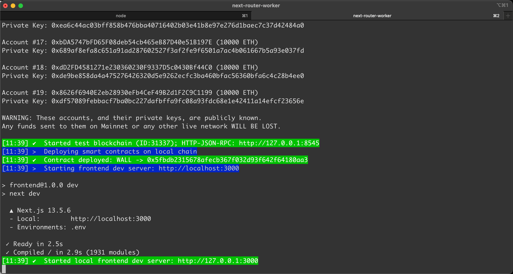
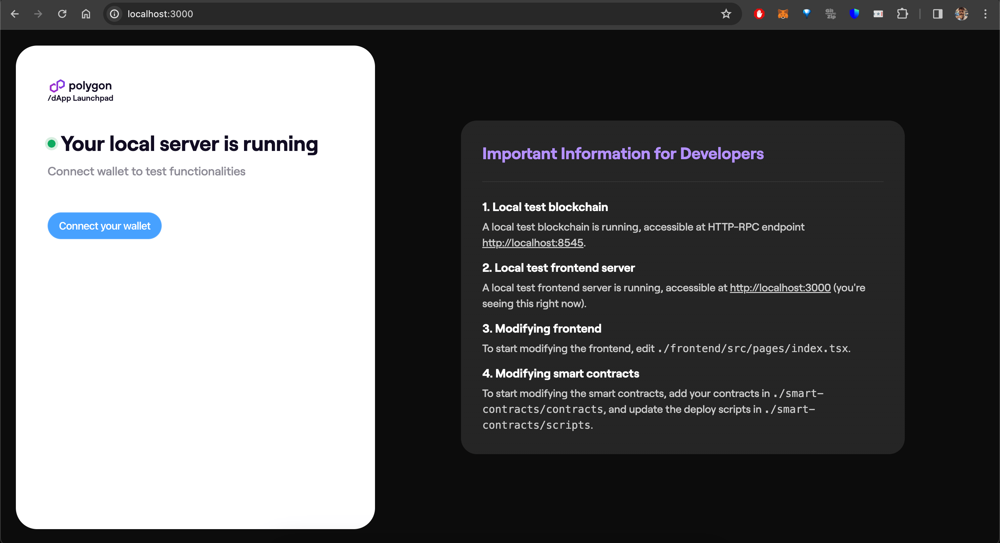

## Prerequisites

- [Node](https://nodejs.org/en/download) version 18.x.x is recommended.
- Anything above Node version 16.14.x is supported.
- We recommend [https://github.com/nvm-sh/nvm](https://github.com/nvm-sh/nvm) for managing Node installations.

## Install the app

Open a terminal window and run the following command to install the launchpad:

```sh
npm install -g @polygonlabs/dapp-launchpad
```

## Initialize a new project

```sh
dapp-launchpad init <PROJECT-NAME>
```

This creates a new directory in your current directory, initializes a minimal dApp project, and installs the required packages.

### Project templates

By default, the scaffolded project uses JavaScript. For TypeScript, use the `--template` flag.

```sh
dapp-launchpad init <PROJECT-NAME> --template typescript
```

To see the available templates, run the following:

```sh
dapp-launchpad list scaffold-templates
```

## Set up environment variables

There are mandatory environment variables in both the `frontend` and `smart-contracts` directories. 

1. `cd` into your project directory.

2. Navigate to the frontend folder and copy the example file.

    ```sh
    cd frontend
    cp .env.example .env
    ```

3. Open the `.env` file and add the `NEXT_PUBLIC_WALLETCONNECT_PROJECT_ID` to the file. 

    !!! info "How to get the WalletConnect project ID"
        You can get the variable by creating an application on [WalletConnect](https://cloud.walletconnect.com/). 
        
        1. Create an account and sign in.
        2. Select **Create a new project**.
        3. Give it a name and select **Continue**. You can leave the URL empty for now.
        4. Select **AppKit** and continue.
        5. Select **Next.js** and then select the **Create** button the bottom right of the pop-up window.
        6. This brings up the dashboard. Copy the project ID form the sidebar on the left and paste it into the frontend `.env` file.

4. Navigate to the smart-contracts directory and copy the example file.

    ```sh
    cd proj/smart-contracts
    cp .env.example .env
    ```

5. Open the `.env` file and add the mandatory `PRIVATE_KEY_DEPLOYER` variable. This is a private key from any wallet account. 

    !!! info
        The other variables in the smart-contracts `.env` file are optional.

## Start developing

1. Run the following command from the project root:

    ```sh
    dapp-launchpad dev
    ```

    You will see the local test blockchain running with deployed contracts and some pre-funded wallets you can use.

    

2. Open [http://localhost:3000](http://localhost:3000) in a browser.

    

You now have a fully integrated dev environment including a local dev blockchain and a local frontend dev server. Any changes to the code automatically updates both the frontend and the smart contracts. No manual reload is necessary.

### Start developing on an existing chain fork

You can start developing by forking an existing chain. To see the available options run the following:

```sh
dapp-launchpad dev -h
```

The chain name options are in this section of the help output:

```sh
-n, --fork-network-name [NAME]        Name of the network to fork; optional. 
                                        By default, it starts a new
                                        chain from genesis block. (choices: "ethereum", "goerli",
                                        "polygonPos", "polygonAmoy", "polygonZkevm", "polygonZkevmTestnet")
```

To fork Polygon zkEVM, for example, run the following command:

```sh
dapp-launchpad dev -n polygonZkevm
```

To fork at a particular block number run the command including the optional flag `-b`:

```sh
dapp-launchpad dev -n polygonZkevm -b [BLOCK_NUMBER_TO_FORK_AT]
```

## Deploy your app to production

To deploy your project to production, run:

```sh
dapp-launchpad deploy -n <CHAIN-NAME>
```

This does two things:

1. Deploys all your smart contracts to the selected chain, and logs the deployment results.
2. Deploys your frontend to Vercel, and logs the deployment URL.

To deploy only the smart contracts, run:

```sh
dapp-launchpad deploy -n CHAIN_NAME --only-smart-contracts
```

To deploy only the frontend, run:

```sh
dapp-launchpad deploy -n CHAIN_NAME --only-frontend
```

!!! important
    The frontend deployment requires that smart contracts to have already been deployed, so if you are only deploying the frontend, make sure that you:

    1. Have already run the smart contracts deploy command successfully.
    2. If not, run the following wizard command:
    
            `generate smart-contracts-config -e production -n CHAIN_NAME`