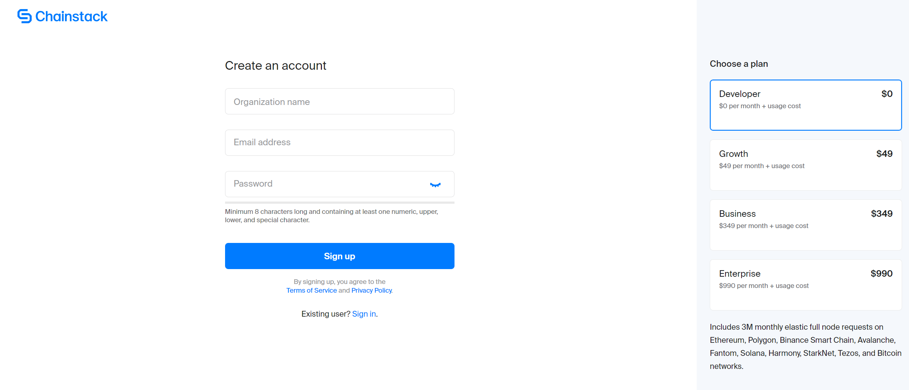
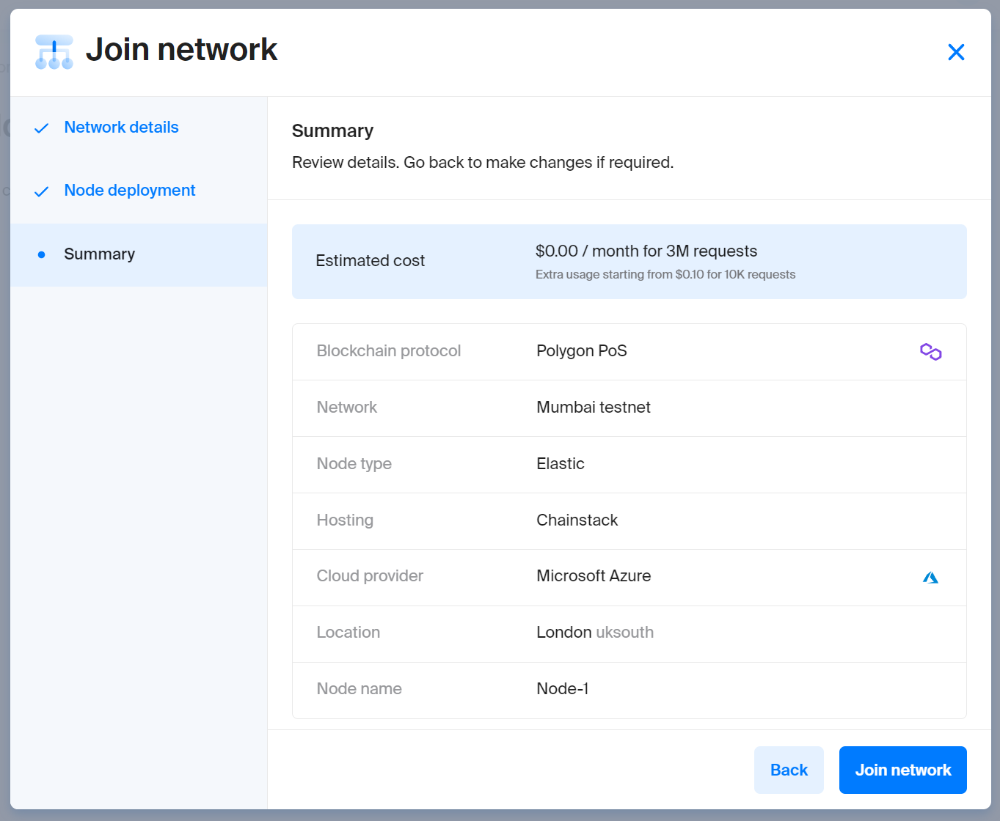

!!! warning "Third-party content"

    Polygon technical documentation may contain third-party content, including websites, products, and services, that are provided for informational purposes only.

    Polygon Labs does not endorse, warrant, or make any representations regarding the accuracy, quality, reliability, or legality of any third-party websites, products, or services. If you decide to access any third-party content, you do so entirely at your own risk and subject to the terms and conditions of use for such websites. Polygon Labs reserves the right to withdraw such references and links without notice.

    Polygon technical documentation serves as an industry public good and is made available under the [MIT License](https://opensource.org/license/mit/). In addition, please view the official [Polygon Labs Terms of Use](https://polygon.technology/terms-of-use).

This section guides you through deploying a Hello World contract using [Chainstack](https://chainstack.com/build-better-with-polygon/) and [Foundry](https://github.com/gakonst/foundry/) on the Polygon Mumbai testnet.

Chainstack provides infrastructure for Ethereum-based applications and other blockchains. They maintain nodes and guarantee their connection to the network and also offer an interface to interact with mainnet and testnets.

Foundry is a fast toolkit for Ethereum application development written in Rust. It provides testing, interaction with EVM smart contracts, sending transactions, and blockchain data retrieval.

!!! tip

    If you have any questions, reach out in the [Chainstack Discord](https://discord.com/invite/Cymtg2f7pX) server.

## What you will learn

Create a Hello World contract, using Chainstack to deploy a Polygon node and Foundry to deploy the contract.

## What you will do

1. Deploy a Polygon node using Chainstack
2. Set up Foundry
3. Create the smart contract
4. Deploy the smart contract.

## Deploy a Polygon Mumbai Node

You need a node to deploy a smart contract to the blockchain network. Follow the steps below to get your node up and running:

**Step 1 &rarr;** Sign up with [Chainstack](https://console.chainstack.com/user/account/create)



**Step 2 &rarr;** Follow the instructions on how to [deploy a Mumbai node](https://docs.chainstack.com/platform/join-a-public-network#join-a-polygon-pos-network)



**Step 3 &rarr;** Get the [deployed node’s HTTPS endpoint](https://docs.chainstack.com/platform/view-node-access-and-credentials)

## Install Foundry

Foundry is a development toolkit to work with smart contracts. To begin working with it, you need to install the Rust coding language first.

1. [Install Rust](https://www.rust-lang.org/tools/install).
1. [Install Foundry](https://github.com/gakonst/foundry/).

## Initialize with Foundry

To create a boilerplate project, navigate to your working directory and run:

```
forge init PROJECT_NAME
// PROJECT_NAME - name of project
```

## Fund Your Account

You will need a wallet account to deploy the smart contract. You can use [Metamask](https://metamask.io/) for that. You also need to pay gas on the network to deploy the contract. Just copy your wallet address and get Mumbai MATIC token [through the faucet](https://faucet.polygon.technology/).

## Create the Hello World contract

In the initialized Foundry project in `src/`, create `HelloWorld.sol`:

```
// SPDX-License-Identifier: None

// Specifies the version of Solidity, using semantic versioning.
// Learn more: https://solidity.readthedocs.io/en/v0.5.10/layout-of-source-files.html#pragma
pragma solidity >=0.8.9;

// Defines a contract named `HelloWorld`.
// A contract is a collection of functions and data (its state). Once deployed, a contract resides at a specific address on the Ethereum blockchain. Learn more: https://solidity.readthedocs.io/en/v0.5.10/structure-of-a-contract.html
contract HelloWorld {

   //Emitted when update function is called
   //Smart contract events are a way for your contract to communicate that something happened on the blockchain to your app front-end, which can be 'listening' for certain events and take action when they happen.
   event UpdatedMessages(string oldStr, string newStr);

   // Declares a state variable `message` of type `string`.
   // State variables are variables whose values are permanently stored in contract storage. The keyword `public` makes variables accessible from outside a contract and creates a function that other contracts or clients can call to access the value.
   string public message;

   // Similar to many class-based object-oriented languages, a constructor is a special function that is only executed upon contract creation.
   // Constructors are used to initialize the contract's data. Learn more:https://solidity.readthedocs.io/en/v0.5.10/contracts.html#constructors
   constructor(string memory initMessage) {

      // Accepts a string argument `initMessage` and sets the value into the contract's `message` storage variable).
      message = initMessage;
   }

   // A public function that accepts a string argument and updates the `message` storage variable.
   function update(string memory newMessage) public {
      string memory oldMsg = message;
      message = newMessage;
      emit UpdatedMessages(oldMsg, newMessage);
   }
}
```

## Deploy the Contract

At this point, you are ready to deploy your contract:

* You have your own node on the Polygon Mumbai network through which you will deploy the contract.
* You have Foundry that you will use to deploy the contract.
* You have a funded account that will deploy the contract.

To deploy the contract, run:

```bash
forge create HelloWorld --constructor-args "Hello" --contracts CONTRACT_PATH --private-key PRIVATE_KEY --rpc-url HTTPS_ENDPOINT
```

Here,

* CONTRACT_PATH — path to your `HelloWorld.sol` file.
* PRIVATE_KEY — the private key from your account.
* HTTPS_ENDPOINT — [your node's endpoint](https://docs.chainstack.com/platform/view-node-access-and-credentials).

Example:

``` sh
forge create HelloWorld --constructor-args "Hello" --contracts /root/foundry/src/HelloWorld.sol --private-key d8936f6eae35c73a14ea7c1aabb8d068e16889a7f516c8abc482ba4e1489f4cd --rpc-url https://nd-123-456-789.p2pify.com/3c6e0b8a9c15224a8228b9a98ca1531d
```

!!! tip

    You can always check the contract's deployment on [Mumbai Polygonscan](https://mumbai.polygonscan.com/) using the newly-generated hash from the last step.

## Test the Contract

There is a `forge test` command in case you need to check whether the contract is working fine. Foundry provides many [options](https://book.getfoundry.sh/reference/forge/forge-test) (flags) for more specific tests. Learn more about writing tests, advanced testing and other features at [Foundry's documentation](https://book.getfoundry.sh/forge/tests).

**Congratulations! You have deployed your Hello World smart contract on Polygon.**

See also Chainstack docs for more Polygon-related [tutorials](https://docs.chainstack.com/tutorials/polygon/) and [tools](https://docs.chainstack.com/operations/polygon/tools).
