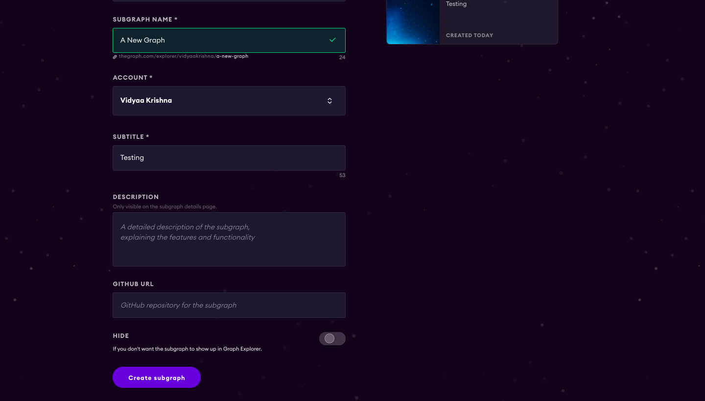

!!! info "Content disclaimer"

    Please view the third-party content disclaimer [here](https://github.com/0xPolygon/polygon-docs/blob/main/CONTENT_DISCLAIMER.md).

The Graph, a decentralized protocol for indexing and querying chain data, supports the Matic chain. Data defined through subgraphs is easy to query and explore. Subgraphs can be created locally, or use a free hosted explorer for indexing and data display.

> Note: See <https://thegraph.com/docs/quick-start> for more details, local installation and more. The docs include an example for learning how subgraphs work and this video provides a good introduction.

## Steps

1. Go to Graph Explorer (<https://thegraph.com/explorer/>) and setup an account. You will need a GitHub account for authentication.

1. Go to your dashboard and click Add Subgraph. Define the subgraph Name, Account, and Subtitle and update the image and other info (you can update later) if desired.

    

1. Install Graph CLI on your machine (using either npm or yarn).

    ```bash
    npm install -g @graphprotocol/graph-cli
    yarn global add @graphprotocol/graph-cli
    ```

1. The following command creates a subgraph that indexes all events of an existing contract. It attempts to fetch the contract ABI from BlockScout and falls back to requesting a local file path. If any of the optional arguments are missing, it takes you through an interactive form.

      ```bash
      graph init \
        --from-contract <CONTRACT_ADDRESS> \
        [--network Matic ] \
        [--abi <FILE>] \
        <GITHUB_USER>/<SUBGRAPH_NAME> [<DIRECTORY>]

      --network: choose “Matic” for Matic mainnet and “Mumbai” for Matic Testnet.
      --from-contract <CONTRACT_ADDRESS> is the address of your existing contract which you have deployed on the Matic network: Testnet or Mainnet.
      --abi <FILE> is a local path to a contract ABI file (optional, If verified in BlockScout, the graph will grab the ABI, otherwise you will need to manually add the ABI. You can save the abi from BlockScout or by running truffle compile or solc on a public project.)
      The <GITHUB_USER> is your github user or organization name, <SUBGRAPH_NAME> is the name for your subgraph, and <DIRECTORY> is the optional name of the directory where graph init will put the example subgraph manifest.
      ```

    >Note: More details are here: <https://thegraph.com/docs/define-a-subgraph#create-a-subgraph-project>

1. Authenticate with the hosted service.

      ```bash
      graph auth https://api.thegraph.com/deploy/ <your-access-token>
      ```

      You can find the access token by going to your dashboard on the graph website.

1. `cd` to the directory you created and start defining the subgraph. Information on creating a subgraph is available in the Graph Docs here: <https://thegraph.com/docs/define-a-subgraph>.

1. When you are ready, deploy your subgraph. You can always test and redeploy as needed.

    >If your previously deployed subgraph is still in status Syncing, it will be immediately replaced with the newly deployed version. If the previously deployed subgraph is already fully synced, Graph Node will mark the newly deployed version as the Pending Version, sync it in the background, and only replace the currently deployed version with the new one once syncing the new version has finished. This ensures that you have a subgraph to work with while the new version is syncing.

    ```bash
    yarn deploy
    ```

    Your subgraph will be deployed and can be accessed from your dashboard.

You can learn about querying the subgraph here: <https://thegraph.com/docs/query-the-graph#using-the-graph-explorer>.

If you want to make your subgraph public, you can do so by accessing your subgraph from your dashboard and then click on edit button. You will see the slider at the bottom of edit page.
