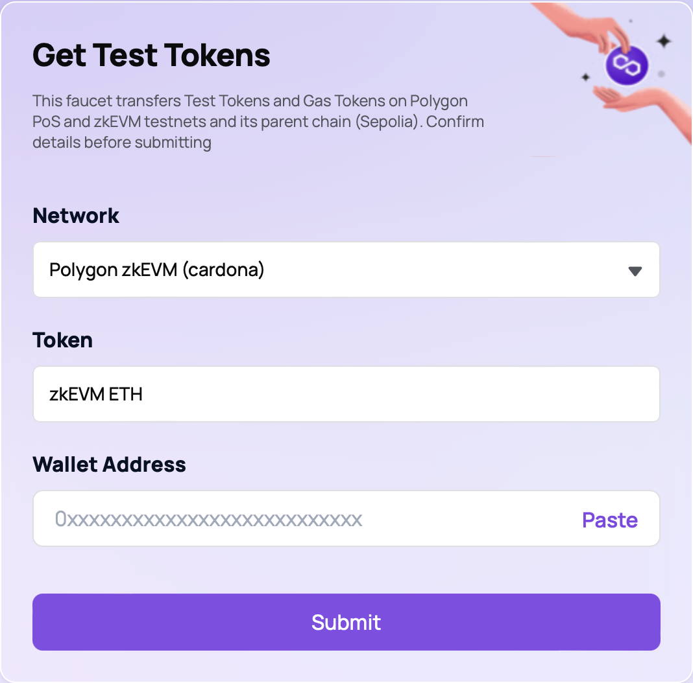
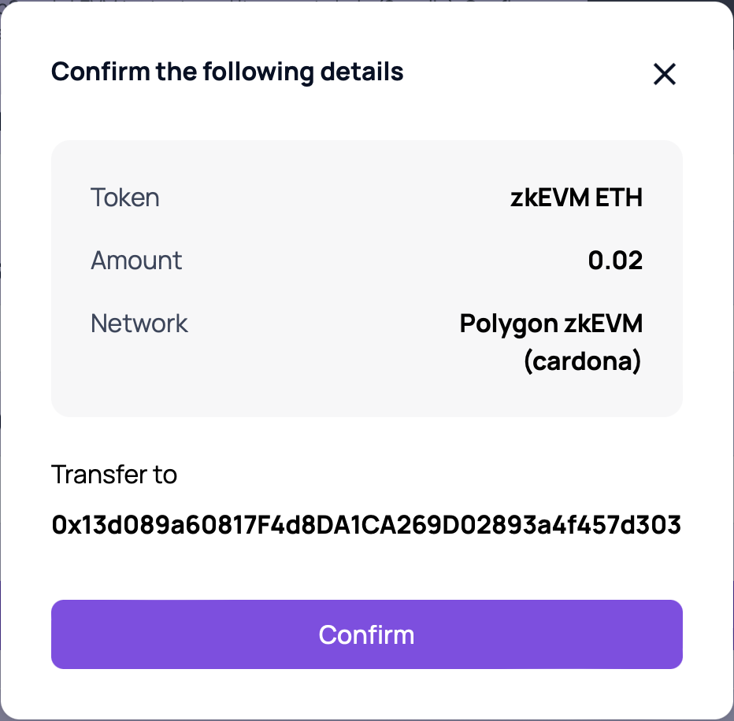
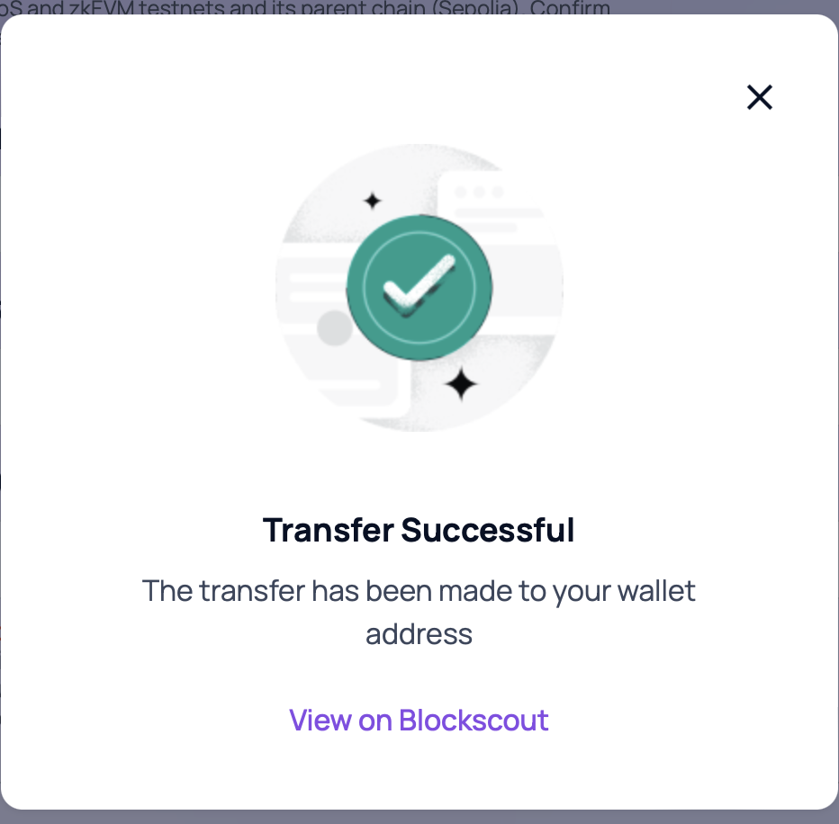
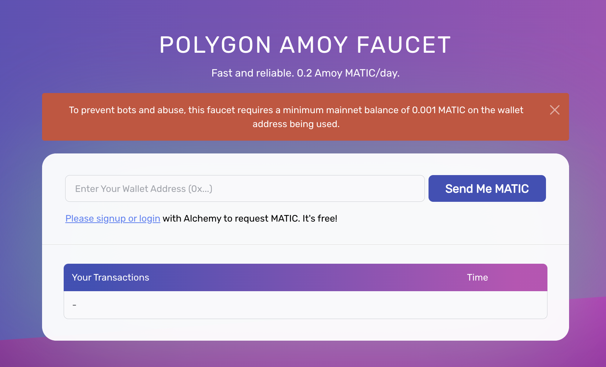
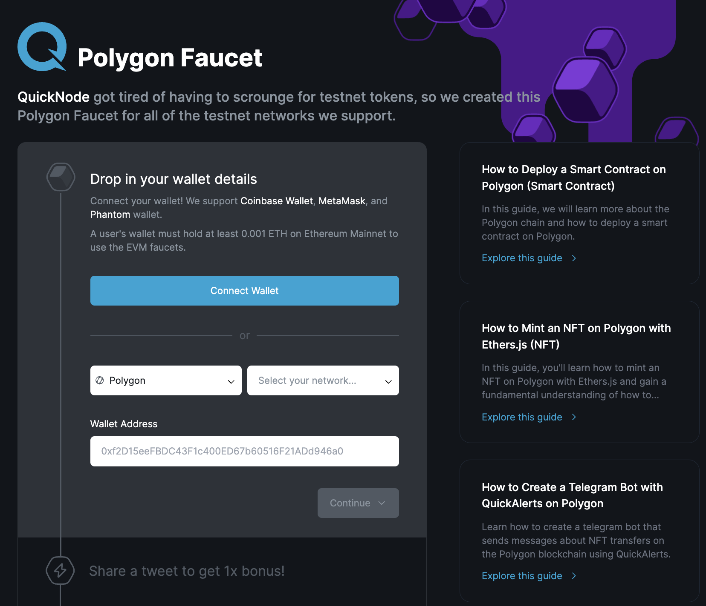

!!! info "Testnet tokens hold no real-world value"
      Tokens on testnets such as PoS Amoy, Ethereum Sepolia, and zkEVM Cardona hold no real value and are solely used for testing purposes.

Several faucet tools are available to receive test POL and ETH on Sepolia-anchored Polygon networks:

|          Faucet          | Supported testnets                                                                                                               |
| :----------------------: | -------------------------------------------------------------------------------------------------------------------------------- |
|      Polygon Faucet      | [zkEVM Cardona, PoS Amoy, Ethereum Sepolia](https://faucet.polygon.technology)                                                   |
|      Alchemy Faucet      | [PoS Amoy](https://www.alchemy.com/faucets/polygon-amoy) \| [Ethereum Sepolia](https://www.alchemy.com/faucets/ethereum-sepolia) |
| QuickNode Polygon Faucet | [PoS Amoy](https://faucet.quicknode.com/polygon/amoy)                                                                            |
|     GetBlock Faucet      | [PoS Amoy](https://getblock.io/faucet/matic-amoy/) \| [Ethereum Sepolia](https://getblock.io/faucet/eth-sepolia)                 |
|     StakePool Faucet     | [PoS Amoy, Ethereum Sepolia](https://faucet.stakepool.dev.br/)                                                                   |

## Polygon Faucet

The Polygon Faucet is a tool provided by Polygon and ecosystem partners like Alchemy, QuickNode, and GetBlock. It enables developers to acquire free POL/ETH test tokens on the PoS Amoy and zkEVM Cardona testnets. Start deploying and testing your dApps on the Polygon network with test tokens that allow you to explore Polygon features without spending actual POL tokens on the mainnet.

Polygon Faucet drips:

- POL on PoS Amoy.
- POL and a dummy ERC20 token on Ethereum Sepolia.
- Test ETH on zkEVM Cardona.

- Start by navigating to [faucet.polygon.technology](https://faucet.polygon.technology/) and connecting/verifying your Discord by selecting **Connect Discord** in the top-right corner of the page.

   

   {width=70%}
   

- Select one of the blockchain testnet networks from the drop-down list. We'll select **Polygon zkEVM (cardona)** for this example.

- Select the type of token you want to receive; zkEVM ETH in this case.

- Copy your wallet address and either paste it directly in the **Wallet Address** field, or select **Paste**. Typing is disabled to prevent entering a wrong address.

- Select **Submit**. 

- Verify the details and select **Confirm** to finalize the transaction.

   

   {width=50%}
   

- Testnet tokens usually arrive within 1 to 2 minutes.

   

   {width=50%}
   

!!! tip "Always maintain sufficient test token balance"

      If you don't have enough POL/ETH test tokens in your wallet account to pay for gas fees when sending transactions, the action will fail. If you require testnet tokens in bulk, please fill out [this form](https://docs.google.com/forms/d/e/1FAIpQLSe4npoGldJknEs9EBtPaV3AS-0HTso2IuMWDCiMmLEMCx8euQ/viewform).

## Alchemy Faucet

!!! tip "Get 0.5 Amoy POL"
      If you sign up or log in with an Alchemy account, you get 0.5 POL per day. Without an account, you get 0.2.

- You can request POL tokens from Alchemy's Amoy Faucet. In order to receive testnet tokens, head over to the [Alchemy Polygon Amoy POL faucet](https://www.alchemy.com/faucets/polygon-amoy), enter your wallet address and hit the **Send Me POL** button.

   

- Check the transaction hash as soon as you finish requesting your POL, and view the transaction details on [Polygonscan](https://amoy.polygonscan.com/).

## QuickNode Polygon Faucet

In order to receive Amoy POL tokens using QuickNode faucet,

- Head over to the [QuickNode Polygon Faucet](https://faucet.quicknode.com/polygon). Connect your Coinbase, MetaMask, or Phantom wallet by clicking on **Connect Wallet**. Then, choose **Amoy**, and finally select **Continue**.

   

   {width=80%}
   

!!! tip "Get 2x POL"
      Tweet the [drip faucet URL](https://faucet.quicknode.com/drip) with your wallet address to get *twice* as many POL testnet tokens.

- Click on the transaction hash to view transaction details on [Polygonscan](https://amoy.polygonscan.com/).

## GetBlock Polygon Faucet

Head over to the [GetBlock Polygon Faucet](https://getblock.io/faucet/matic-amoy/) to acquire Amoy POL tokens using the GetBlock faucet.

Please register or login to request free testnet tokens.

!!! tip "Get additional tokens" 
    If you tweet about the [GetBlock Faucet](https://getblock.io/faucet/matic-amoy/), you can claim additional PoS Amoy testnet tokens.

## Discord community

Make sure to connect with the [Polygon Discord community](https://discord.com/invite/0xPolygonCommunity) for news, tips, and help.
