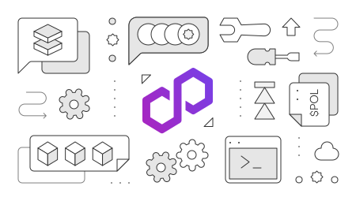

---
hide:
- toc
---

      

   

      <h1 class="hero-heading">Developer tools</h1>
      
This section describes some of the in-house and third-party tools that are used by developers to work with Polygon products and services.

      
Find out how to access data, code against blockchain networks, use oracles, and much more. 

      <i>
All third-party content in this section is covered by our <a href="https://github.com/0xPolygon/polygon-docs/blob/main/CONTENT_DISCLAIMER.md">content disclaimer</a>.</i>

   

   

      <a href="./dApp-development/launchpad/intro">
         

            
dApp Launchpad

         

         
Automated CLI tool for initializing, creating, and deploying fully-integrated, web3 dApp projects.

      </a>
   

   

      <a href="./chain-indexer-framework/overview">
         

            
Chain indexer framework

         

         
Web3 data indexing framework for developing flexible, event-driven data pipelines on EVM blockchains.

      </a>
   

   

      <a href="./gas/matic-faucet">
         

            
Token faucets

         

         
Different ways to fetch test POL and ETH on Polygon PoS and zkEVM network.

      </a>
   

   

      <a href="./matic-js/get-started">
         

            
MaticJS

         

         
The <code>matic.js</code> library used to interact with Polygon networks and services.

      </a>
   

   

      <a href="./wallets/portal">
         

            
Polygon Portal

         

         
Polygon's asset management dashboard used for bridging and claiming.

      </a>
   

   

      <a href="./wallets/getting-started">
         

            
Wallets

         

         
Using Polygon-compatible external wallets, such as MetaMask, with Polygon networks.

      </a>
   

   

      <a href="https://polygonscan.com/">
         

            
Block explorers
</a>
         

         
Links to useful explorers like 
         <a href="https://polygonscan.com/">Polygonscan</a> and 
         <a href="https://www.okx.com/web3/explorer/polygon">OKX explorer</a>.
         

   

   

      <a href="./storage/ipfs">
         

            
Storage

         

         
Interact with blockchain storage services such as IPFS.

      </a>
   

   

      <a href="./oracles/getting-started">
         

            
Oracles

         

         
Oracle services used for accessing accurate offline data.

      </a>
   

