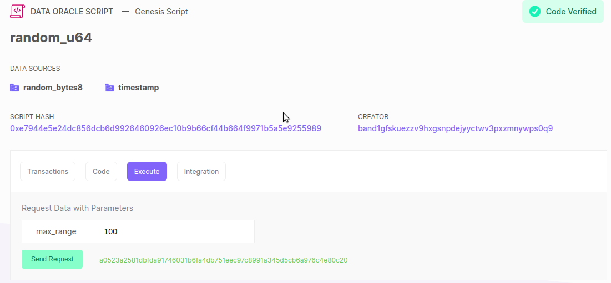

!!! info "Content disclaimer"

    Please view the third-party content disclaimer [here](https://github.com/0xPolygon/polygon-docs/blob/main/CONTENT_DISCLAIMER.md).

Band Protocol allows you to query data from traditional web APIs and use it in the blockchain. Developers can make queries through **BandChain, a cosmos-based blockchain** for facilitating oracle requests and payment, and then use the data on the dApp through inter-chain communication. Integrating oracle data can be done in 3 simple steps:

1. **Choosing the oracle scripts**

    Oracle script is a hash that uniquely identifies the type of data to be requested from band-chain. These scripts are used as one of the parameters while making the oracle request.

2. **Requesting data from BandChain**

    This can be done in two ways:

    - **Using the BandChain explorer**

        You can click on the oracle script of your choice, and then from the **Execute** tab you can pass in the parameters and get the response from BandChain. The response will contain the result and also an EVM proof. This proof has to be copied and will be used in the final step. The BandChain docs for querying oracle using explorer are available [**here**](hthttps://docs.bandchain.org/develop/custom-scripts/data-source/introduction).

        

        Given above is an example of making an oracle request to get the random number values. The value 100 is passed to the `max_range` parameter of the oracle request. We get a hash in response. Clicking on this hash will show us the complete details of the response.

    - **Using the BandChain-Devnet JS library**

        You can query BandChain directly using the BandChain-Devnet library. When queried, it gives an **EVM proof** in the response. This proof can be used for the final step of BandChain integration. The BandChain docs for querying oracle using BandChain-Devnet JS Library is available [**here**](https://docs.bandchain.org/develop/custom-scripts/data-source/introduction). The request payload for the random number oracle will look like this. Make sure the request body is passed in application/json format.

3. **Using the data in smart contracts**

  The final step is to deploy a validation contract and store the responses from the oracle request into the validation contracts state variables. Once these state variables are set, they can be accessed as and when required by the dApp. Also these state variables can be updated with new values by querying the oracle scripts again from the dApp. Given below is a validation contract that stores the random number value using the random number oracle script.

  ```jsx
  pragma solidity 0.5.14;
  pragma experimental ABIEncoderV2;

  import "BandChainLib.sol";
  import "IBridge.sol";

  contract SimplePriceDatabase {
    using BandChainLib for bytes;

    bytes32 public codeHash;
    bytes public params;
    IBridge public bridge;

    uint256 public latestPrice;
    uint256 public lastUpdate;

    constructor(
      bytes32 _codeHash ,
      bytes memory _params,
      IBridge _bridge
    ) public {
      codeHash = _codeHash;
      params = _params;
      bridge = _bridge;
    }

    function update(bytes memory _reportPrice) public {
      IBridge.VerifyOracleDataResult memory result = bridge.relayAndVerify(_reportPrice);
      uint64[] memory decodedInfo = result.data.toUint64List();

      require(result.codeHash == codeHash, "INVALID_CODEHASH");
      require(keccak256(result.params) == keccak256(params), "INVALID_PARAMS");
      require(uint256(decodedInfo[1]) > lastUpdate, "TIMESTAMP_MUST_BE_OLDER_THAN_THE_LAST_UPDATE");

      latestPrice = uint256(decodedInfo[0]);
      lastUpdate = uint256(decodedInfo[1]);
    }
  }
  ```

  When deploying, 3 parameters have to be passed. The **first parameter** is the `codeHash` which is the oracle script hash. The **second parameter** is the oracle script request parameters object. This has to be passed in bytes format. BandChain provides a REST API for converting the parameter JSON object to bytes format. The API details can be found [**here**](https://docs.bandchain.org/develop/developer-guides/obi). A 0x has to be appended to the response received from this API. The **third parameter** is the contract address of the BandChain contract that is already deployed on the Polygon network. Band Protocol supports Polygon TestnetV3: 0x3ba819b03fb8d34995f68304946eefa6dcff7cbf.

  Another thing to note is that the validation contract should import the helper library and interface which is called `BandChainLib.sol` and `IBridge.sol` respectively. 
  
  Once the validation contract is deployed, the state variables can be accessed by querying from a dApp. Similarly multiple validation contracts can be created for different in-built oracle scripts. The IBridge interface has a method called `relayAndVerify()` that verifies the values being updated each time in the validation contract. The `update()` method in the validation contract has the logic to update the state variables. The EVM proof obtained from querying the oracle script has to be passed to the `update()` method. Each time a value is updated, the BandChain contract deployed on Polygon verifies the data before storing it in the contract state variable.

  The BandChain provides a decentralized network of oracles that can be used by dApps to boost their smart contract logic. The BandChain docs on deploying the contract, storing the values, and updating them can be found [**here**](https://docs.bandchain.org/dapp-developers/requesting-data-from-bandchain/requesting-data-via-js-library).
