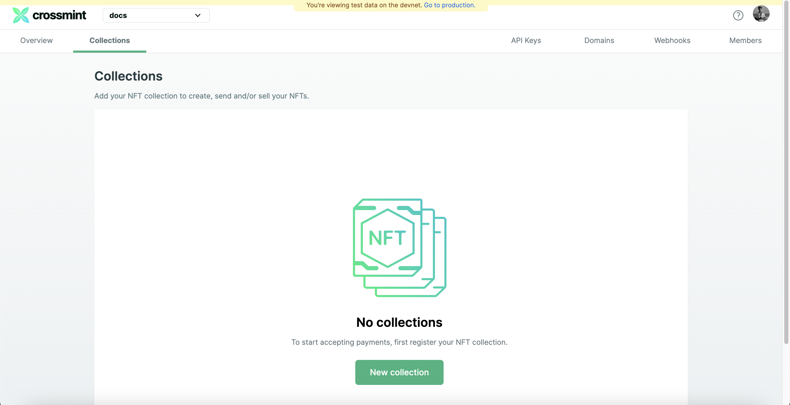
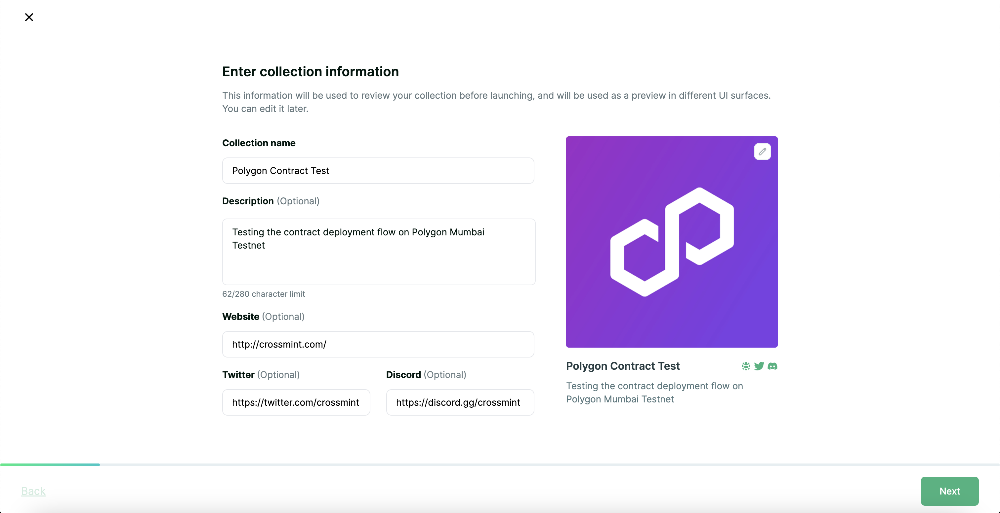
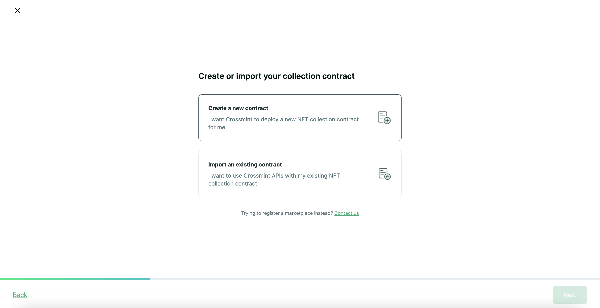
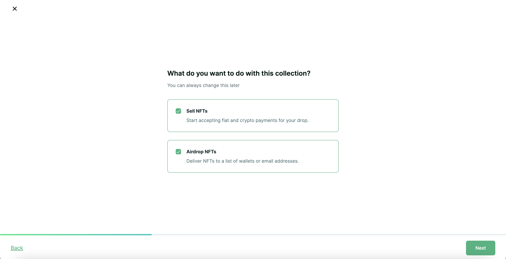
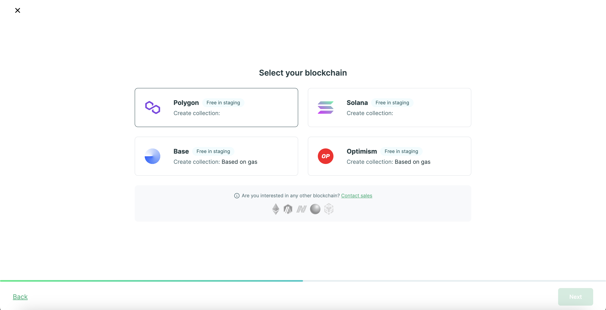
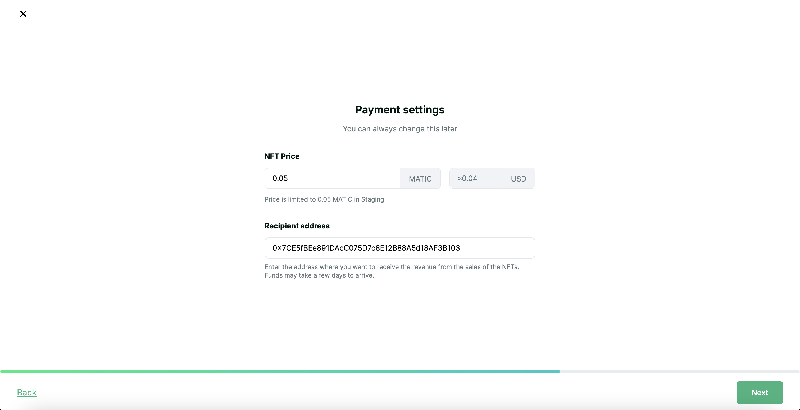
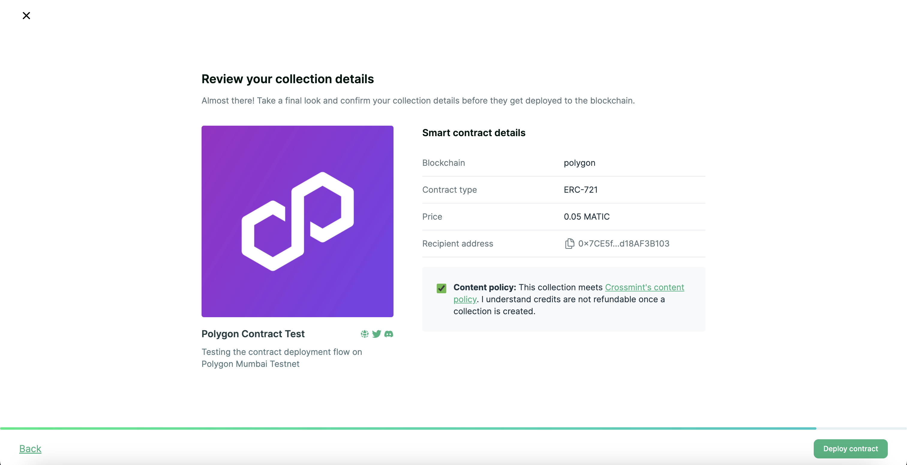
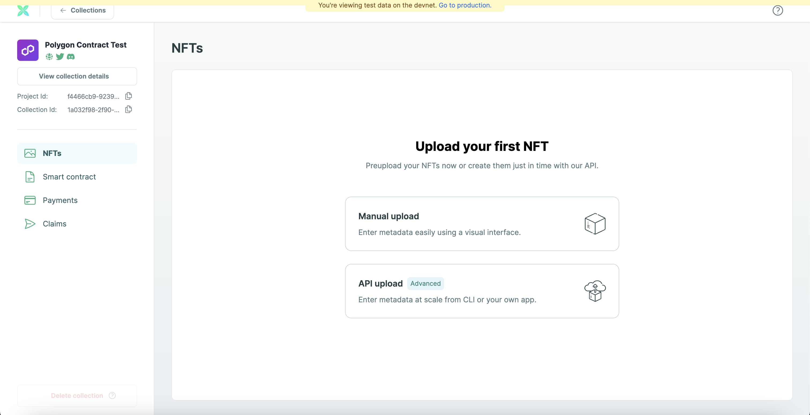

!!! info "Content disclaimer"

    Please view the third-party content disclaimer [here](https://github.com/0xPolygon/polygon-docs/blob/main/CONTENT_DISCLAIMER.md).

Crossmint is an enterprise-grade web3 development platform, allowing you to build NFT applications without requiring any blockchain experience or holding cryptocurrency, and making the blockchain invisible to end users. The platform offers a one-stop-shop for most of your NFT infrastructure needs across all major chains, including creating, distributing, selling, storing digital assets, and offering post-mint utility. 

## Create a contract

To create a new smart contract using Crossmint's Developer Console, follow the steps below.

!!! info 
    - Crossmint has two developer console environments, they are `Staging`, which works with contracts deployed on a testnet and `Production` which works with contracts deployed on a mainnet. 
    - Please use the staging environment to familiarize yourself with Crossmint before proceeding with the Production environment. 

1. Navigate to the [Crossmint's developer console page:](https://staging.crossmint.com/console/overview/?utm_source=backlinks&utm_medium=docs&utm_campaign=polygon)

    

    !!! important
        You need to create a developer account on Crossmint using your email Id before proceeding with the above step. 

2. Click on **Collections** on the top navbar.

    

3. Click on "New Collection" to create a new collection on your console.

4. Enter the collection information 
   
    - `Collection name`: The name of your contract and NFT Collection
    - `Description`: The description of your contract and NFT Collection
    - `Website`: The website of your project
    - `Twitter`: Twitter URL of your project
    - `Discord`: Invite link for your Discord server
    - Also upload the cover image for your NFT Collection and your contract. 

    

5. Click on "Create a new contract" to create a new NFT contract.

    

6. Select the preferred use-case for your collection. You can select both if you wish to do so and this can be changed later. 

    

7. Select your blockchain as Polygon.

    

8. Configure your Payment settings
   
    - `NFT Price`: The price per NFT in MATIC
    - `Recipient address`: Enter the address where you want to receive the revenue from the sales of the NFTs.

    

9. Review the details of your collection and click on "Deploy contract"

    

10. Now you can upload your NFTs along with their metadata

    

!!! note
    For additional information on Deploy, please refer to [Crossmint’s documentation](https://docs.crossmint.com/minting/guides/create-collections/?utm_source=backlinks&utm_medium=docs&utm_campaign=polygon).

## Verify the contract

Contracts deployed to [Polygon](https://docs.crossmint.com/minting/introduction/?utm_source=backlinks&utm_medium=docs&utm_campaign=polygon) are automatically verified by **Crossmint**. You can check the status on the Polygonscan. 

## Need more help?

If you have any questions or encounter any issues during the process, please reach out to the [official Crossmint support](https://help.crossmint.com/hc/en-us/?utm_source=backlinks&utm_medium=docs&utm_campaign=polygon) or to us on our [official Discord server](https://discord.com/invite/crossmint/?utm_source=backlinks&utm_medium=docs&utm_campaign=polygon).
