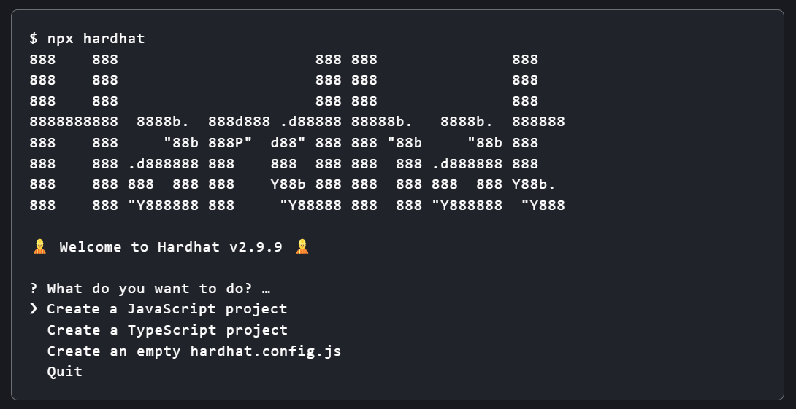
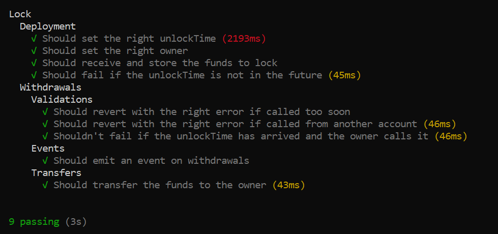

## Overview

Hardhat is an Ethereum development environment that provides an easy way to deploy smart contracts, run tests and debug Solidity code locally.

In this tutorial, you will learn how to set up Hardhat and use it to build, test and deploy a simple smart contract.

### What you will do

- Set up Hardhat.
- Create a simple smart contract.
- Compile the contract.
- Test the contract.
- Deploy the contract.

## Setting up the development environment

There are a few technical requirements before we start. Please install the following:

- [Node.js v10+ LTS and npm](https://nodejs.org/en/) (comes with Node)
- [Git](https://git-scm.com/)

Once we have those installed, you need to create an npm project by going to an empty folder, running `npm init`, and following its instructions to install Hardhat. Once your project is ready, you should run:

```bash
npm install --save-dev hardhat
```

To create your Hardhat project, run `npx hardhat` in your project folder.
Let’s create the sample project and go through these steps to try out a sample task and compile, test and deploy the sample contract.

!!! note
    The sample project used here comes from the [Hardhat Quickstart guide](https://hardhat.org/getting-started/#quick-start), as well as its instructions.

## Creating a project

To create a sample project, run `npx hardhat` in your project folder. You should see the following prompt:



Choose the JavaScript project and go through these steps to compile, test and deploy the sample contract.

### Checking the contract

The `contracts` folder contains `Lock.sol`, which is a sample contract which consistis of a simple digital lock, where users could only withdraw funds after a given period of time.

```solidity
// SPDX-License-Identifier: UNLICENSED
pragma solidity ^0.8.9;

// Import this file to use console.log
import "hardhat/console.sol";

contract Lock {
    uint public unlockTime;
    address payable public owner;

    event Withdrawal(uint amount, uint when);

    constructor(uint _unlockTime) payable {
        require(
            block.timestamp < _unlockTime,
            "Unlock time should be in the future"
        );

        unlockTime = _unlockTime;
        owner = payable(msg.sender);
    }

    function withdraw() public {
        // Uncomment this line to print a log in your terminal
        // console.log("Unlock time is %o and block timestamp is %o", unlockTime, block.timestamp);

        require(block.timestamp >= unlockTime, "You can't withdraw yet");
        require(msg.sender == owner, "You aren't the owner");

        emit Withdrawal(address(this).balance, block.timestamp);

        owner.transfer(address(this).balance);
    }
}
```

### Setting up the contract

- Go to `hardhat.config.js`
- Update the `hardhat-config` with matic-network-credentials
- Create `.env` file in the root to store your private key
- Add Polygonscan API key to `.env` file to verify the contract on Polygonscan. You can generate an API key by [creating an account](https://polygonscan.com/register)

```js
require('dotenv').config();
require("@nomiclabs/hardhat-ethers");
require("@nomiclabs/hardhat-etherscan");

module.exports = {
  defaultNetwork: "polygon_mumbai",
  networks: {
    hardhat: {
    },
    polygon_mumbai: {
      url: "https://rpc-mumbai.maticvigil.com",
      accounts: [process.env.PRIVATE_KEY]
    }
  },
  etherscan: {
    apiKey: process.env.POLYGONSCAN_API_KEY
  },
  solidity: {
    version: "0.8.9",
    settings: {
      optimizer: {
        enabled: true,
        runs: 200
      }
    }
  },
}
```

!!! note
    Note that the file above requires DOTENV, for managing environment variables and also ethers and etherscan. Make sure to install all those packages.

    Find more instructions on how to use DOTENV on [this page](https://www.npmjs.com/package/dotenv).

    You can deploy on MATIC(Polygon mainnet) if you change polygon_mumbai by MATIC.

### Compiling the contract

To compile the contract, you first need to install Hardhat Toolbox:

```bash
npm install --save-dev @nomicfoundation/hardhat-toolbox
```

Then, simply run to compile:

```bash
npx hardhat compile
```

### Testing the contract

To run tests with Hardhat, you just need to type the following:

```bash
npx hardhat test
```

And this is an expected output:



### Deploying on Polygon network

Run this command in root of the project directory:

```bash
npx hardhat run scripts/deploy.js --network polygon_mumbai
```

The contract will be deployed on Matic's Mumbai Testnet, and you can check the deployment status here: <https://mumbai.polygonscan.com/>

**Congratulations! You have successfully deployed Greeter Smart Contract. Now you can interact with the Smart Contract.**

!!! tip "Quickly verify contracts on Polygonscan"

    Run the following commands to quickly verify your contract on Polygonscan. This makes it easy for anyone to see the source code of your deployed contract. For contracts that have a constructor with a complex argument list, see [here](https://hardhat.org/plugins/nomiclabs-hardhat-etherscan.html).

    ```bash
    npm install --save-dev @nomiclabs/hardhat-etherscan
    npx hardhat verify --network polygon_mumbai 0x4b75233D4FacbAa94264930aC26f9983e50C11AF
    ```
