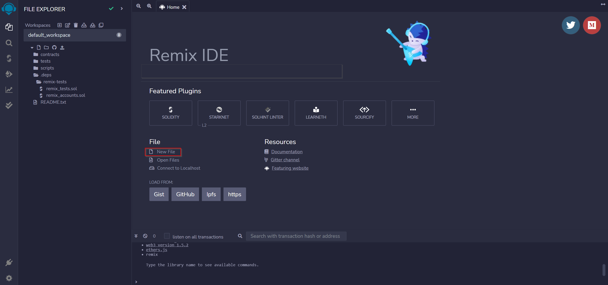
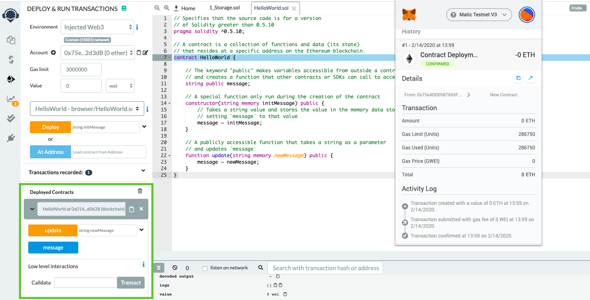
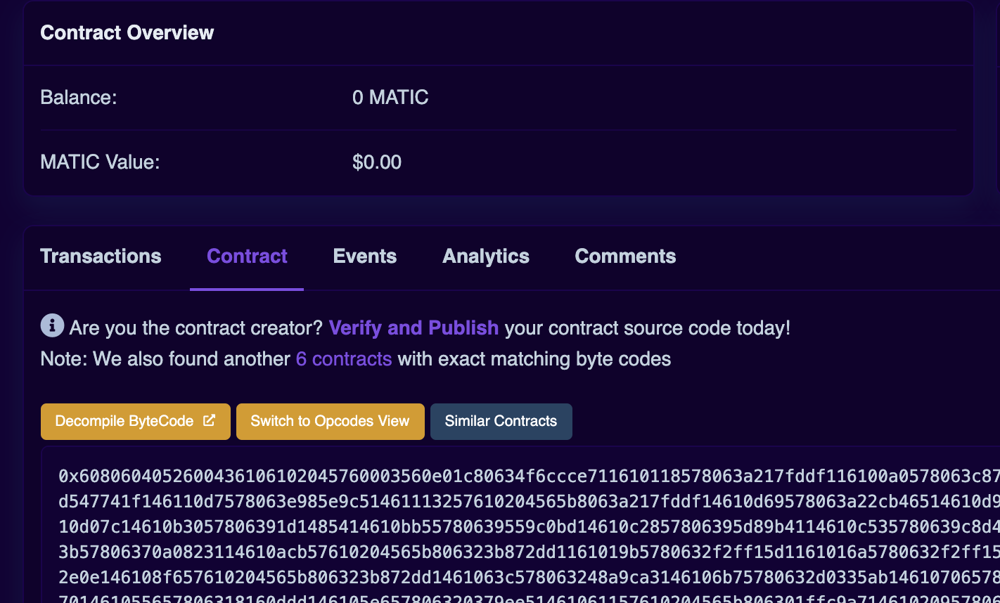

## Overview

This tutorial guides you to implement a Hello World dApp which echoes a message passed to the contract on to the frontend. You will also be able to change the message using the interactive panel.

!!! tip "Recommended"

    We recommend you to follow this tutorial using the online IDE available at [Remix IDE](https://remix.ethereum.org/). Remix IDE is an easy-to-use platform that does not require any downloads, creating accounts, or logins.

## What you will do

- Create a file on Remix.
- Upload a pre-built smart contract into the IDE.
- Compile the smart contract.
- Connect the application to the Polygon Mumbai Testnet via Metamask.
- Deploy the smart contract.
- Verify the smart contract.

## Getting started with [Remix IDE](https://remix.ethereum.org/)

Remix is a Ethereum-focused IDE: an online platform to develop and deploy smart contracts. To start building a smart contract, click on **New File** and name it `HelloWorld.sol`.



## Smart contract

Copy and paste the smart contract code provided below into the newly created `HelloWorld.sol` file.

```js title="HelloWorld.sol"
// Specifies that the source code is for a version
// of Solidity greater than 0.5.10
pragma solidity ^0.5.10;

// A contract is a collection of functions and data (its state)
// that resides at a specific address on the Ethereum blockchain.
contract HelloWorld {

    // The keyword "public" makes variables accessible from outside a contract
    // and creates a function that other contracts or SDKs can call to access the value
    string public message;

    // A special function only run during the creation of the contract
    constructor(string memory initMessage) public {
        // Takes a string value and stores the value in the memory data storage area,
        // setting `message` to that value
        message = initMessage;
    }

    // A publicly accessible function that takes a string as a parameter
    // and updates `message`
    function update(string memory newMessage) public {
        message = newMessage;
    }
}
```

The first line `pragma solidity ^0.5.10` specifies that the source code is for a Solidity version greater than 0.5.10. [Pragmas](https://solidity.readthedocs.io/en/latest/layout-of-source-files.html#pragma) are common instructions for compilers about how to treat the source code (e.g., pragma once).

A contract in the sense of Solidity is a collection of code (its functions) and data (its state) that resides at a specific address on the Ethereum blockchain. The line `string public message` declares a public state variable called `message` of type `string`. You can think of it as a single slot in a database that you can query and alter by calling functions of the code that manages the database. The keyword `public` automatically generates a function that allows you to access the current value of the state variable from outside of the contract. Without this keyword, other contracts have no way to access the variable.

The [constructor](https://solidity.readthedocs.io/en/latest/contracts.html#constructor) is a special function run during the creation of the contract and cannot be called afterward. In this case, it takes a string value `initMessage`, stores the value in the [memory](https://solidity.readthedocs.io/en/latest/introduction-to-smart-contracts.html#storage-memory-and-the-stack) data storage area, and sets `message` to that value.

The `update` function is another public function that is similar to the constructor, taking a string as a parameter, and updating the `message` variable.

## Compile smart contract

- Go to the **Solidity Compiler** tab (below the search button)

- Select compiler version to **0.5.10**

- Now, compile `HelloWorld.sol`

- After successful compilation, it will show a green tick mark on the **Compiler** tab button

## Deploying to the Mumbai testnet

Now, we have to deploy our smart contract on Mumbai, Polygon Network's Testnet. Not only does it cost money (e.g., gas fees) to deploy a smart contract on Polygon Mainnet, but also, the contract is immutable and can't be changed once deployed. Therefore, it's best to first deploy your smart contract to the Testnet first.

To deploy to the Mumbai testnet, we have to connect to the Web3 world which can be accomplished by using any of the services like Metamask, Brave, Portis, etc. We will be using MetaMask in this tutorial. Please follow this [guide to set up a MetaMask Account](../wallets/metamask/index.md).

- Open Metamask. Click on the network dropdown menu (set to **Ethereum Mainnet** by default) and click on the **Add Network** button. MaticVigil provides a public endpoint and is rate-limited. Therefore, most developers use a free blockchain provider like [Alchemy](https://docs.alchemy.com/docs/how-to-add-polygon-to-metamask) or [Quicknode](https://www.quicknode.com/guides/smart-contract-development/how-to-deploy-a-smart-contract-on-maticpolygon#setting-up-metamask-with-polygon-node) to have a dedicated RPC endpoint with faster throughput AKA computing units per second (CUPs). You need to create a free account to get your private API key from one of these providers to put into the dedicated RPC endpoint URL below.

    - **Network:** Polygon Mumbai Testnet
    - **RPC URL (public endpoint):** <https://rpc-mumbai.maticvigil.com>.
    - **RPC URL (dedicated endpoint):** <https://polygon-mumbai.g.alchemy.com/v2/your-api-key>. You'll need a [free API key](https://docs.alchemy.com)
    - **Chain ID:** 80001
    - **Currency Symbol:** MATIC
    - **Block Explorer URL:** <https://mumbai.polygonscan.com/>

- Go ahead and click **Save**

- Copy your wallet address from MetaMask by clicking over your account name

- Head over to [Faucet](https://faucet.polygon.technology/) and request test MATIC - you will need this to pay for gas on the Polygon network. Select **Mumbai** as the network and **MATIC Token** as the token in the faucet. You can also use this free [Mumbai faucet](https://mumbaifaucet.com)

- Finally, to deploy to Mumbai, refer to the instructions in the "Remix deployment" section below

## Deploying to Polygon mainnet

After you can deploy on the Mumbai Testnet without any errors (i.e., the purpose of the Testnet), let's deploy the Smart Contract on the Polygon Mainnet. Remember this will cost real $ in the form of MATIC tokens.

Similar to the steps above when you deployed to Mumbai, you open your MetaMask wallet. Click on the network dropdown menu (set to **Ethereum Mainnet** by default) and click on the **Add Network** button. Make sure to have your [Alchemy API key](https://docs.alchemy.com/docs/alchemy-quickstart-guide).

- Open Metamask

    - **Network Name**: Polygon Mainnet
    - **New RPC URL**: <https://polygon-mainnet.g.alchemy.com/v2/your-api-key>
    - **Chain ID**: 137
    - **Currency Symbol**: MATIC
    - **Block Explorer URL**: <https://polygonscan.com/>

- Go ahead and click **Save**

- Copy your wallet address from MetaMask by clicking over your account name

- Make sure your MetaMask wallet has MATIC tokens to pay the deployment / gas fees

- Finally, to deploy to Mumbai, refer to the instructions in the "Remix deployment" section below

## Remix deployment

In both Testnet and Mainnet, you do the below to deploy your smart contract using Remix. The below step will use the connect MetaMask API keys you set up in the previous steps.

- Select **Injected Provider** MetaMask in the **Environment** dropdown and your contract

  

- Accept the **Connect** request received in MetaMask. If the popup doesn't open by default, you can also try manually launching the MetaMask extension

- Once MetaMask is connected to Remix, the `Deploy` transaction would generate another MetaMask popup that requires transaction confirmation. Simply confirm the transaction!

  
<br/>

Congratulations! You have successfully deployed the HelloWorld smart contract to the Polygon Mumbai Testnet. You can start interacting with your smart contract. Check the deployment status at <https://mumbai.polygonscan.com/>.

## Verifying your contract

### Flatten your smart contract

The first and foremost step is to flatten the solidity smart contract into a single file. In order to do that, install [truffle-flattener](https://github.com/nomiclabs/truffle-flattener) or [sol-merger](https://github.com/RyuuGan/sol-merger).

After installation, flatten the contract using below command (we have demonstrated using sol-merger).

```sh
sol-merger \"./contracts/*.sol\" ./build
```

### Verifying on Polygonscan

- Navigate to your contract's Polygonscan page and click on **Verify and Publish**.

  

- Select **Solidity (Single File)** in compiler type

- Select appropriate compiler version

- Choose the license type of your contract

In the next section, paste your flattened samrt contract here. If you had enabled optimization, then adjust the `optimization` section accordingly.

Constructor arguments should have been filled in automatically. If not, they can be retrieved from the trailing bytes of the deployment transaction (example: `000000000000000000000000a6fa4fb5f76172d178d61b04b0ecd319c5d1c0aa`).
