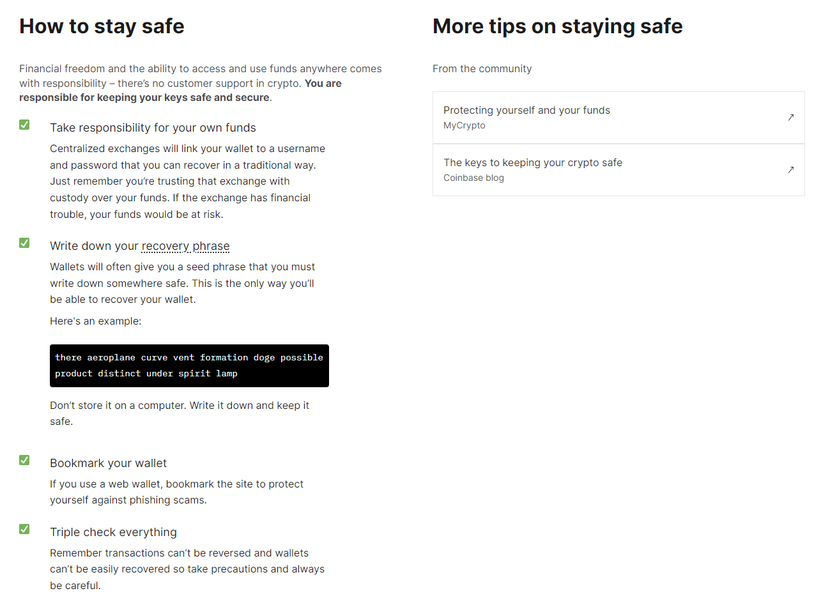

!!! warning "Content disclaimer"

      Please view the third-party content disclaimer [here](https://github.com/0xPolygon/polygon-docs/blob/main/CONTENT_DISCLAIMER.md).

This page serves as a resource for using Polygon compatible wallets which have key management and interfaces that allow users to perform chain actions and sign transactions, such as sending assets.

If you are new to the concepts and terminology of wallets, start at the [wallet basics](#wallet-basics) section of this page. You can browse through the many [third-party wallets](#third-party-wallets) that support Polygon chains, or if you already have Polygon networks in your wallet of choice, check out Polygon's native asset management solution [Polygon Portal](#polygon-portal).

!!! info "Centralized Exchanges (CEXs)"
      For a list of CEXs that support Polygon, visit a third-party tracking website such as [**CoinGecko**](https://www.coingecko.com/).

## Wallet basics

Comprehensive information and guides on wallets, including what a wallet is, how to use it, types of wallets, and key terminology can be found on the [Ethereum.org's Wallet documentation page](https://ethereum.org/en/wallets/).

### Important wallet safety information

**You are responsible for keeping your keys safe and secure.** There are many scams and pitfalls in managing your wallet and protecting it from malicious situations where bad actors will try to compromise your wallet. Ethereum.org documentation has [a How to stay safe section](https://ethereum.org/en/wallets/) on their Wallet documentation page (scroll to the middle of the page) referenced in the screenshot below. It includes some tips and links to more comprehensive articles.

There are companion plugins for wallets that help detect, warn, and prevent malicious wallet scams and transactions. Visit the [Wallet Security Tools on the Alchemy website](https://www.alchemy.com/best/wallet-security-tools). Look for the "Wallet Security Tools" tag for tools you can use to protect your wallet.

!!! warning "Wallet safety"
      The official Polygon Support **cannot** provide assistance for stolen wallet assets and third-party wallet security plugins/software. **Do your own research and be cautious**.

## Third party wallets

!!! info "Third-party"
      Some third party wallets may not have Polygon networks natively as an option in their blockchain network selection. It is very easy to fix this by using Chainlist, searching for the Polygon network you want to add to your wallet, and click the "Connect Wallet" button. More information and an example of adding a mainnet or testnet Polygon chain using Chainlist MetaMask wallet can be found [here](../wallets/metamask/add-polygon-network.md).
      
!!! warning "Third-party wallets"
      **You should do your own due diligence before using third party wallets**. The official Polygon Support **cannot** provide assistance for issues with these wallets or other non-native wallets.

[Ethereum.org's Wallet documentation page](https://ethereum.org/en/wallets/) has a comprehensive page of different wallets you can select from. There are many options to filter the list to find a wallet that is right for you including:

- Device type: browser plugin, desktop, mobile, or hardware wallet
- Security: open source, personal ownership/custody of your wallet
- Language support: filter by your preferred language

**Be sure to select "Layer 2" on the Filter menu on the left side of the page to list wallets that are compatible with Polygon networks.**

## Polygon portal

The [Polygon Portal](https://portal.polygon.technology) is a comprehensive solution for account management on Polygon.

The Portal can be used to perform a variety of tasks, such as:

- Bridge your assets via the [Polygon Native Bridge](https://support.polygon.technology/support/solutions/articles/82000905011-how-does-bridging-work-) and a variety of third-party bridges
- View your assets and token lists
- Use the Refuel Gas feature to purchase MATIC or ETH for gas on the destination chain you are sending assets to
- Swap assets easily with third-party DEXs

For more details on what features Polygon Portal offers, and how-to guides, visit the [Polygon Portal documentation page](../wallets/portal.md).