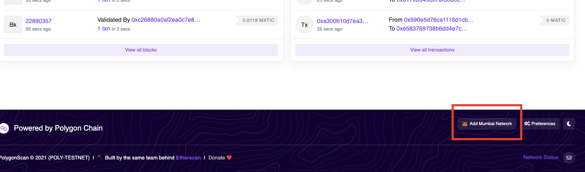
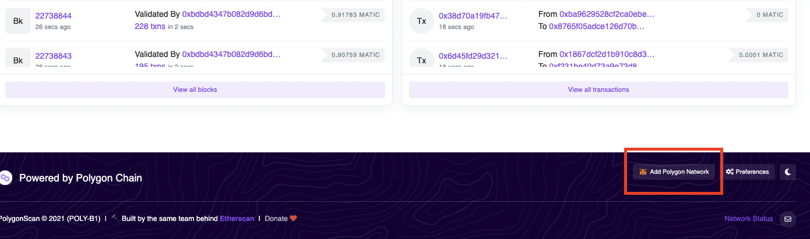
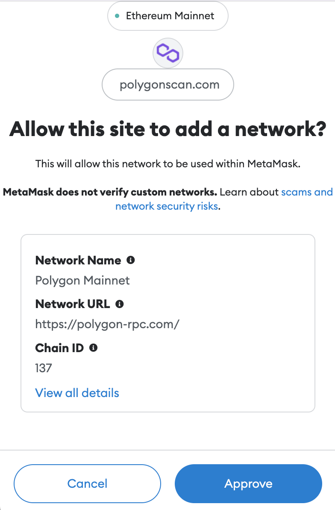
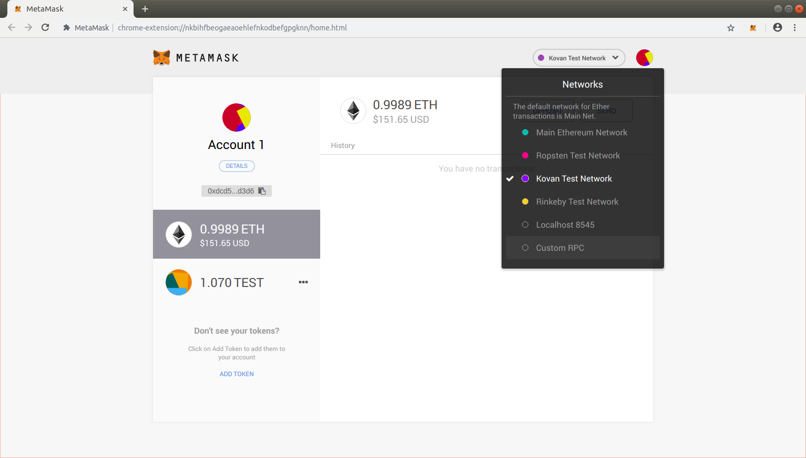
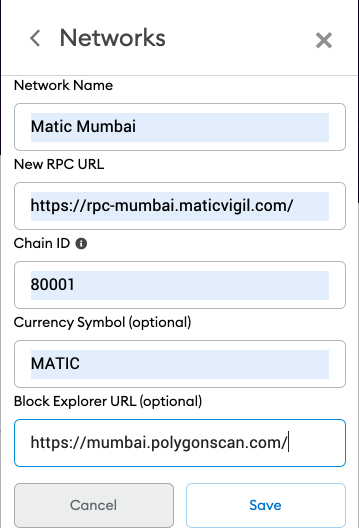
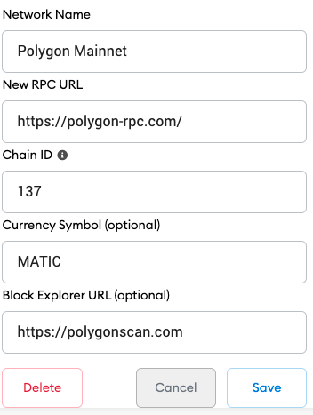
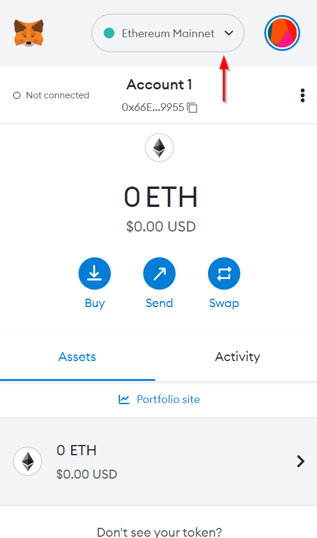
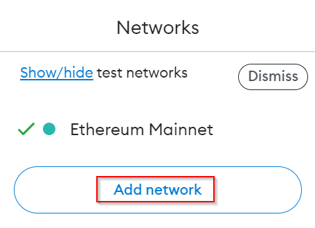
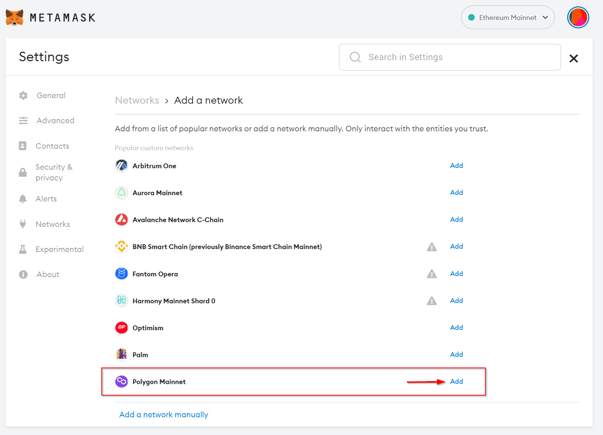
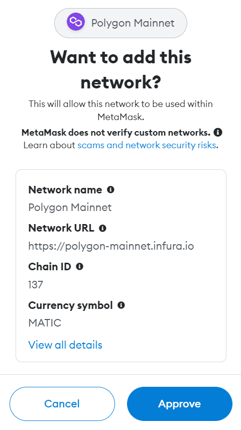

!!! caution "Content disclaimer"
    Please view the third-party content disclaimer [here](https://github.com/0xPolygon/polygon-docs/blob/main/CONTENT_DISCLAIMER.md).

In order to view the flow of funds in your accounts, on the Polygon Network, you will need to configure Polygon testnet and mainnet URLs on Metamask.

There are two ways to do it:

1. [Using Polygonscan](add-polygon-network.md#polygon-scan)
2. [Add the Polygon network manually](add-polygon-network.md#add-the-polygon-network-manually)

!!! tip
    Find a tip at the end of this article on how to easily add **Polygon Mainnet** to Metamask.

## Using Polygonscan

!!! note
    Please make sure you have already installed **[Metamask](https://metamask.io/)**!

### Mumbai

Please follow the steps to add Polygon's Mumbai-Testnet:

1. Navigate to [mumbai.polygonscan.com](https://mumbai.polygonscan.com/)
2. Scroll down to the bottom of the page and click on the button `Add Mumbai Network`

      

3. Once you click the button you will see a MetaMask Notification, now click on **Approve**.

    

      { width="50%" }
    

You will be directly switched to Polygon’s Mainnet now in the network dropdown list. You can now close the dialog.

### Mainnet

Please follow the steps to add Polygon’s Mainnet:

1. Navigate to [polygonscan.com](https://polygonscan.com/)
2. Scroll down to the bottom of the page and click on the button `Add Polygon Network`

      

3. Once you click the button you will see a MetaMask Notification, now click on **Approve**. You will be directly switched to Polygon’s Mainnet now in the network dropdown list. You can now close the dialog.

    

      { width="50%" }
    

If you are facing any issue, **add the network manually** according to the steps given below.

## Add the Polygon network manually

### Mumbai

To add Polygon's Mumbai-Testnet, click on the Network selection dropdown and then click on Custom RPC.

It will open up a form with 2 tabs on the top, Settings and Info. In the Settings tab you can add `Matic Mumbai` in the Network Name field, URL `https://rpc-mumbai.maticvigil.com/` in the New RPC URL field, `80001` in Chain ID field, `MATIC` in Currency Symbol field and `https://mumbai.polygonscan.com/` in Block Explorer URL field.

Once you’ve added the URL in the New Network field, click on Save. You will be directly switched to Polygon’s Mumbai-Testnet now in the network dropdown list. You can now close the dialog.

### Mainnet

To add Polygon’s Mainnet, click on the Network selection dropdown and then click on Custom RPC.

It will open up a form with 2 tabs on the top, Settings and Info. In the Settings tab you can add `Polygon Mainnet` in the Network Name field, URL `https://polygon-rpc.com/` in the New RPC URL field, `137` in Chain ID field, `MATIC` in Currency Symbol field and `https://polygonscan.com/` in Block Explorer URL field.

Once you’ve added the information click on Save. You will be directly switched to Polygon’s Mainnet now in the network dropdown list. You can now close the dialog.

**You have successfully added Polygon Network to your Metamask!**

!!! tip "Easy way to add Polygon mainnet"
    If you just need to add Polygon Mainnet, you can follow these steps:

    1. On Metamask, select the Network tab:
        

        { width="50%" }
        

    2. Click on **Add Network**:
        

        { width="50%" }
        

    3.  Find Polygon Mainnet on the list of available networks:
        

        { width="50%" }
        

    4. Approve the network addition:
        

        { width="50%" }
        

    Now you may see the Polygon Mainnet on the Networks tab:
    

    { width="50%" }       
    

