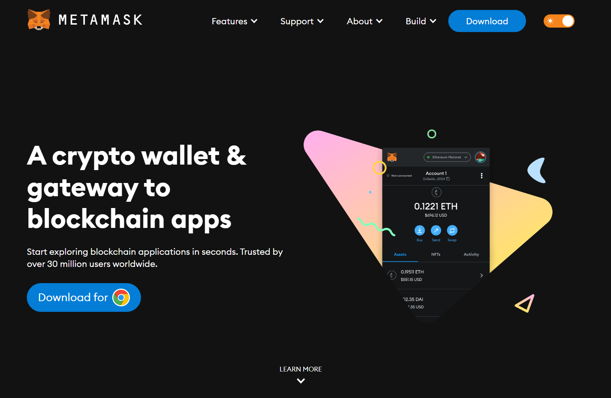
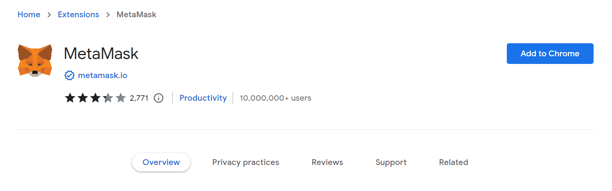
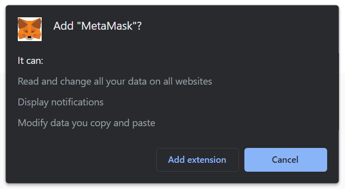
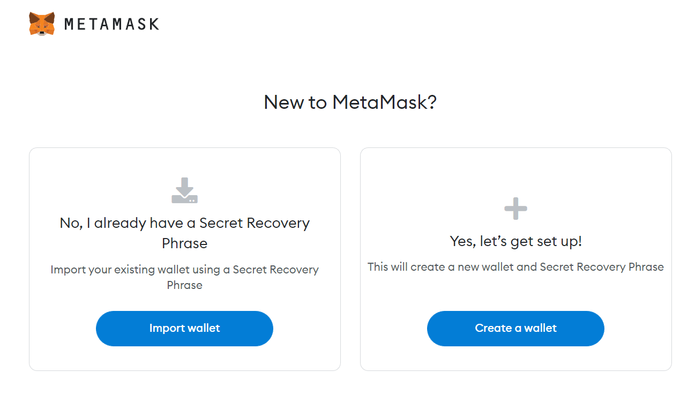
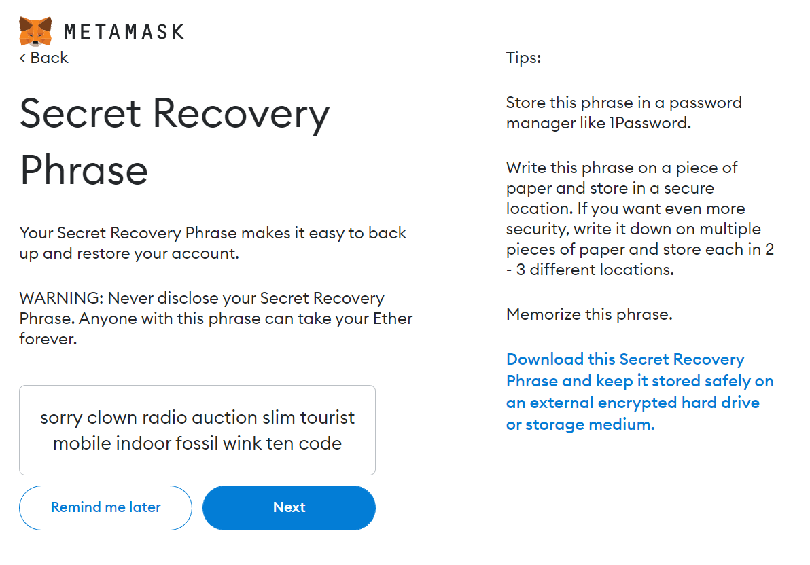
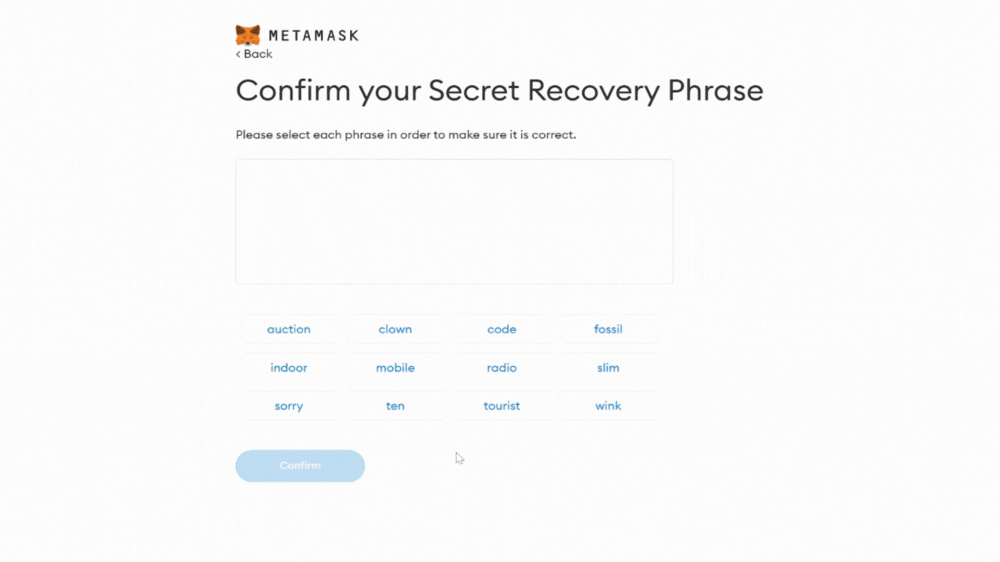

!!! caution "Content disclaimer"
    Please view the third-party content disclaimer [here](https://github.com/0xPolygon/polygon-docs/blob/main/CONTENT_DISCLAIMER.md).

If you are wondering how to create a new cryptocurrency wallet, consider creating one by installing the MetaMask extension.

MetaMask is a free and secure browser extension that allows web applications to read and interact with the Ethereum blockchain.

## Step 1. Install MetaMask on your browser

To create a new wallet with MetaMask you need to install the extension first. You can install MetaMask for [Chrome](https://chrome.google.com/webstore/detail/nkbihfbeogaeaoehlefnkodbefgpgknn), [Firefox](https://addons.mozilla.org/en-US/firefox/addon/ether-metamask/), Brave and [Opera](https://addons.opera.com/en/extensions/details/metamask/) browsers.

1. Open [https://metamask.io](https://metamask.io/) or search for “Metamask extension” using your favorite search engine.

    !!! note
        In this tutorial we will be using Google Chrome as an example, but the workflow is the same for all browsers.

    

2. Click **Download** to install MetaMask as a Google Chrome extension.

3. Click **Add to Chrome.**

    

4. Click **Add Extension**.

    

That’s it! You have successfully installed MetaMask extension!

## Step 2. Create an account

The next step is to create an account.

1. When the download is finished, you will be able to either **restore a wallet** with a Secret Recovery Phrase or **create a new account**, by creating a new wallet and generating a new Secret Recovery Phrase.

    

2. You will be asked to create a new password. Create a strong password and click **Create**.

    

    { width="50%" }
    

3. MetaMask will then provide some information about the Secret Recovery Phrase and on the next page you will see your phrase.

    

4. Write the 12-word phrase down  on a piece of paper on the same order presented.

    !!! caution
        Read carefully Metamask's instructions. Write this phrase on a piece of paper and store in a secure location. If you want even more security, write it down on multiple pieces of paper and store each in 2–3 different locations. You can even memorize this phrase.

5. Verify your secret phrase by selecting the previously generated phrase. When done, click **Confirm**.

    

By “solving this puzzle” you are confirming that you know your secret phrase.

**Congratulations!** You have successfully created your MetaMask account. A new Ethereum wallet address was automatically generated for you!
