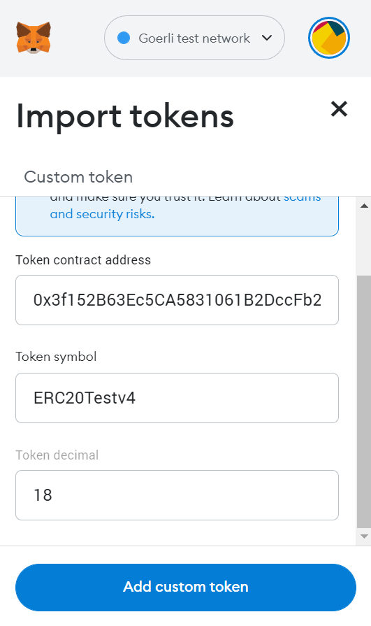
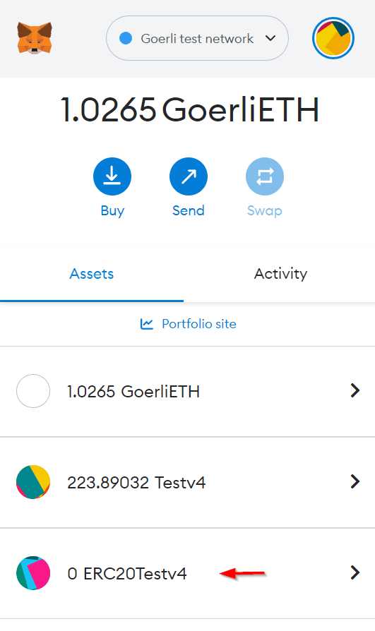

!!! caution "Content disclaimer"
    Please view the third-party content disclaimer [here](https://github.com/0xPolygon/polygon-docs/blob/main/CONTENT_DISCLAIMER.md).

This page demonstrates the process of configuring/adding custom tokens to Metamask.

You can use the same process to add any custom tokens to any network on Metamask. You can refer to [this table](#tokens-and-contract-addresses) to visualize some examples of test tokens with their respective contract addresses.

## Adding a custom token to your MetaMask account

First, choose the appropriate network for the new token on your Metamask's home screen. Then click on "Import Tokens".

{ width="50%" }

It will then navigate you to a new screen. On the Import Tokens screen, copy-paste an address in the Token Address field.

!!! info
    To illustrate this process, we are using an **ERC20-TESTV4** token on the **Goerli network**. Find other test tokens from other networks [here](#tokens-and-contract-adresses).

{ width="50%" }

The other fields will auto-populate. Click on Add Custom Tokens and then click on Import Tokens. The `TEST` token should now be displayed on your account on Metamask.

{ width="50%" }

**Adding a test ERC1155 token to your MetaMask account**

While the Polygon network supports ERC1155, [Metamask does not yet support the standard](https://metamask.zendesk.com/hc/en-us/articles/360058488651-Does-MetaMask-support-ERC-1155-). This update is expected in the fourth quarter of 2021.

### Tokens and Contract Addresses

| Token         | Network | Contract Address                             |
|---------------|---------|----------------------------------------------|
| ERC20-TESTV4  | Goerli  | `0x3f152B63Ec5CA5831061B2DccFb29a874C317502` |
| MATIC-TST     | Mumbai  | `0x2d7882beDcbfDDce29Ba99965dd3cdF7fcB10A1e` |
| ERC721-TESTV4 | Goerli  | `0xfA08B72137eF907dEB3F202a60EfBc610D2f224b` |
| ERC721-TESTV4 | Mumbai  | `0x33FC58F12A56280503b04AC7911D1EceEBcE179c` |
