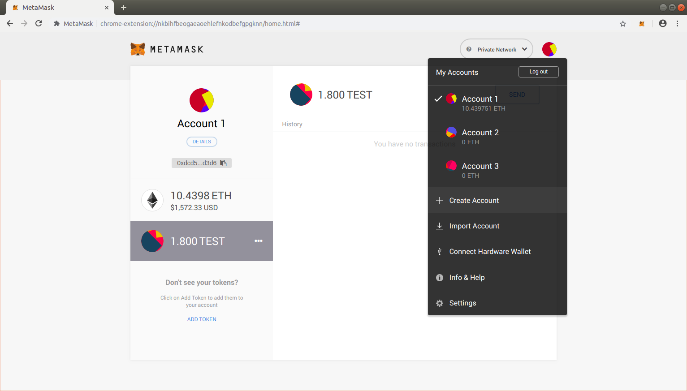
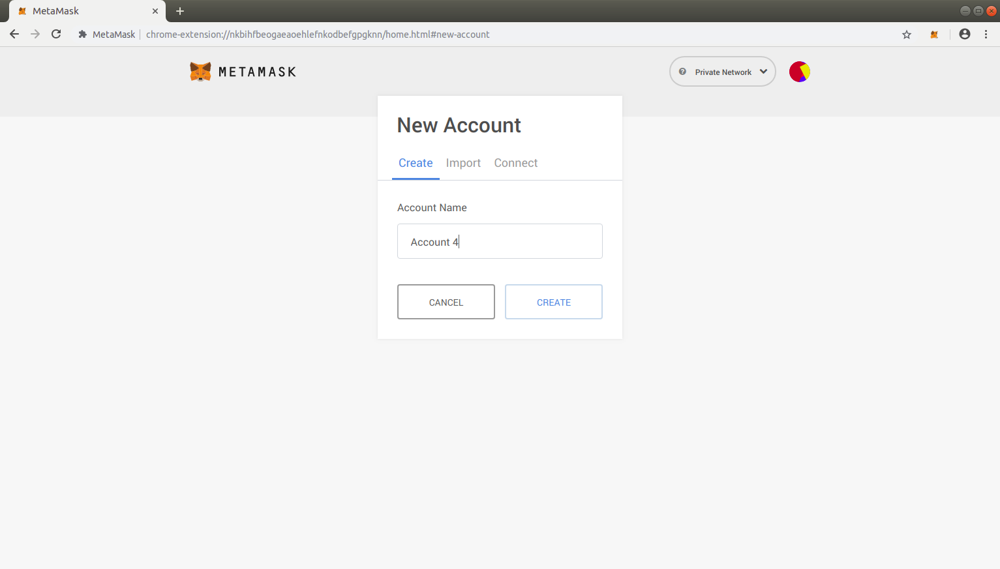
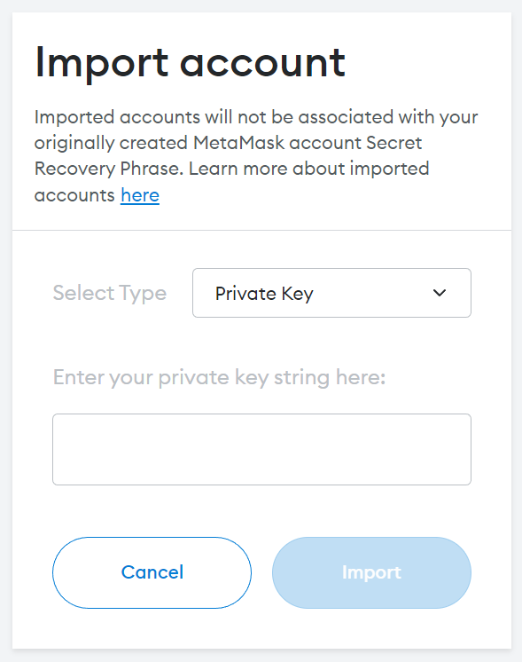

!!! caution "Content disclaimer"
    Please view the third-party content disclaimer [here](https://github.com/0xPolygon/polygon-docs/blob/main/CONTENT_DISCLAIMER.md).

In case you are new to Ethereum and Metamask, here is a guide on how to create multiple accounts and import them:

## Create account

To create multiple accounts, you click on Profile icon on MetaMask and then click on Create Account.

You can then add an account name and click on Create.

You can create more accounts this way. When you create multiple accounts, your addresses will be different at your end.

!!! tip "Import account"
    The importing process on MetaMask is similar to creating a new account. You just have to copy-paste the **Private key** (more information [here](https://metamask.zendesk.com/hc/en-us/articles/360015289632-How-to-export-an-account-s-private-key#:~:text=On%20the%20account%20page%2C%20click,click%20%E2%80%9CConfirm%E2%80%9D%20to%20proceed.)), from your local account. Then paste it into the window provided, and select Import.
    

    { width="50%" }
    

