<!--
---
comments: true
---
-->

[Polygon Portal](https://portal.polygon.technology/) is an integrated UI platform that serves as a one-stop solution for asset management and token operations such as swapping and bridging. The unified UI comes with a comprehensive dashboard that can be used by connecting your wallet via popular tools such as MetaMask, Coinbase, Bitski, Venly, WalletConnect, and more. 

The portal establishes a trustless, two-way transaction channel between the Polygon PoS and zkEVM, and Ethereum networks, along with support for LxLy chains in the Polygon Ecosystem. You can transfer your tokens across these chains without incurring third-party risks and market liquidity limitations.

!!! info
    - The bridge is operational on both testnet and mainnet.
    - The native bridge currently does not support bridging tokens between Polygon PoS and zkEVM chains.

## Features

- Faster transactions: The bridge integrates the Socket Widget to enable faster transactions.
- Support for Kyberswap: You can swap your tokens via Kyberswap directly through the portal.
- Support for third-party bridges and DEXs: The portal supports bridging and swapping tokens using third-party bridges natively through the same UI.
- Refueling: The portal integrates the 0x API to enable seamless bridging for your tokens to Polygon chains and eliminates the need to swap your tokens for the respective native token (i.e., MATIC or ETH depending upon the destination chain), or purchase them separately, to pay for gas fees.

!!! info
    The Refuel feature is limited to select tokens.

## Getting started

In this tutorial, we'll cover how to:

- [Connect to Polygon Portal](#connect-to-polygon-portal)
- [Transfer funds from Ethereum to Polygon chains](#transfer-funds-from-ethereum-to-polygon-chains)
- [Claim bridged tokens on Ethereum](#claim-bridged-tokens-on-ethereum)
- [Add custom tokens to Polygon Portal](#add-custom-tokens-to-polygon-portal)

!!! info
    If you come across any issues, [Polygon support](https://support.polygon.technology/support/home) is just a click away! Feel free to get in touch with us for assistance.

## Connect to Polygon Portal

1. Use the following URL to access Polygon Portal: https://portal.polygon.technology/

2. Click on the **Connect Wallet** button to bring up the **blocknative** wallet connect window.

    

    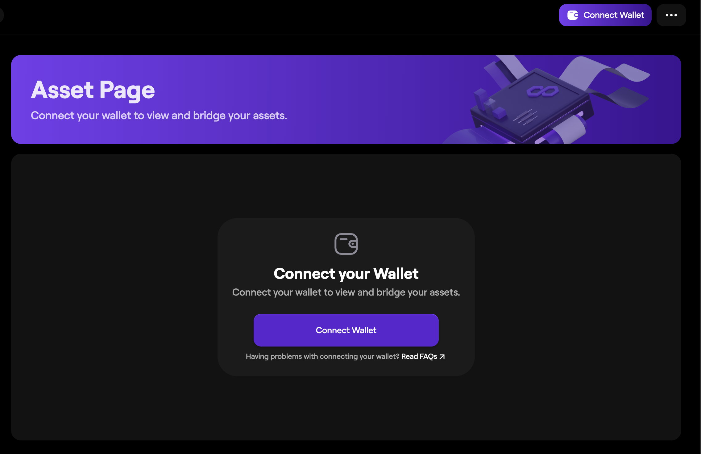{ width=60% }
    

3. Select your wallet from the options available. We'll proceed with MetaMask for the scope of this tutorial. You can connect to the portal with a Coinbase, OKX, or another wallet that supports WalletConnect.

    

    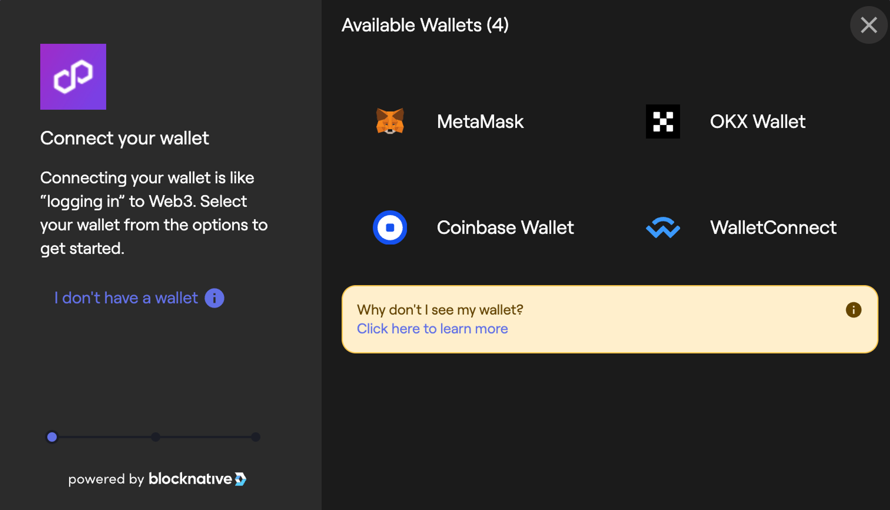{ width=60% }

    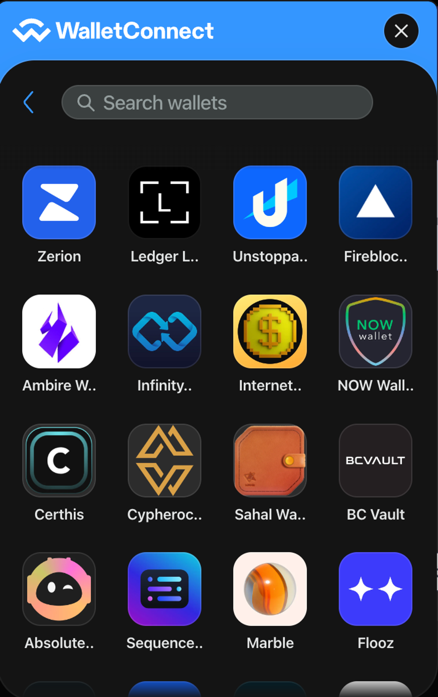{ width=60% }
    

4. Once you approve the connection in your wallet, you'll be able to you asset balances across Ethereum and Polygon chains.

    

    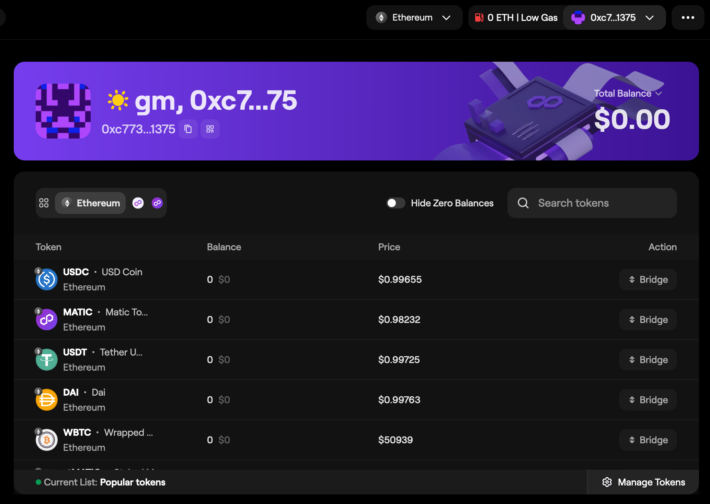{ width=60% }
    

## Transfer funds from Ethereum to Polygon chains

1. Start by navigating to the [Polygon Portal](https://portal.polygon.technology/), and then either selecting **Bridge your Asset** option on the main page, or the **Bridge** option from the sidebar on your dashboard.

    

    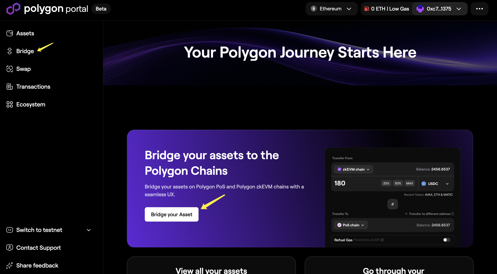{ width=60% }
    

2. Once you see the bridge widget on your main screen, input the source and destination chains.For instance, if you were transferring tokens from Ethereum to Polygon zkEVM, select the following options.

    

    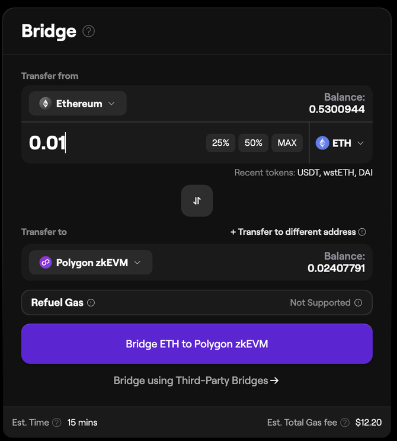{ width=60% }
    

3. Select the token from the drop-down list that you're looking to bridge from the source chain to the destination chain.

    

    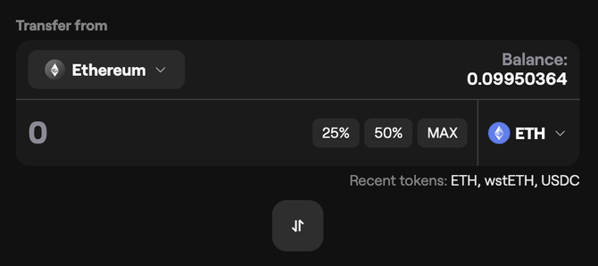{ width=60% }

    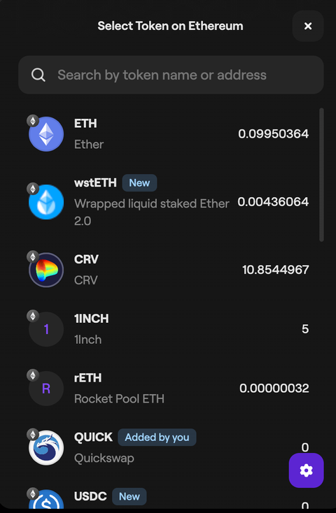{ width=60% }
    

4. Enter the transfer amount for your selected token either manually, or by selecting a percentage of your current balance.

    !!! tip "Bridging tokens to a different address"
        You'll also see the option to transfer the tokens to a different address that you can select to enter a wallet address different from the one connected to the portal.

5. At this point, you should be able to send the transaction through. Confirm the transaction in your wallet, and you'll be able to see an ETA for the funds to hit your wallet on the destination chain.

    

    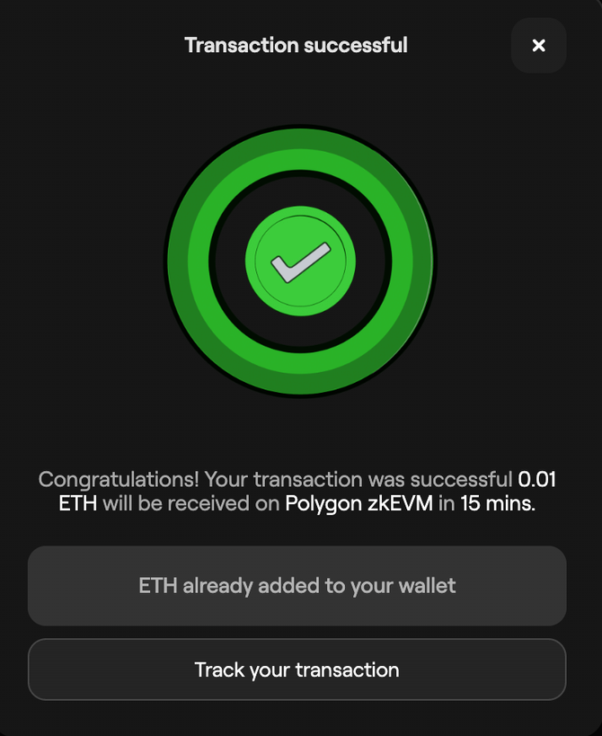{ width=60% }
    

6. You can check the transaction status and browse your transaction history by selecting **Transactions** from the sidebar. Select a transaction to view details.

    

    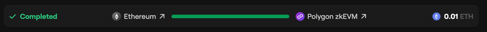{ width=60% }

    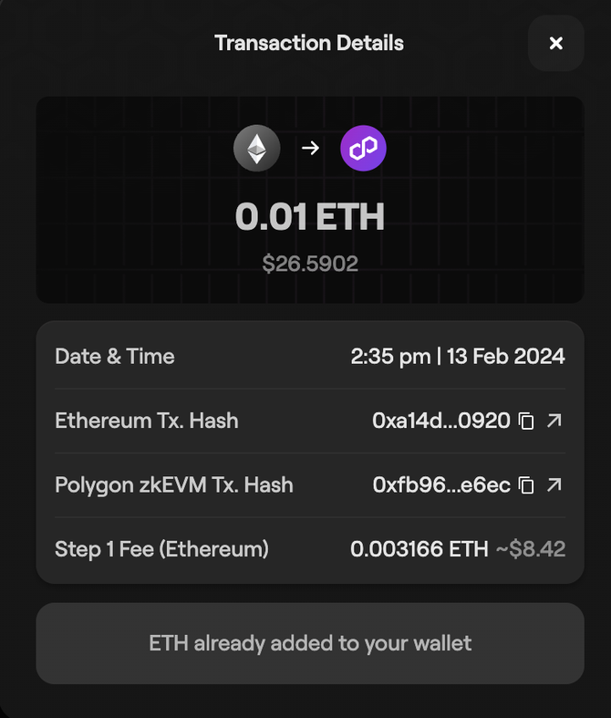{ width=60% }
    

## Claim bridged tokens on Ethereum

### MATIC tokens

1. Let's say you bridged MATIC from PoS to Ethereum. Once your tokens are ready to claim, you'll be able to select the **Initiate Claim** option under the transaction record.

    

    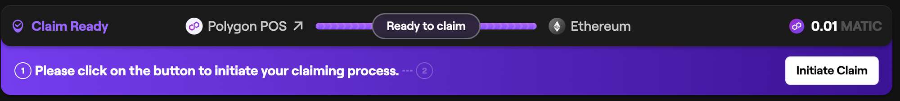{ width=60% }
    

2. Approve the transaction in your wallet, and then select "Claim Tokens".

    

    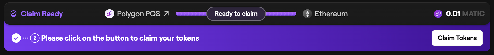{ width=60% }
    

3. The funds will be reflected in your wallet soon. You can keep an eye on the transaction status from this page.

### ETH and custom tokens

1. Your tokens transferred from Polygon zkEVM to Ethereum will generally be available to claim in 30-45 minutes. You can track the transaction status on the "Transactions" page.

    

    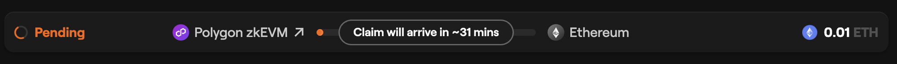{ width=60% }
    

2. The **Claim Tokens** button will appear under the transaction once your tokens are ready to be claimed.

    

    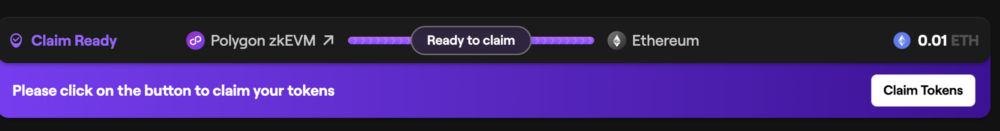{ width=60% }
    

3. Upon claiming your tokens, you'll receive a prompt in your wallet to sign the transaction.

    

    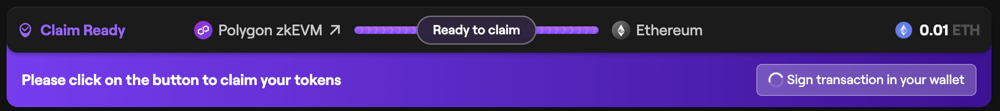{ width=60% }
    

4. Once you sign the transaction successfully, the bridged tokens will be sent to your wallet, which your wallet balance will reflect shortly.

    

    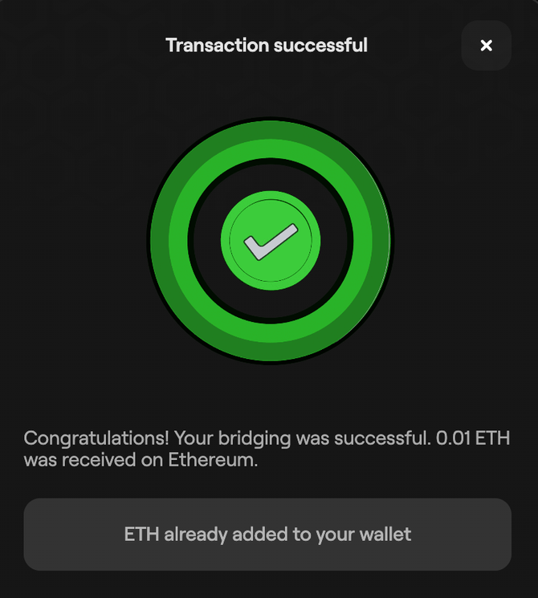{ width=60% }
    

## Add custom tokens to Polygon Portal

1. First, try looking up the token directly by clicking on the **Manage Tokens** located in the bottom-right corner of the dashboard, and then entering the token name in the input field.

    

    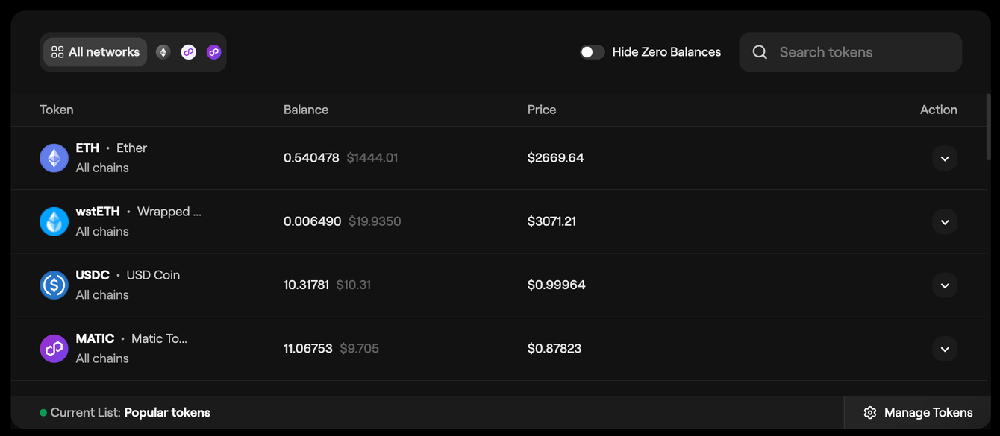{ width=60% }

    { width=60% }
    

2. If the token you're looking for shows up, select **Add** to add it to the portal.

3. If your token doesn't appear in the search results, you can also add the token manually by selecting the **+** in the bottom-right of the **Manage tokens** window.

    

    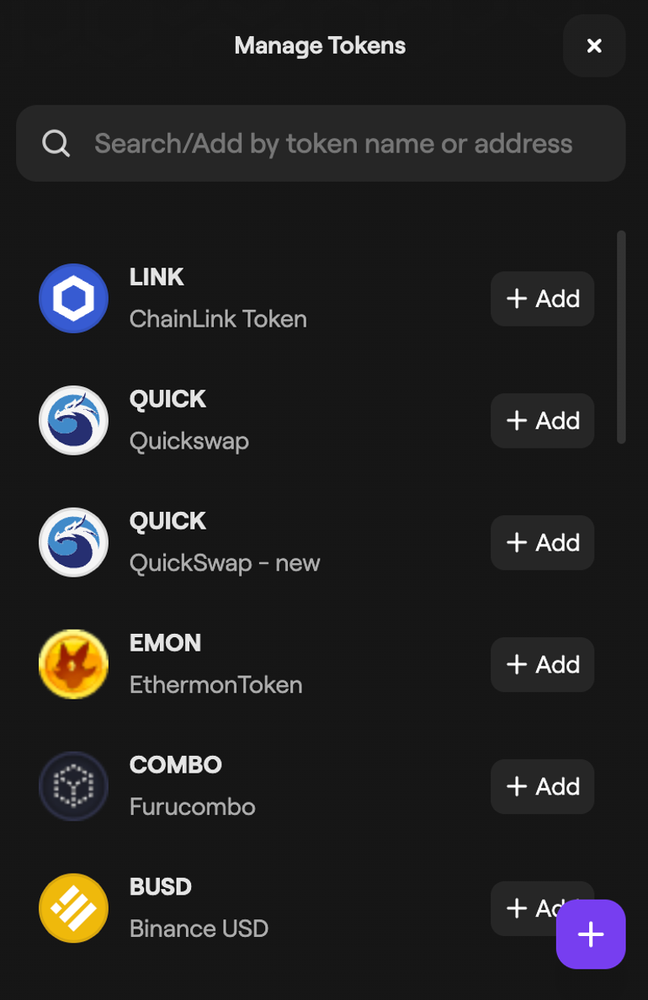{ width=60% }
    

4. Enter the token contract address in the input field.

    

    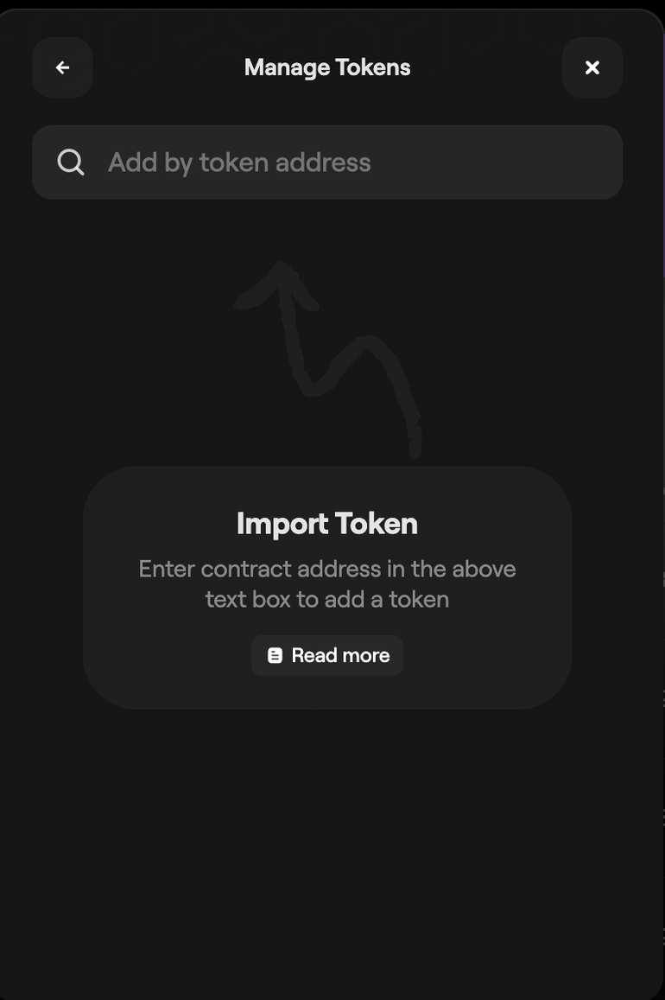{ width=60% }
    

5. If the token contract address is valid, you'll see the option at the bottom to add it to the portal. Select the option and the token will appear in the token list on the portal dashboard.

    

    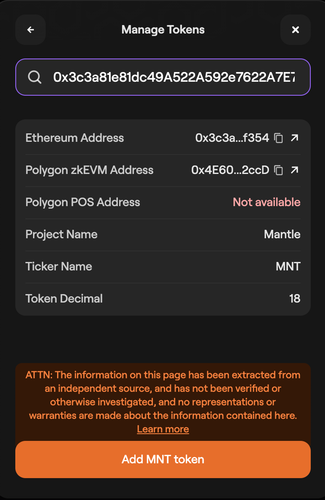{ width=60% }

    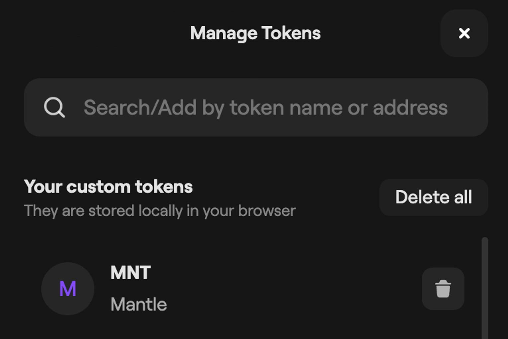{ width=60% }
    

