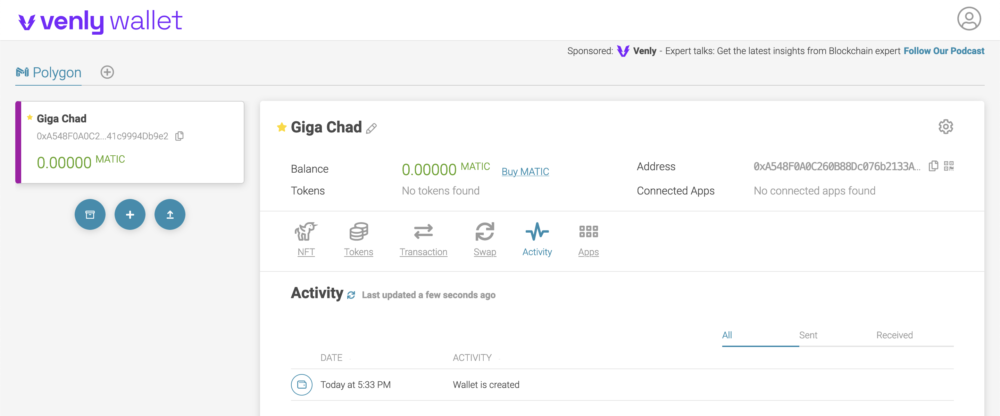

!!! caution "Content disclaimer"
    Please view the third-party content disclaimer [here](https://github.com/0xPolygon/polygon-docs/blob/main/CONTENT_DISCLAIMER.md).

If you are looking for a user-friendly wallet on the Polygon network, consider creating a [Venly](https://www.venly.io/) wallet. It allows you to enable a recovery mechanism and comes with end-user support via their in-app chat.

## Sign up to Venly

**Step 1 &rarr;** Navigate to https://wallet.venly.io/

**Step 2 &rarr;** **Create an Account** if you are new to Venly. You can sign up to Venly with your social credentials or using your email and password.

**Step 3 &rarr;** After signing up with one of your social accounts or with your email and password, you will need to accept their terms and conditions.

**Step 4 &rarr;** An **authentication code** will be sent to your email address. Enter the code and click **Submit**.

**Step 5 &rarr;** To secure the wallet, you must configure a PIN. Your PIN should be **6 digits** and it will be used to approve future transactions. After entering the PIN, press **Set** and it will take you to the [Venly Wallet](https://wallet.venly.io/) page.

**Step 6 &rarr;**  Next, it is mandatory to enable **emergency code**. This will help with **PIN resets** in case you forget your PIN. Click **Next**.

**Step 7 &rarr;** Confirm your **PIN** and click **Create**.

**Step 8 &rarr;** 
- Copy the emergency code and save it somewhere safe. (_It will be used for PIN resets_)
- Check the box confirming you stored the emergency code safely. (_You cannot view it again_)
- Click **Close**.

## Create your wallet

Now that you've configured your PIN, you are all set to create a Polygon wallet. Select Polygon from the list of various blockchain networks listed on Venly.

To create a new wallet, select **Create New Wallet**. In case if you already have one, select the **Import Wallet** option to retrieve your wallet.

Once you've pressed the button, Venly will ask you to confirm the new wallet creation using your PIN (the one you configured a few steps before). After that, your wallet will be created and you will be taken to your dashboard.

**Congratulations!** You have now created your Polygon wallet using Venly to manage your digital assets on the Polygon network.

## Resources
- [Use Venly in your Dapp](https://docs.bnbchain.org/docs/wallet/arkane-developer/)
- [Venly Widget](https://docs.venly.io/docs/widget-overview)
- [Web3 Wallet Providers](https://docs.venly.io/docs/ethersjs)
