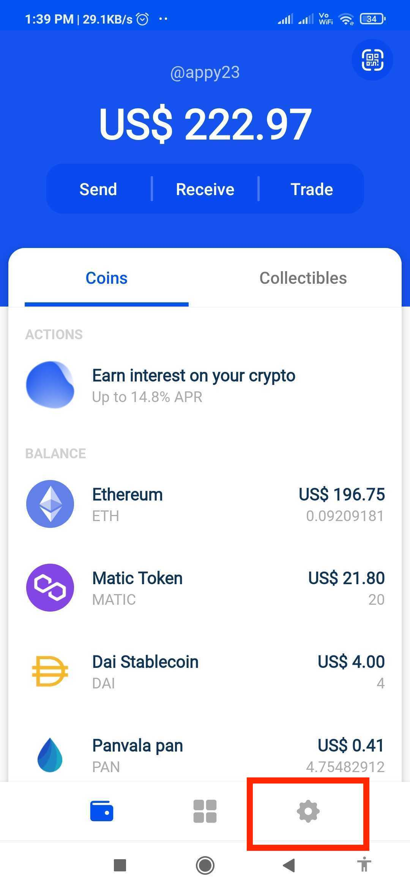
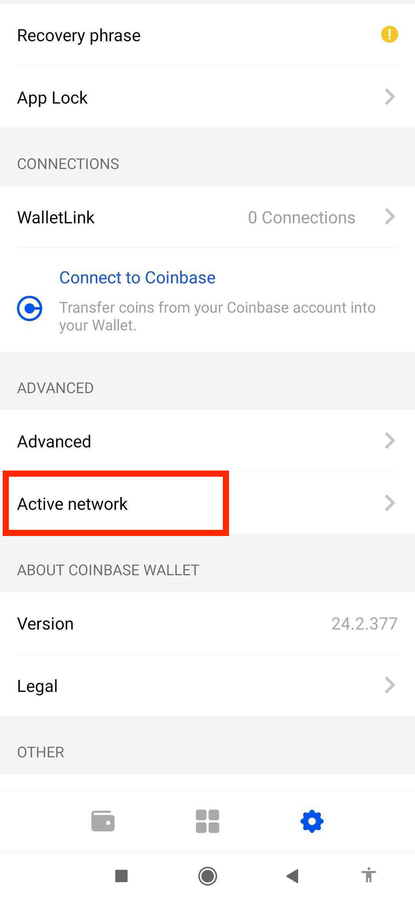
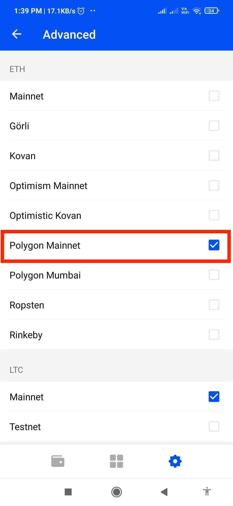
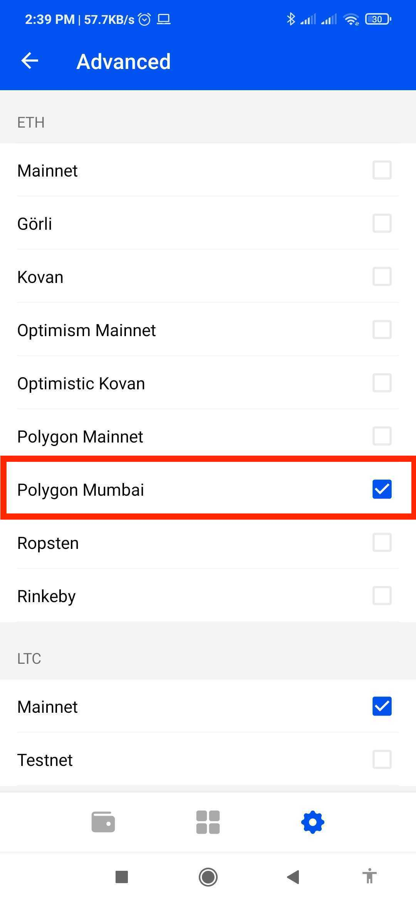

!!! caution "Content disclaimer"
    Please view the third-party content disclaimer [here](https://github.com/0xPolygon/polygon-docs/blob/main/CONTENT_DISCLAIMER.md).

## Configure Polygon on Walletlink

### Mainnet

1. From the Walletlink home page, select the Settings button

    

    { width="50%" }
    

2. From the setting page, under the Advanced section, select the Active network Option.

    

    { width="50%" }
    

3. From the Active Networks page, under the ETH section, select the Polygon Mainnet.

    

    { width="50%" }
    

### Mumbai

1. From the Walletlink home page, select the Settings button

    

    { width="50%" }
    

2. From the setting page, under the Advanced section, select the Active network Option.

    

    { width="50%" }
    

3. From the Active Networks page, under the ETH section, select the Polygon Mumbai.

    

    { width="50%" }
    

