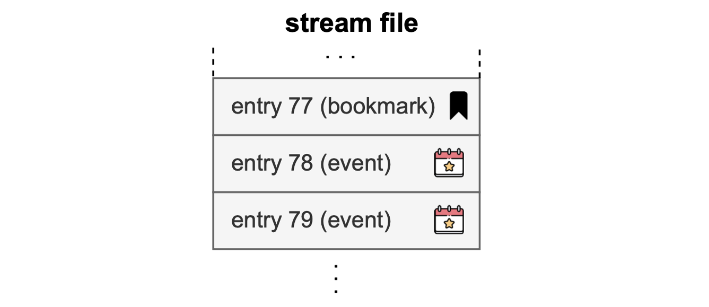
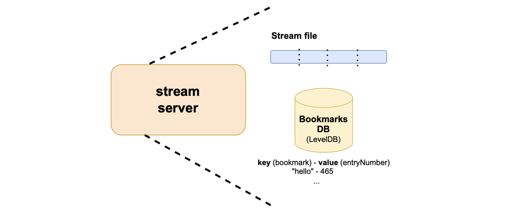

## Client-server protocol: Bookmarks

A stream is a sequence of entries, where these entries belong to some specific operation, and are identified by an entry number.

In the generic sense, an entry can be any piece of data relevant to an application's context. They can be either events or bookmarks.

Events are defined by the application. Stream clients provide relevant information about an event that must be streamed.

In the case of the Polygon zkEVM, entries are actually L2 blocks, while operations are thought of as batches. 

So then, when the stream source triggers the $\texttt{StartAtomicOp()}$ function and the corresponding message is sent to the stream server, that message in the Polygon zkEVM context, amounts to an instruction to "begin a batch, and prepare to receive its related entries (i.e., blocks) that are about to follow."

Again, in the Polygon zkEVM context, the message sent when the $\texttt{CommitAtomicOp()}$ function is called, is tantamout to saying: "close the batch with the last entry received."

Note that without these two messages, the stream server has no means of knowing where a batch starts and ends.

Similarly, in the client-server protocol, there is a need for a stream client to indicate to the stream server what entry the streaming should begin with.

A **bookmark** is used for this purpose by the stream client. 

### What is a bookmark?

A bookmark is an entry in a stream, and therefore has an entry number, denoted by $\texttt{entryNumber}$.

A bookmark is essentially a string of bytes. It links an $\texttt{entryNumber}$ to a string of bytes, in a way that is meaningful to an application.

Stream clients can request stream servers to start the stream from a particular bookmark using the $\texttt{StartBookmark()}$ method.

A bookmark is a type of a stream entry, used as an identifier. It points to a specific position in the stream from which the stream server must begin the streaming.

### StartBookmark command

In addition to the $\texttt{start()}$ and $\texttt{stop()}$ commands of the client-server protocol, a command called $\texttt{StartBookmark()}$ is added.

In the similar way the $\texttt{start()}$ and $\texttt{stop()}$ commands are identified by $\texttt{1}$ and $\texttt{2}$, respectively, the $\texttt{StartBookmark()}$ command is identified with the number $4$.

The $\texttt{StartBookmark()}$command is as follows:  

$$
\begin{aligned}
1.\qquad &\mathtt{u64\ command\ =\ 4} \\
2.\qquad &\mathtt{u64\ streamType} \qquad //\ \texttt{e.g. 1:}\ \mathtt{zkEVM\ Sequencer} \\
3.\qquad &\mathtt{u32\ bookmarkLength} \qquad //\ \texttt{Length of fromBookmark}\\
4.\qquad &\mathtt{u8[\ ]\ fromBookmark}
\end{aligned}
$$

As previously seen with other commands, $\texttt{streamType}$ refers to the network associated with the stream source.

When calling the $\texttt{StartBookmark()}$ function, and the corresponding message is sent to the stream server, the stream client must provide a bookmark. That is, a string of bytes together with the length of the string, denoted by $\texttt{bookmarkLength}$.

**Example**:

Consider the Polygon zkEVM case, where entries are L2 blocks. As seen in the above diagram, a bookmark precedes events.

In this context, the data of each block is preceded by a bookmark entry, and this bookmark entry contains among other things the block number.

It is more meaningful to use the $\texttt{blockNumber}$ in the Polygon zkEVM context.

That is, the $\texttt{blockNumber}$ of the block with which the streaming must begin as requested by the stream client.

### Bookmarks DB

Although stream entries are recorded in the **stream file**, there's a database called **Bookmarks DB**, which is specifically for storing all bookmarks.

The Bookmarks DB is a key-value database that maps a bookmark (used as a key) with its entry number (used as the value). The technology behind Bookmarks DB is [LevelDB](https://github.com/google/leveldb?tab=readme-ov-file), which is an open-source, fast key-value storage library written by Google's developers.

So, when a stream client requests the stream server to start streaming from a specific bookmark, it provides the bookmark as a string of bytes.

The stream server performs a binary search in order to locate the bookmark in the Bookmarks DB, and fetches the corresponding $\texttt{entryNumber}$ from the Bookmarks DB. It then begins to stream entries, starting from the $\texttt{entryNumber}$ onwards.

All commands made by stream clients return a response, called a $\texttt{Result}$ entry. The format of such a $\texttt{Result}$ entry is as follows:

$$
\begin{aligned}
1.\qquad &\texttt{u8 packetType  // 0xff:Result} \\
2.\qquad &\texttt{u32 length // Total length of the entry} \\
3.\qquad &\texttt{u32 errorNum // Error code (e.g. 0:OK)} \\
4.\qquad &\texttt{u8[] errorStr}
\end{aligned}
$$

Whenever a stream client calls the $\texttt{start()}$ function, the stream server responds with the $\texttt{Result}$ entry first, followed by all the entries.

In the client-server protocol, each message from the stream server has its identifier or packetType.

As seen in the code above, the $\texttt{Result}$ entry has the identifier, $\texttt{0xff}$, at the protocol level.

The $\texttt{Result}$ identifier is followed by the total length of the entry.

Next is a code of an error message, $\texttt{errorStr}$. If everything goes well then a $\texttt{0}$ is sent, meaning $\texttt{OK}$. 

A string is also sent, which is in a more human readable text.

An error is sent in the form of a code and a string, where the string is just an array of bytes, and each byte is an ASCII character.

## Client-server protocol messages

The stream client-server protocol messages are $\texttt{Start}$, $\texttt{StartBookmark}$, $\texttt{Stop}$, $\texttt{Header}$, $\texttt{Entry}$ and $\texttt{Bookmark}$​.

- The $\texttt{Start}$​​ message is sent from the stream client to the stream server in order to request for a stream to be sent.
    
    If the stream client wants to receive all the stream file, a $\texttt{Start}$ message is sent with an $\mathtt{entryNumber}$ $= \texttt{0}$.

    If the stream client knows the entry number at which the stream should start, it sends a $\texttt{Start}$ message with that particular entry number. That is, $\mathtt{entryNumber} \not= \texttt{0}$.

- $\texttt{StartBookmark}$ message is the type of message the stream client can send if the the stream client does not the know entry number, but knows something more meaningful to the application, like a bookmark.
    
    In the case of the Polygon zkEVM, if the stream client wants to receive information from a certain L2 block number, then it provides the appropriate bookmark by sending a $\texttt{StartBookmark}$ message.

    Such a bookmark is actually a codification of the L2 block number.

- $\texttt{Stop}$ message is a message the stream client can send to the stream server if it wants to stop receiving the stream.
    
- $\texttt{Header}$ message can be sent if the stream client requests just the header of a particular entry.
    
    We discuss the information an entry contains, in more detail, later in this document.

    In summary, an entry has two parts: a part called a $\texttt{Header}$, and a part called the $\texttt{data}$.

    So, a $\texttt{Header}$ message is used to request for just the header, but not the full data of an entry.

    It's like asking for only the block header and not the entire L2 block, in the Polygon zkEVM case.

- $\texttt{Entry}$ message can be sent by the stream client in order to request for a specific entry in the stream file. Thus, instead of requesting the stream server to start streaming from a particular entry onwards, only one entry is obtained by sending an $\texttt{Entry}$ message.
    
- $\texttt{Bookmark}$ message is a message in which a stream client sends a bookmark to the stream server, and the stream server in turn tells the stream client what entry number is linked to the bookmark.

The above six messages are all messages used in the client-server protocol. And they can be found [here](https://github.com/0xPolygonHermez/zkevm-data-streamer#stream-tcp-commands).

## Stream server-source library

Interaction between the stream source and each stream server is enabled by the Server-source library, which is a Go library with six main functions for modifying or adding entries to operations.

### Send data functions

When each of these functions is called, a corresponding message is generated and sent to the stream server:

1. $\texttt{StartAtomicOp}(\ )$ starts an atomic operation. When called, a message that amounts to saying: "start an atomic operation," is generated and sent from the stream source to the stream server.
2. $\texttt{AddStreamEntry(u32 entryType, u8[] data)}$ adds an entry to the atomic operation and returns an $\texttt{u64 entryNumber}$. When called, a message equivalent to saying: "Add an entry of this type, with this data, to the current atomic operation," is generated and sent to the stream server.
3. $\texttt{AddStreamBookmark(u8[] bookmark)}$ adds an entry to the atomic operation and returns an $\texttt{u64}$ $\texttt{entryNumber}$. 
4. $\texttt{CommitAtomicOp}(\ )$ commits an operation $\texttt{Op}$ so that its entries can be sent to stream clients. When called, a message which is tantamount to saying: "All entries associated with the current operation have been sent, the operation ends with the last sent entry," is generated and sent to the stream server.
5. $\texttt{RollbackAtomicOp}(\ )$ rolls back an atomic operation. 
6. $\texttt{UpdateEntryData(u64 entryNumber, u32 entryType, u8[] newData)}$ updates an existing entry. This function only applies to entries for which the atomic operation has not been committed.

### Query data functions

The stream source can use a few more functions of the stream server-source library, to get information from the stream server.

It uses the following functions:

- $\texttt{GetHeader()}$: The stream source uses this function to query the header of a particular entry. The function returns, $\texttt{struct HeaderEntry}$.
- $\texttt{GetEntry(u64 entryNumber)}$: This function is used to get an entry that corresponds to a given entry number. It returns, $\texttt{struct FileEntry}$.
- $\texttt{GetBookmark(u8[ ] bookmark)}$: The stream source uses this function to get a bookmark. The function returns, $\texttt{u64 entryNumber}$.
- $\texttt{GetFirstEventAfterBookmark(u8[ ] bookmark)}$: This function is used to get the first entry after a given bookmark. It returns, $\texttt{struct FileEntry}$.

The complete stream source-server library is described, but referred to as the DATA STREAMER INTERFACE (API), [here](https://github.com/0xPolygonHermez/zkevm-data-streamer#data-streamer-interface-api).

It's possible to create, using the stream source-server library, a stream source that connects with a server, opens and commits operations.

## Stream file

Next is an explanation of stream file structure.

The stream file is created in a binary format instead of a text file. 

It has a header page and one or more data pages. The header page is first and has a fixed size of 4096 bytes. The data pages follow immediately after the header page, and the size of each data page is 1 MB.

Data pages contain entries.  

If an entry does not fit in the remaining page space, it gets stored in the next page. This means the unused space in the previous data page gets filled with some padding.

### The header page

Let's zoom into how the $\texttt{Header}$​ page looks like.

1. The $\texttt{HeaderEntry}$ consists of the following data; $\texttt{magicNumbers}$, $\texttt{packetType}$, $\texttt{headerLength}$, $\texttt{streamType}$, $\texttt{TotalLength}$, and $\texttt{TotalEntries}$​.

   

   The $\texttt{HeaderEntry}$ starts with an array of 16 bytes, called $\texttt{magicNumbers}$​.

$$
\texttt{u8[16] magicNumbers}
$$

 The $\texttt{magicNumbers}$ identify which application to which the data in the stream file belongs. 

2. The $\texttt{magicNumbers}$ identify which application to which the data in the stream file belongs. 

In the Polygon zkEVM case, the $\texttt{magicNumbers}$ is the ASCII-encoding of these sixteen (16) characters: $\texttt{polygonDATSTREAM}$.

3. After the $\texttt{magicNumbers}$ comes the $\texttt{packetType}$, which indicates whether the current page is a $\texttt{Header}$ page or a $\texttt{Data}$ page.

$$
\texttt{u8 packetType = 1 // 1: Header entry}
$$

The $\texttt{packetType}$ for the $\texttt{Header}$ entry is $\texttt{1}$, but it is $\texttt{2}$ for the $\texttt{Data}$ entry and $\texttt{0}$ for a padding.

4. Included in the $\texttt{Header}$ page is the $\texttt{streamType}$​, which has the same meaning as seen in the Server-source protocol: It indicates the application, or in particular, the stream source node to which the stream server should connect.

$$
\texttt{u64 streamType // 1: zkEVM Sequencer}
$$

As mentioned in the above line of code, $\texttt{streamType = 1}$ means the stream source node is the zkEVM Sequencer.

5. The $\texttt{streamType}$ is then followed by the $\texttt{TotalLength}$​ , which is the total number of bytes used in the stream file.
   $$
   \texttt{u64 TotalLength // Total bytes used in the file}
   $$

   

6. After the $\texttt{TotalLength}$ is the $\texttt{TotalEntries}$​​, which is the total number of entries used in the file.

   $$
   \texttt{u64 TotalEntries // Total number of data entries}
   $$

### The data pages

A data page contains entries and some padding.

Since this is a $\texttt{data}$ page, and not a $\texttt{Header}$ page, the entries are preceded by $\texttt{packetType = 2}$, while the padding is preceded by $\texttt{packetType = 0}$​.

$$
\begin{aligned}
1.\quad &\texttt{u8 packetType  // 2:Data entry, 0:Padding} \\
2.\quad &\texttt{u32 Length   // Total length of data entry} \\
3.\quad &\texttt{u32 Type   // 0xb0:Bookmark, 1:Event1, 2:Event2,... } \\
4.\quad &\texttt{u64 Number  // Entry number (sequence from 0)} \\
5.\quad &\texttt{u8[] data}
\end{aligned}
$$

The $\texttt{packetType}$ is followed by the $\texttt{Length}$ of the data entry, then the $\texttt{Type}$ of the entry. That is, whether it is a bookmark or an event entry.

A bookmark $\texttt{Type}$ is indicated by $\texttt{0xb0}$, while each event's $\texttt{Type}$ is its position among a sequence of events. That is, each $i$-th event is of $\mathtt{Type = i}$.   

The next value after the $\texttt{Type}$ is the entry number, denoted by $\texttt{Number}$. The next values in a data page are $\texttt{data}$.

After the last entry in a data page, is the $\texttt{packetType = 0}$ and some padding for any unused space.

## How do we implement commits and rollbacks?

Recall that the server-source protocol begins with calling the $\texttt{StartAtomicOp}(\ )$, corresponding to which a message is sent to the stream server, preparing to receive entries related to a specific atomic operation.

When the stream source sends the entries, the stream server appends the data of the entries to the stream file.

Once all entries have been sent, the stream source calls the $\texttt{CommitAtomicOp}(\ )$ function, and the header of the stream file is subsequently updated. In particular, the $\texttt{totalLength}$ and $\texttt{totalEntries}$ fields.

But if the $\texttt{RollbackAtomicOp}(\ )$ is triggered instead of the $\texttt{CommitAtomicOp}(\ )$, the header is not updated.

In other words, the header of the stream file only changes when the $\texttt{CommitAtomicOp}(\ )$ function is called. So, although some entries related to the atomic operation have already been added to the stream file, the header of the stream file is updated only with information of entries related to committed atomic operations.

Since the $\texttt{RollbackAtomicOp}(\ )$​ function can only be executed before a given atomic operation is committed, the header is not updated because the added entries (of the uncommitted atomic operation) will be overwritten with entries of the next atomic operation(s).

This means a rollback amounts to overwriting entries in the strem file that are related to an uncommitted atomic operation.

### Example (Commit and rollback)

Suppose an operation $\mathtt{Op_A}$ has been started, and $\texttt{100}$ entries had already been added to the stream file when a rollback was triggered. 

Since a rollback was triggered before $\mathtt{Op_A}$ was committed, the header of the stream file remains unaffected by the $\texttt{100}$​ added entries.

Let's say the $\texttt{totalLength}$ of the stream file is $\texttt{1712}$ when the rollback occurred. Although the actual length of the stream is $\texttt{1812}$, the $\texttt{totalLength}$ in the header of the stream file remains unchanged. 

Suppose that the next atomic operation $\mathtt{Op_B}$ gets started and committed, but has only $40$​ related entries.

Since $\mathtt{Op_B}$ is committed but only $40$ entries have been added to the stream file, the header will now reflect the $\texttt{totalLength}$ to be $1752$. This means only $\texttt{40}$ of the $\texttt{100}$ entries of the previously uncommitted operation $\mathtt{Op_A}$ got overwritten, but the actual stream is still $\texttt{1812}$.

How is this not a problem from an application point of view?

It's because if a stream client requests for the stream, the stream server sends the stream only up to the $\texttt{totalLength}$ recorded in the header of the stream file, $1752$, and not the actual length of the stream, $\texttt{1812}$.

## Concluding remarks

The basic trick here is for the stream server to only use the information recorded in the header of the stream file, and to change that information only if an atomic operation is committed.

This way the stream server always sends the stream only up to the last entry of the committed operation.

All-in-all, this is just an optimal way to rollback. There's no need to delete information from the stream file. The header of the stream file is updated only if an atomic operation has been committed. 

This is the main reason why parameters such as the $\texttt{totalLength}$ and $\texttt{totalEntries}$ are recorded in the header of the stream file.
