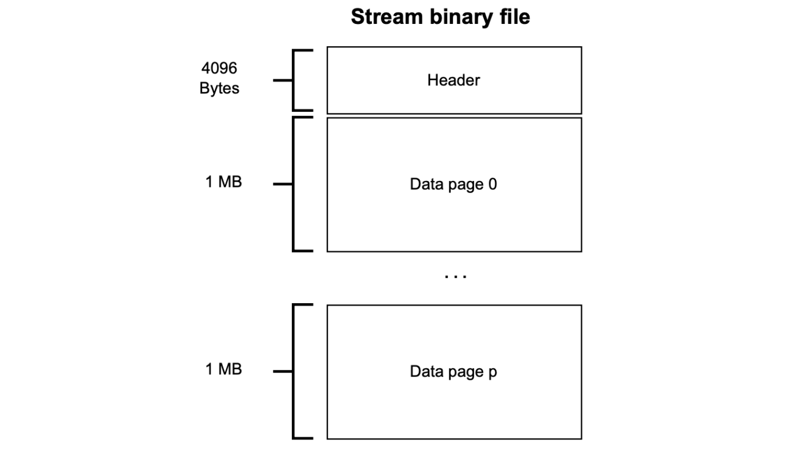
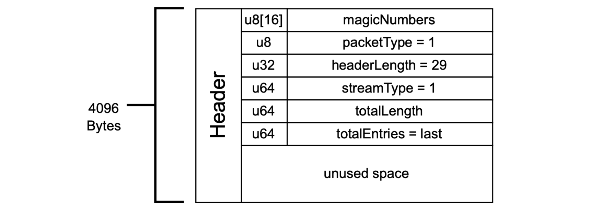
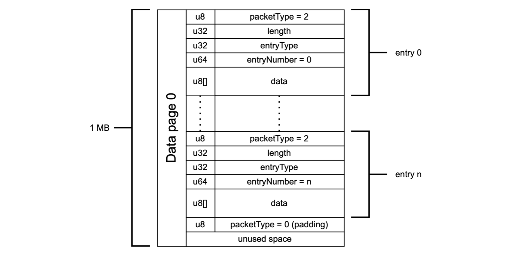

Next is an explanation of the stream file structure.

The stream file is created in a binary format instead of a text file. 

It has a header page and one or more data pages. The header page is first and has a fixed size of 4096 bytes. The data pages follow immediately after the header page, and the size of each data page is 1 MB.

Data pages contain entries.  

If an entry does not fit in the remaining page space, it gets stored in the next page. This means the unused space in the previous data page gets filled with some padding.

## Header page

Let's zoom into how the $\texttt{Header}$​ page looks like.

The $\texttt{HeaderEntry}$ consists of the following data; $\texttt{magicNumbers}$, $\texttt{packetType}$, $\texttt{headerLength}$, $\texttt{streamType}$, $\texttt{TotalLength}$, and $\texttt{TotalEntries}$​.

1. The $\texttt{HeaderEntry}$ starts with an array of 16 bytes, called $\texttt{magicNumbers}$​.

    $$
    \texttt{u8[16] magicNumbers}
    $$

    The $\texttt{magicNumbers}$ identify the application to which the data in the stream file belongs.

    In the Polygon zkEVM case, the $\texttt{magicNumbers}$ is the ASCII-encoding of these sixteen (16) characters: $\texttt{polygonDATSTREAM}$.

2. After the $\texttt{magicNumbers}$ comes the $\texttt{packetType}$, which indicates whether the current page is a $\texttt{Header}$ page or a $\texttt{Data}$ page.
    
    $$
    \texttt{u8 packetType = 1 // 1: Header entry}
    $$

    The $\texttt{packetType}$ for the $\texttt{Header}$ entry is $\texttt{1}$, but it is $\texttt{2}$ for the $\texttt{Data}$ entry and $\texttt{0}$ for a padding.

    

3. Included in the $\texttt{Header}$ page is the $\texttt{streamType}$​, which has the same meaning as seen in the Server-source protocol: It indicates the application, or in particular, the stream source node to which the stream server should connect.
    
    $$
    \texttt{u64 streamType // 1: zkEVM Sequencer}
    $$

    As mentioned in the above line of code, $\texttt{streamType = 1}$ means the stream source node is the zkEVM Sequencer.

4. The $\texttt{streamType}$ is then followed by the $\texttt{TotalLength}$​ , which is the total number of bytes used in the stream file.
    
    $$
    \texttt{u64 TotalLength // Total bytes used in the file}
    $$

5. After the $\texttt{TotalLength}$ is the $\texttt{TotalEntries}$​​, which is the total number of entries used in the file.
    
    $$
    \texttt{u64 TotalEntries // Total number of data entries}
    $$

## Data pages

A data page contains entries and some padding.

Since this is a $\texttt{data}$ page, and not a $\texttt{Header}$ page, the entries are preceded by $\texttt{packetType = 2}$, while the padding is preceded by $\texttt{packetType = 0}$​.

$$
\begin{aligned}
1.\quad &\texttt{u8 packetType  // 2:Data entry, 0:Padding} \\
2.\quad &\texttt{u32 Length   // Total length of data entry} \\
3.\quad &\texttt{u32 entryType   // 0xb0:Bookmark, 1:Event1, 2:Event2,... } \\
4.\quad &\texttt{u64 entryNumber  // Entry number (sequence from 0)} \\
5.\quad &\texttt{u8[] data}
\end{aligned}
$$

The $\texttt{packetType}$ is followed by the $\texttt{Length}$ of the data entry, then the $\texttt{entryType}$ of the entry. That is, whether it is a bookmark or an event entry.

A bookmark $\texttt{entryType}$ is indicated by $\texttt{0xb0}$, while each event's $\texttt{entryType}$ is its position among a sequence of events. That is, each $i$-th event is of $\mathtt{entryType = i}$.   

The next value after the $\texttt{entryType}$ is the entry number, denoted by $\texttt{entryNumber}$. The next values in a data page are $\texttt{data}$.

After the last entry in a data page, is the $\texttt{packetType = 0}$ and some padding for any unused space.

