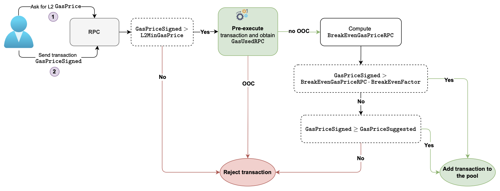

The RPC flow phase of transactions consists of two stages:

- The gas price suggestion.
- Pre-execution of transactions. 

This flow ends with transactions being stored in a pool waiting to be executed by the sequencer.

## Gas price suggestion

The L2 network (the zkEVM) polls for L1 gas price values, and uses them to:

- Suggest L2 gas price to users, at the users' request.
- Sets the minimum acceptable L2 gas price, denoted by $\texttt{L2MinGasPrice}$.

The user then signs transactions with the appropriate gas price, called $\texttt{GasPriceSigned}$, based on the suggested L2 gas price, $\texttt{GasPriceSuggested}$.

User's transactions are accepted for pre-execution only if

$$
\texttt{GasPriceSigned} > \texttt{L2MinGasPrice}
$$

## Pre-execution of transactions

Pre-execution of transactions, which happens at the RPC level, involves estimating the gas required for processing user's transactions. 

This is internally measured (internal to the zkEVM) in terms of resources spent to execute the transactions. These resources are the numbers of counters used up in the zkEVM ROM. 

A transaction is said to be _out of counters_ (OOC) if the signed gas price is insufficient to pay for all the required gas units.

Transactions with OOC get rejected, while those with no OOC stand a chance to be added to the pool.

At this stage of the flow, the RPC also computes the "break-even-gas-price", denoted by $\texttt{BreakEvenGasPriceRPC}$. That is, 

$$
  \texttt{BreakEvenGasPrice} = \frac{\texttt{TotalTxPrice}}{\texttt{GasUsedRPC}} \cdot \texttt{NetProfit},
$$

 where $\texttt{NetProfit}$ is the L2's marginal profit  for transaction processing.   

Transactions with no OOC get added to the pool of transactions if,

- Either $\texttt{GasPriceSigned} > \texttt{BreakEvenGasPriceRPC} \cdot \texttt{BreakEvenFactor}$.
  
  where $\texttt{GasUsedRPC}$ is the RPC's estimated gas cost.
  
- Or $\texttt{GasPriceSigned} \geq \texttt{GasPriceSuggested}$.

The total fees paid by the user is given by:

$$
\texttt{TotalTxPrice} = \texttt{DataCost} \cdot \texttt{L1GasPrice} + (\texttt{L2 Execution gas cost}) \cdot \texttt{L2GasPrice}
$$

The RPC flow is summarized in the figure below.

