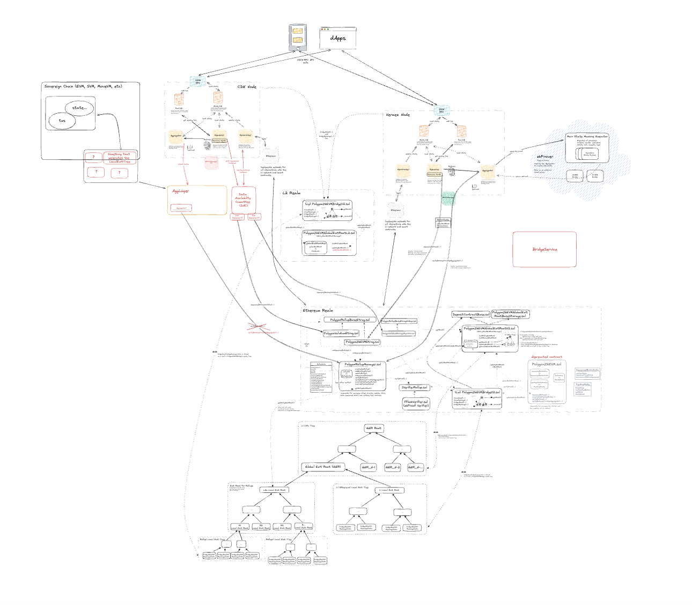

<!-- https://excalidraw.com/#json=JKZp9QEihifF_B7Z41Dfv,FVNhqQKi9PA1jM0kzUoCsQ" -->

This section of the docs provides a detailed analysis of the full topology of the Polygon zero-knowledge system architecture. 

Tailored for CDK stacks and using zkEVM technology, these documents explore the contents, layout, and interactions among component systems and functions. They offer in-depth descriptions of the components that constitute the larger system, with references to relevant code bases.

The diagram below is a full and detailed topological overview of the entire Polygon zero-knowledge system architecture.

## Architectural topology

## Components 

- Smart contracts: L1 and L2 Solidity smart contracts used for interacting with the whole stack. See the discussion on [zkEVM smart contracts](../../architecture/protocol/zkevm-bridge/smart-contracts.md) for more information.
- Exit root trees: Append-only sparse Merkle trees which record the current and historical state of the system. See the discussion on [zkEVM exit trees](../../architecture/protocol/zkevm-bridge/exit-tree.md) for more information.
- CDK and zkEVM nodes containing:
    - JSON RPC client: Exposes the read/write interfaces for interacting with a node/chain.
    - Pool database: The pool database records transaction requests coming in from the JSON RPC client and sends them to the sequencer.
    - State database: The state database responds to read requests from the JSON RPC client.
    - Sequencer: Does the complex job of carefully sequencing transactions as they come in before sending them to the aggregator for batching. See the discussion on [sequencers](../../architecture/index.md#sequencer) for more information.
    - Aggregator: Used for aggregating transaction batches to send to the prover. See the discussion on [aggregators](../../architecture/index.md#aggregator) for more information.
    - Synchronizer: This component ensures a synchronized state between the node's systems and the L1 outside-world via the Etherman component and the state database. 
    - Etherman component: The Etherman helps the synchronizer maintain a synchronized state with L1 by communicating with the L1 Ethereum chain via smart contract methods.
- Bridge service component: Provides an API to perform bridge claims, i.e. asset and message transfers between L1/L2 and L2/L2.
- Prover component: System for calculating zero-knowledge proofs on transaction batches.

## What to expect

When complete, this section will include information on: 

- The structure of a CDK node and how it interacts with L2 and L1 smart contracts.
- The structure of a zkEVM node and how it interacts with L2 and L1 smart contracts.
- The key components included in the nodes, how they function, and their interactions with other components, external dApps, and the L1/L2 environment.
- Key similarities and differences between a CDK and zkEVM node.
- CDK validium components, including the DAC and DAC sequencer.
- Detailed description of the Polygon smart contract sets for L1 and L2.
- The zkProver and how it interacts with a zkEVM node aggregator.

### Currently out of scope

- The bridge service.
- AggLayer.
