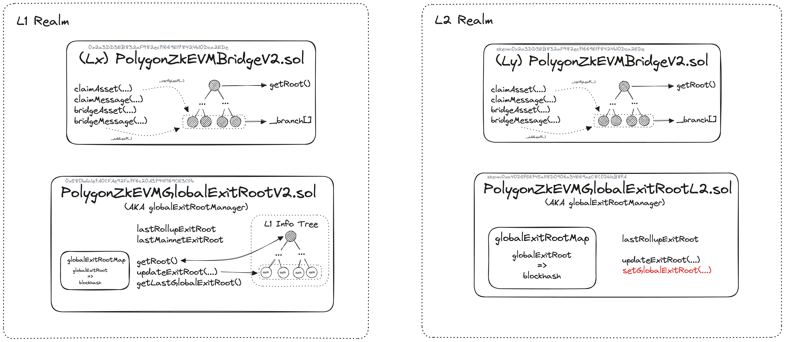

The unified bridge transfers assets and messages between L1 and L2 networks by calling bridge and claim functions on the unified bridge smart contract. 

The smart contract that manages bridging and claiming across networks is the [PolygonZkEVMBridgeV2.sol](https://github.com/0xPolygonHermez/zkevm-contracts/blob/main/contracts/v2/PolygonZkEVMBridgeV2.sol) contract. 

This contract is deployed on L1 and there is also one deployed on every L2 network. It communicates closely with an exit root manager contract specific to L1 or L2.

## Bridge and claim

The main functions of the bridge are:

- [`bridgeAsset(...)`](https://github.com/0xPolygonHermez/zkevm-contracts/blob/1ad7089d04910c319a257ff4f3674ffd6fc6e64e/contracts/v2/PolygonZkEVMBridgeV2.sol#L204)
- [`bridgeMessage(...)`](https://github.com/0xPolygonHermez/zkevm-contracts/blob/1ad7089d04910c319a257ff4f3674ffd6fc6e64e/contracts/v2/PolygonZkEVMBridgeV2.sol#L325)
- [`claimAsset(...)`](https://github.com/0xPolygonHermez/zkevm-contracts/blob/1ad7089d04910c319a257ff4f3674ffd6fc6e64e/contracts/v2/PolygonZkEVMBridgeV2.sol#L446)
 - [`claimMessage(...)`](https://github.com/0xPolygonHermez/zkevm-contracts/blob/1ad7089d04910c319a257ff4f3674ffd6fc6e64e/contracts/v2/PolygonZkEVMBridgeV2.sol#L599) 

### L1 to L2

To bridge assets from L1 to L2, the sender first transfers the token into the bridge by locking the asset on the origin L1 network. 

The bridge smart contract mints an equivalent asset, called a wrapped token, on the destination network (L2). 

Once minted, the recipient can claim the token on the destination network (L2).

The data below is transaction data represented by a leaf node and comes from an [example L1 to L2 transaction](https://etherscan.io/tx/0xddbff67ac10c27db39c8e49a36871eba319528286752188e1730fbfdcb184f1b) recorded on the L2 zkEVM chain after a successful `bridgeAsset` call.

| Index | Parameter name                     | Data type   | Example value                              |
|------|---------------------------|---------|--------------------------------------------|
| 0    | `destinationNetwork`        | uint32  | 1  (zkEVM network)                                        |
| 1    | `destinationAddress`        | address | 0x2944119d60465AE2f4E6C587fCc669214a5094E1 |
| 2    | `amount`                    | uint256 | 20270613020262720                          |
| 3    | `token`                     | address | 0x0000000000000000000000000000000000000000 (Ether) |
| 4    | `forceUpdateGlobalExitRoot` | bool    | true (indicates if new global exit root is updated)                                      |
| 5    | `permitData`               | bytes   | (Raw data of the call `permit` of the token)         |

### L2 to L1

To send an asset from L2 to L1, the wrapped token is first burnt on the L2 network.

The bridge smart contract then unlocks the original asset on the origin network (L1) ready for claiming.

The data below is transaction data represented by a leaf node and comes from an [example L2 to L1 claim transaction](https://etherscan.io/tx/0x70f7f550cded85e21e0893b6ea5aae3dd2b998021ce449770fa78a967bc44f79) which also posts the local and network exit roots and root proofs used for verification on L1.

| #  | Parameter name                   | Data type        | Example value                                                              |
|----|------------------------|-------------|--------------------------------------------------------------------|
| 0  | smtProofLocalExitRoot  | bytes32[32] | 0xdaaaac32944200f40bbf1e208472...                                  |
| 1  | smtProofRollupExitRoot | bytes32[32] | 0xf73a9a58cf58b6ba6a4cc7b4951a...                                  |
| 2  | globalIndex            | uint256     | 48352 (used for synchronizing)                                                             |
| 3  | mainnetExitRoot        | bytes32     | 0x22e6d13ed71c26a403b8bae97755fc215744bfa490d108aa8d14386fef41de02 |
| 4  | rollupExitRoot         | bytes32     | 0x118318620b268cc322953926c3b45092e573af034ddf75c143456b2886a844ef |
| 5  | originNetwork          | uint32      | 0                                                                  |
| 6  | originTokenAddress     | address     | 0x0000000000000000000000000000000000000000                         |
| 7  | destinationNetwork     | uint32      | 0                                                                  |
| 8  | destinationAddress     | address     | 0x5251b3304d1bA5834fd227c2842AA82aC50412E6                         |
| 9  | amount                 | uint256     | 67000000000000000                                                  |
| 10 | metadata               | (Abi encoded metadata if any, empty otherwise)bytes       |                                                                    |

## Updating system state

The Polygon bridge smart contract uses exit tree roots to manage state. Leaves of the trees point to transaction data such as detailed above.

!!! tip
    - For further details on the exit tree architecture, check out the [exit root documentation](exit-roots.md).

On a call to the bridge, the bridge contract calls the `updateExitRoot(...)` function on the relevant exit root contract (L1 or L2) which adds an exit leaf to the relevant exit tree. 

- If `msg.sender` is the bridge contract, the L1 local exit root is updated.
- If `msg.sender` is the rollup manager, the L2 local exit root is updated.

Adding a new leaf to the tree triggers an update to the exit tree root which then propagates to an update on the global exit tree root.

Using Merkle tree exit roots in this way, referenced by the bridge contract and accessible to the `PolygonRollupManager` contract with getters, the bridge contract synchronizes data across L1 and L2, the sequencer component, and the state db.

The use of two distinct global exit root manager contracts for L1 and L2, as well as separate logic for the bridge contract and each of these global exit root managers, allows for extensive network interoperability.

Meanwhile, all asset transfers can be validated by any L1 and L2 node due to the accessibility of state data.

## Transaction flows in depth

### L1 to L2

1. If a call to the `bridgeAsset` or `bridgeMessage` passes validation, the bridge contract appends an exit leaf to the L1 exit tree and computes the new L1 exit tree root.

2. The global exit root manager appends the new L1 exit tree root to the global exit tree and computes the global exit root.

3. The sequencer fetches the latest global exit root from the global exit root manager.

4. At the start of the transaction batch, the sequencer stores the global exit root in special storage slots of the L2 global exit root manager smart contract, allowing L2 users to access it.

5. A call to `claimAsset` or `claimMessage` provides a Merkle proof that validates the correct exit leaf in the global exit root.

6. The bridge contract validates the caller's Merkle proof against the global exit root. If the proof is valid, the bridging process succeeds; otherwise, the transaction fails.

### L2 to L1

1. If a `bridgeAsset` or `bridgeMessage` call on the L2 bridge contract validates, the bridge contract appends an exit leaf to the L2 exit tree and computes the new L2 exit tree root.

2. The L2 global exit root manager appends the new L2 exit tree toot to the global exit tree and computes the global exit root. At that point, the caller's bridge transaction is included in one of batches selected and sequenced by the sequencer.

3. The aggregator generates a zk-proof attesting to the computational integrity in the execution of sequenced batches which include the transaction.

4. For verification purposes, the aggregator sends the zk-proof together with all relevant batch information that led to the new L2 exit tree root (computed in step 2), to the consensus contract.

5. The consensus contract utilizes the `verifyBatches` function to verify validity of the received zk-proof. If valid, the contract sends the new L2 exit tree root to the global exit root manager in order to update the global exit tree.

6. `claimMessage` or `claimAsset` is then called on the bridge contract with Merkle proofs for correct validation of exit leaves.

7. The bridge contract retrieves the global exit root from the L1 global exit root manager and verifies validity of the Merkle proof. If the Merkle proof is valid, the bridge completes. Otherwise, the transaction is reverted.

### L2 to L2

1. When a batch of transactions is processed, the bridge contracts appends the L2 exit tree with a new leaf containing the batch information. This updates the L2 exit tree root.

2. The bridge contracts communicates the L2 exit tree root to the L2 global exit root manager. The L2 global exit root manager, however, does not update the global exit tree at this stage.

3. For proving and verification, the zk-proof-generating circuit obtains the L2 exit tree root from the L2 global exit root manager.

4. Only after the batch has been successfully proved and verified does the L2 global exit root manager append the L2 exit tree root to the global exit tree. As a result, the global exit root is updated.

5. The zk-proof-generating circuit also writes the L2 exit tree root to the mainnet. The L1 bridge contract can then finalize the transfer by using the `claim` function.