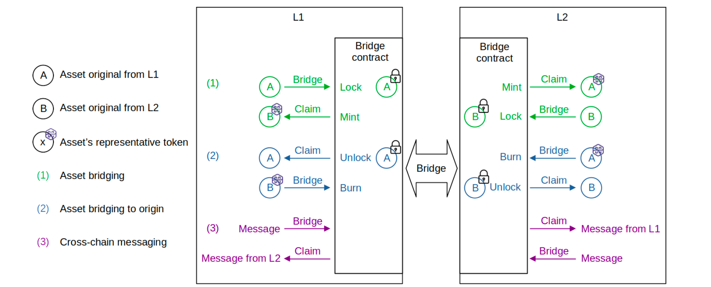

The unified bridge transfers assets and messages between L1 and L2 networks by calling bridge and claim functions on the unified bridge smart contract. 



## Smart contract definition

The smart contract that manages bridging and claiming across networks is the [PolygonZkEVMBridgeV2.sol](https://github.com/0xPolygonHermez/zkevm-contracts/blob/main/contracts/v2/PolygonZkEVMBridgeV2.sol) contract. It is deployed on both L1 and L2 networks.

### Bridge and claim assets

Bridging and claiming assets is managed by the `bridgeAsset` and the `claimAsset` functions.

These functions allow data payloads to be sent across networks.

#### `bridgeAsset`

To send an asset from L1 to L2, the sender first transfers the token from the user into the bridge by locking the asset on the origin network (L1). 

```solidity
IERC20Upgradeable(token).safeTransferFrom(
    msg.sender,
    address(this),
    amount
);
```

##### Bridge asset data L1 to L2

The following data comes from an [example L1 to L2 transaction](https://etherscan.io/tx/0xddbff67ac10c27db39c8e49a36871eba319528286752188e1730fbfdcb184f1b) recorded on the L2 zkEVM chain after a successful `bridgeAsset` call.

| Name | Type                      | Data    | Example value                              |
|------|---------------------------|---------|--------------------------------------------|
| 0    | destinationNetwork        | uint32  | 1                                          |
| 1    | destinationAddress        | address | 0x2944119d60465AE2f4E6C587fCc669214a5094E1 |
| 2    | amount                    | uint256 | 20270613020262720                          |
| 3    | token                     | address | 0x0000000000000000000000000000000000000000 |
| 4    | forceUpdateGlobalExitRoot | bool    | true                                       |
| 5    | permitData                | bytes   |                                            |

From L2 to L1, the wrapped token is burnt on the L2 network:

```solidity
TokenWrapped(token).burn(msg.sender, amount);
``` 

#### `claimAsset`

From L1 to L2, the bridge smart contract mints an equivalent asset, called a wrapped token, on the destination network (L2). 

```solidity
bytes32 tokenInfoHash = keccak256(
    abi.encodePacked(originNetwork, originTokenAddress)
);
```

Once minted, the recipient can claim the token on the destination network (L2).

##### Claim asset data L1 to L2

As you can see, the [example claim transaction](https://etherscan.io/tx/0x70f7f550cded85e21e0893b6ea5aae3dd2b998021ce449770fa78a967bc44f79) posts the local and network exit root proofs for verification.

| #  | Name                   | Type        | Data                                                                                                                                                                                                                                                                                                                                                                                                                                                                                                                                                                                                                                                                                                                                                                                                                                                                                                                                                                                                                                                                                                                                                                                                                                                                                                                                                                                                                                                                                                                                                                                                                                                                                                                                                                                                                                                                                                                                                                                                                                                                                                                                                                                                                            |
|----|------------------------|-------------|---------------------------------------------------------------------------------------------------------------------------------------------------------------------------------------------------------------------------------------------------------------------------------------------------------------------------------------------------------------------------------------------------------------------------------------------------------------------------------------------------------------------------------------------------------------------------------------------------------------------------------------------------------------------------------------------------------------------------------------------------------------------------------------------------------------------------------------------------------------------------------------------------------------------------------------------------------------------------------------------------------------------------------------------------------------------------------------------------------------------------------------------------------------------------------------------------------------------------------------------------------------------------------------------------------------------------------------------------------------------------------------------------------------------------------------------------------------------------------------------------------------------------------------------------------------------------------------------------------------------------------------------------------------------------------------------------------------------------------------------------------------------------------------------------------------------------------------------------------------------------------------------------------------------------------------------------------------------------------------------------------------------------------------------------------------------------------------------------------------------------------------------------------------------------------------------------------------------------------|
| 0  | smtProofLocalExitRoot  | bytes32[32] | 0xdaaaac32944200f40bbf1e208472b0ac949eba68ea2a310b4c3c9a0d9944abec 0xd5dade8bd207ae5812fdc6eb52793e46cc14c607da273c5cb267cb9de8c67457 0x411702fb748d53a5b85222e014100773ccdb132f0cf2facedd61a4cc1b1e4711 0xfa7843eae04c9902c103834222b320386a34b6b894c1e593f8e2a8ce31571ba9 0x2312872967b9968357723f1c6e4106acc273d7e11bb99814769a6e4fe6c227ff 0x5febdbfc73b1e1c730f5170aebb78a7f7693fdb9f313f92740d57f6aa2615b74 0x1f3c82c9ba3415ff3d306e71c7594d1933aefede003f067afb9996db76a05968 0x41c36d7477b43b945ca50a3c7fea40d266a8561c94dde10a48479e1fde67865f 0x9bc28135a70ff5fbf1940b9443b6d4c16faa678874a8f7f51102e8fd1edaa98a 0xa17cb35397e4fcf7a9e04aeb53bd01083b4736eaeda3300a43da4d219e505cbf 0x237c902d2f450e8986868f2130bb4ce35022cb6af1f1cef3411d09dededc2b2d 0x09cd9f8f8c10cd340b9b0c768d9f37d6350e4ef7b01e0a4418f73933a8d4ba70 0xd73d713361638588e3df11f7f642449ef02c082fdccbccabdc216e92e51c47d0 0xff4dac7686b6c91f4994353300f072511c79ffcb131b0c8af3d20ed3d10b15c1 0xbd28a0b5c4c0b921c184addc22782bd369d65b87c1408d22ae7d98600f2dc32c 0xd6732dfd0025b125ae7676c7bb34b59e87b83a728fccabefa973c91a3a71ccaa 0x2733e50f526ec2fa19a22b31e8ed50f23cd1fdf94c9154ed3a7609a2f1ff981f 0xe1d3b5c807b281e4683cc6d6315cf95b9ade8641defcb32372f1c126e398ef7a 0x5a2dce0a8a7f68bb74560f8f71837c2c2ebbcbf7fffb42ae1896f13f7c7479a0 0xb46a28b6f55540f89444f63de0378e3d121be09e06cc9ded1c20e65876d36aa0 0xc65e9645644786b620e2dd2ad648ddfcbf4a7e5b1a3a4ecfe7f64667a3f0b7e2 0xf4418588ed35a2458cffeb39b93d26f18d2ab13bdce6aee58e7b99359ec2dfd9 0x5a9c16dc00d6ef18b7933a6f8dc65ccb55667138776f7dea101070dc8796e377 0x4df84f40ae0c8229d0d6069e5c8f39a7c299677a09d367fc7b05e3bc380ee652 0xcdc72595f74c7b1043d0e1ffbab734648c838dfb0527d971b602bc216c9619ef 0x0abf5ac974a1ed57f4050aa510dd9c74f508277b39d7973bb2dfccc5eeb0618d 0xb8cd74046ff337f0a7bf2c8e03e10f642c1886798d71806ab1e888d9e5ee87d0 0x838c5655cb21c6cb83313b5a631175dff4963772cce9108188b34ac87c81c41e 0x662ee4dd2dd7b2bc707961b1e646c4047669dcb6584f0d8d770daf5d7e7deb2e 0x388ab20e2573d171a88108e79d820e98f26c0b84aa8b2f4aa4968dbb818ea322 0x93237c50ba75ee485f4c22adf2f741400bdf8d6a9cc7df7ecae576221665d735 0x8448818bb4ae4562849e949e17ac16e0be16688e156b5cf15e098c627c0056a9 |
| 1  | smtProofRollupExitRoot | bytes32[32] | 0xf73a9a58cf58b6ba6a4cc7b4951aa97ba479d4d652bfbb2236a039cc344744dc 0x196e6441ee47c018426cbbf5ac557f495e1ac8bdf7503a4bc7563f2925d5182f 0xb4c11951957c6f8f642c4af61cd6b24640fec6dc7fc607ee8206a99e92410d30 0x21ddb9a356815c3fac1026b6dec5df3124afbadb485c9ba5a3e3398a04b7ba85 0xe58769b32a1beaf1ea27375a44095a0d1fb664ce2dd358e7fcbfb78c26a19344 0x0eb01ebfc9ed27500cd4dfc979272d1f0913cc9f66540d7e8005811109e1cf2d 0x887c22bd8750d34016ac3c66b5ff102dacdd73f6b014e710b51e8022af9a1968 0xffd70157e48063fc33c97a050f7f640233bf646cc98d9524c6b92bcf3ab56f83 0x9867cc5f7f196b93bae1e27e6320742445d290f2263827498b54fec539f756af 0xcefad4e508c098b9a7e1d8feb19955fb02ba9675585078710969d3440f5054e0 0xf9dc3e7fe016e050eff260334f18a5d4fe391d82092319f5964f2e2eb7c1c3a5 0xf8b13a49e282f609c317a833fb8d976d11517c571d1221a265d25af778ecf892 0x3490c6ceeb450aecdc82e28293031d10c7d73bf85e57bf041a97360aa2c5d99c 0xc1df82d9c4b87413eae2ef048f94b4d3554cea73d92b0f7af96e0271c691e2bb 0x5c67add7c6caf302256adedf7ab114da0acfe870d449a3a489f781d659e8becc 0xda7bce9f4e8618b6bd2f4132ce798cdc7a60e7e1460a7299e3c6342a579626d2 0x2733e50f526ec2fa19a22b31e8ed50f23cd1fdf94c9154ed3a7609a2f1ff981f 0xe1d3b5c807b281e4683cc6d6315cf95b9ade8641defcb32372f1c126e398ef7a 0x5a2dce0a8a7f68bb74560f8f71837c2c2ebbcbf7fffb42ae1896f13f7c7479a0 0xb46a28b6f55540f89444f63de0378e3d121be09e06cc9ded1c20e65876d36aa0 0xc65e9645644786b620e2dd2ad648ddfcbf4a7e5b1a3a4ecfe7f64667a3f0b7e2 0xf4418588ed35a2458cffeb39b93d26f18d2ab13bdce6aee58e7b99359ec2dfd9 0x5a9c16dc00d6ef18b7933a6f8dc65ccb55667138776f7dea101070dc8796e377 0x4df84f40ae0c8229d0d6069e5c8f39a7c299677a09d367fc7b05e3bc380ee652 0xcdc72595f74c7b1043d0e1ffbab734648c838dfb0527d971b602bc216c9619ef 0x0abf5ac974a1ed57f4050aa510dd9c74f508277b39d7973bb2dfccc5eeb0618d 0xb8cd74046ff337f0a7bf2c8e03e10f642c1886798d71806ab1e888d9e5ee87d0 0x838c5655cb21c6cb83313b5a631175dff4963772cce9108188b34ac87c81c41e 0x662ee4dd2dd7b2bc707961b1e646c4047669dcb6584f0d8d770daf5d7e7deb2e 0x388ab20e2573d171a88108e79d820e98f26c0b84aa8b2f4aa4968dbb818ea322 0x93237c50ba75ee485f4c22adf2f741400bdf8d6a9cc7df7ecae576221665d735 0x8448818bb4ae4562849e949e17ac16e0be16688e156b5cf15e098c627c0056a9 |
| 2  | globalIndex            | uint256     | 48352                                                                                                                                                                                                                                                                                                                                                                                                                                                                                                                                                                                                                                                                                                                                                                                                                                                                                                                                                                                                                                                                                                                                                                                                                                                                                                                                                                                                                                                                                                                                                                                                                                                                                                                                                                                                                                                                                                                                                                                                                                                                                                                                                                                                                           |
| 3  | mainnetExitRoot        | bytes32     | 0x22e6d13ed71c26a403b8bae97755fc215744bfa490d108aa8d14386fef41de02                                                                                                                                                                                                                                                                                                                                                                                                                                                                                                                                                                                                                                                                                                                                                                                                                                                                                                                                                                                                                                                                                                                                                                                                                                                                                                                                                                                                                                                                                                                                                                                                                                                                                                                                                                                                                                                                                                                                                                                                                                                                                                                                                              |
| 4  | rollupExitRoot         | bytes32     | 0x118318620b268cc322953926c3b45092e573af034ddf75c143456b2886a844ef                                                                                                                                                                                                                                                                                                                                                                                                                                                                                                                                                                                                                                                                                                                                                                                                                                                                                                                                                                                                                                                                                                                                                                                                                                                                                                                                                                                                                                                                                                                                                                                                                                                                                                                                                                                                                                                                                                                                                                                                                                                                                                                                                              |
| 5  | originNetwork          | uint32      | 0                                                                                                                                                                                                                                                                                                                                                                                                                                                                                                                                                                                                                                                                                                                                                                                                                                                                                                                                                                                                                                                                                                                                                                                                                                                                                                                                                                                                                                                                                                                                                                                                                                                                                                                                                                                                                                                                                                                                                                                                                                                                                                                                                                                                                               |
| 6  | originTokenAddress     | address     | 0x0000000000000000000000000000000000000000                                                                                                                                                                                                                                                                                                                                                                                                                                                                                                                                                                                                                                                                                                                                                                                                                                                                                                                                                                                                                                                                                                                                                                                                                                                                                                                                                                                                                                                                                                                                                                                                                                                                                                                                                                                                                                                                                                                                                                                                                                                                                                                                                                                      |
| 7  | destinationNetwork     | uint32      | 0                                                                                                                                                                                                                                                                                                                                                                                                                                                                                                                                                                                                                                                                                                                                                                                                                                                                                                                                                                                                                                                                                                                                                                                                                                                                                                                                                                                                                                                                                                                                                                                                                                                                                                                                                                                                                                                                                                                                                                                                                                                                                                                                                                                                                               |
| 8  | destinationAddress     | address     | 0x5251b3304d1bA5834fd227c2842AA82aC50412E6                                                                                                                                                                                                                                                                                                                                                                                                                                                                                                                                                                                                                                                                                                                                                                                                                                                                                                                                                                                                                                                                                                                                                                                                                                                                                                                                                                                                                                                                                                                                                                                                                                                                                                                                                                                                                                                                                                                                                                                                                                                                                                                                                                                      |
| 9  | amount                 | uint256     | 67000000000000000                                                                                                                                                                                                                                                                                                                                                                                                                                                                                                                                                                                                                                                                                                                                                                                                                                                                                                                                                                                                                                                                                                                                                                                                                                                                                                                                                                                                                                                                                                                                                                                                                                                                                                                                                                                                                                                                                                                                                                                                                                                                                                                                                                                                               |
| 10 | metadata               | bytes       |                                                                                                                                                                                                                                                                                                                                                                                                                                                                                                                                                                                                                                                                                                                                                                                                                                                                                                                                                                                                                                                                                                                                                                                                                                                                                                                                                                                                                                                                                                                                                                                                                                                                                                                                                                                                                                                                                                                                                                                                                                                                                                                                                                                                                                 |

In reverse, the bridge smart contract unlocks the original asset on the origin network (L1).

## Updating system state

The Polygon bridge smart contract uses exit trees to manage state.

On a successful transfer, the bridge contract adds an exit leaf to the relevant exit tree. 

This triggers an update to the exit tree root which then propagates to an update on the global exit tree root.

Using these Merkle tree exit roots, referenced by the bridge contract and accessible to the `PolygonRollupManager` contract with getters, the bridge contract synchronizes data across L1 and L2, the sequencer component, and the state db.

The use of two distinct global exit root manager contracts for L1 and L2, as well as separate logic for the bridge contract and each of these global exit root managers, allows for extensive network interoperability.

Meanwhile, all asset transfers can be validated by any L1 and L2 node due to the accessibility of state data.

## Transaction flows

### L1 to L2

1. If a call to the `bridgeAsset` or `bridgeMessage` passes validation, the bridge contract appends an exit leaf to the L1 exit tree and computes the new L1 exit tree root.

2. The global exit root manager appends the new L1 exit tree root to the global exit tree and computes the global exit root.

3. The sequencer fetches the latest global exit root from the global exit root manager.

4. At the start of the transaction batch, the sequencer stores the global exit root in special storage slots of the L2 global exit root manager smart contract, allowing L2 users to access it.

5. A call to `claimAsset` or `claimMessage` provides a Merkle proof that validates the correct exit leaf in the global exit root.

6. The bridge contract validates the caller's Merkle proof against the global exit root. If the proof is valid, the bridging process succeeds; otherwise, the transaction fails.

### L2 to L1

1. If a `bridgeAsset` or `bridgeMessage` call on the L2 bridge contract validates, the bridge contract appends an exit leaf to the L2 exit tree and computes the new L2 exit tree root.

2. The L2 global exit root manager appends the new L2 exit tree toot to the global exit tree and computes the global exit root. At that point, the caller's bridge transaction is included in one of batches selected and sequenced by the sequencer.

3. The aggregator generates a zk-proof attesting to the computational integrity in the execution of sequenced batches which include the transaction.

4. For verification purposes, the aggregator sends the zk-proof together with all relevant batch information that led to the new L2 exit tree root (computed in step 2), to the consensus contract.

5. The consensus contract utilizes the `verifyBatches` function to verify validity of the received zk-proof. If valid, the contract sends the new L2 exit tree root to the global exit root manager in order to update the global exit tree.

6. `claimMessage` or `claimAsset` is then called on the bridge contract with Merkle proofs for correct validation of exit leaves.

7. The bridge contract retrieves the global exit root from the L1 global exit root manager and verifies validity of the Merkle proof. If the Merkle proof is valid, the bridge completes. Otherwise, the transaction is reverted.

### L2 to L2

1. When a batch of transactions is processed, the bridge contracts appends the L2 exit tree with a new leaf containing the batch information. This updates the L2 exit tree root.

2. The bridge contracts communicates the L2 exit tree root to the L2 global exit root manager. The L2 global exit root manager, however, does not update the global exit tree at this stage.

3. For proving and verification, the zk-proof-generating circuit obtains the L2 exit tree root from the L2 global exit root manager.

4. Only after the batch has been successfully proved and verified does the L2 global exit root manager append the L2 exit tree root to the global exit tree. As a result, the global exit root is updated.

The zk-proof-generating circuit also writes the L2 exit tree root to the mainnet. The L1 bridge contract can then finalize the transfer by using the `claim` function.