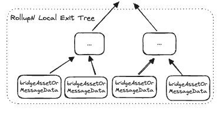
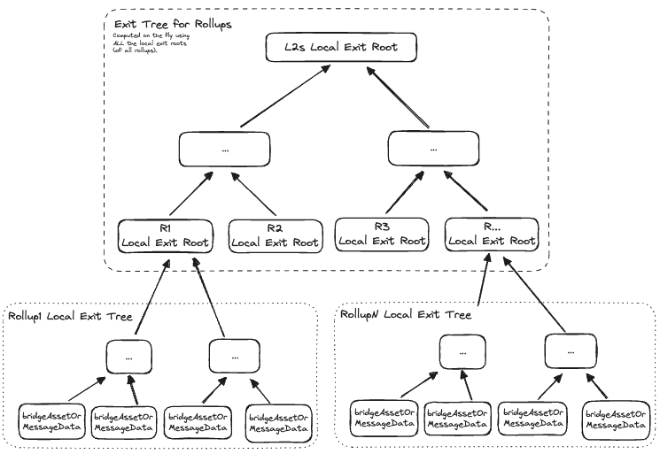
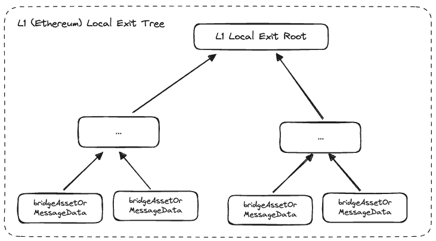
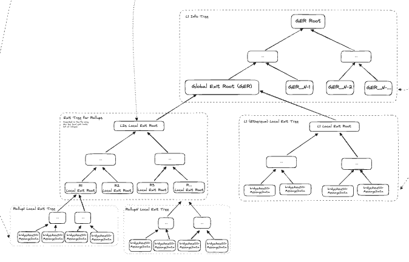
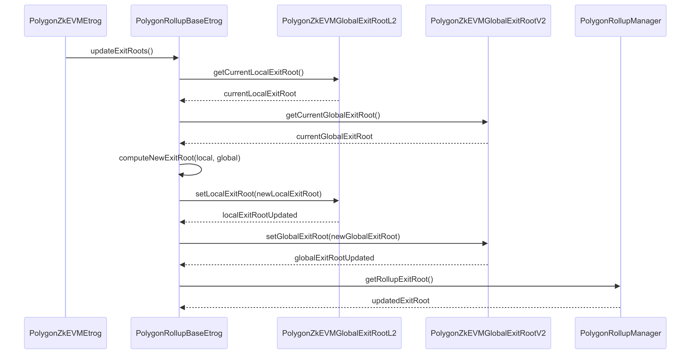
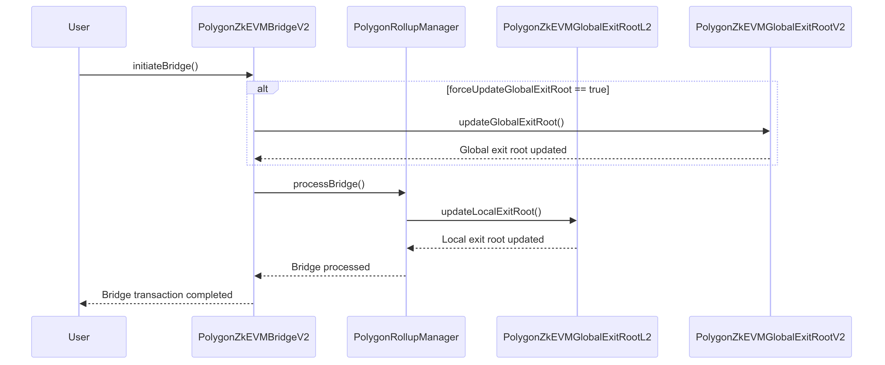

An exit tree is a binary, append-only, sparse Merkle tree (SMT) with a maximum depth of 32, where leaf nodes store bridging data.

The Merkle root of an exit tree is known as the exit tree root, and it is the fingerprint of all the information recorded in the exit tree's leaf nodes. 

The global exit tree root of the L1 info tree is, therefore, the source of truth for the whole network. 

## Rollup local exit trees

The L2 bridge contract manages a special Merkle tree called a local exit tree for each network that participates in bridging and claiming which is updated by the [PolygonZkEVMGlobalExitRootL2.sol](https://github.com/0xPolygonHermez/zkevm-contracts/blob/feature/etrog/contracts/PolygonZkEVMGlobalExitRootL2.sol) contract.

<center>



</center>

Data from `bridgeAsset()` and `bridgeMessage()` calls on the bridge is stored in leaf nodes on the local exit trees. 

!!! important
    The following exit tree structures are managed by:

    - The [PolygonRollupManager.sol](https://github.com/0xPolygonHermez/zkevm-contracts/blob/main/contracts/v2/PolygonRollupManager.sol). 
    - The L1 [PolygonZkEVMBridgeV2.sol](https://github.com/0xPolygonHermez/zkevm-contracts/blob/main/contracts/v2/PolygonZkEVMBridgeV2.sol) contract. 
    - The[PolygonZkEVMGlobalExitRootV2.sol](https://github.com/0xPolygonHermez/zkevm-contracts/blob/main/contracts/v2/PolygonZkEVMGlobalExitRootV2.sol).

## Exit tree for rollups

The roots of the L2 local exit trees feed into a single exit tree that manages state from all participating L2 rollups. The state lives in the L1 realm and is accessed at sequencing time.

<center>



</center>

The L2 local exit root is accessible on the rollup manager by calling the [`getRollupExitRoot()`](https://github.com/0xPolygonHermez/zkevm-contracts/blob/b2a62e6af5738366e7494e8312184b1d6fdf287c/contracts/v2/PolygonRollupManager.sol#L1620) method.

## L1 local exit tree

Every time there is a call to `bridgeAsset()` and `bridgeMessage()` on the bridge at the L1 Ethereum level, the data is stored in a leaf node on the L1 local exit tree.

<center>



</center>

## L1 info tree

The L1 info tree is stored in the [PolygonZkEVMGlobalExitRootV2.sol](https://github.com/0xPolygonHermez/zkevm-contracts/blob/main/contracts/v2/PolygonZkEVMGlobalExitRootV2.sol) contract also known as the global exit root manager.

All subtrees exit roots feed into the leaves of the L1 info tree, which contains the global exit root (GER). 

The GER is the fingerprint of the information stored in all trees, and thus represents the global state of the system.

<center>



</center>

## Exit leaves

Two constants define transaction leaf types in the bridge contract.

```solidity
// Leaf type asset
uint8 private constant _LEAF_TYPE_ASSET = 0;

// Leaf type message
uint8 private constant _LEAF_TYPE_MESSAGE = 1;
```

Data in a leaf contains a Keccak256 hash of the metadata (ABI encoded metadata if any) and the following parameters (matched by publicly available transaction data as seen in the [bridge L1 to L2](../../unified-LxLy/bridging.md#l1-to-l2) documentation):

```solidity
_addLeaf(
    getLeafValue(
        _LEAF_TYPE_ASSET, // or _LEAF_TYPE_MESSAGE_
        originNetwork,
        originTokenAddress,
        destinationNetwork,
        destinationAddress,
        leafAmount,
        keccak256(metadata)
    )
);
```

!!! info "Leaf parameters"
    - `int32 originNetwork`: Origin network ID, where the original asset belongs.
    - `address originTokenAddress`: If `leafType = 0`, Origin network token address (`0x0000...0000`) is reserved for ether. If `leafType = 1`, `msg.sender` of the message.
    - `uint32 destinationNetwor`k: Bridging destination network ID.
    - `address destinationAddress`: Address that receives the bridged asset in the destination network.
    - `uint256 leafAmount`: Amount of tokens/ether to bridge.
    - `bytes32 keccak256(metadata)`: Hash of the metadata. This metadata contains information about assets transferred or the message payload.

## Updating system state

The system uses a set of [exit tree roots](exit-roots.md) to manage system state. Leaves of the trees point to transaction data such as detailed above.

Adding a new leaf to the tree triggers an update to the exit tree root which then propagates to an update on the global exit tree root.

Using Merkle tree exit roots in this way, referenced by the bridge contracts and accessible to the `PolygonRollupManager` contract with getters, the bridge contract triggers data synchronization across L1 and L2, including at the sequencer and state db level.

The use of two distinct global exit root manager contracts for L1 and L2, as well as separate logic for the sequencing flow and the bridge contract, allows for extensive network interoperability. Meanwhile, all asset transfers can be validated by any L1 and L2 node due to the accessibility of state data.

The exit roots are modified in two key flows; sequencing and bridging.

### Sequencing flow

The `PolygonZkEVMGlobalExitRootV2` contract manages updates to the exit roots on sequencing. The contract calls `updateExitRoot(...)` on the `GlobalExitRootManager` during the sequencing flow to add an exit leaf to the relevant exit tree. 



1. Initiate update: `PolygonZkEVMEtrog` initiates the update process by calling `updateExitRoots` on `PolygonRollupBaseEtrog`.
2. Retrieve current roots: `PolygonRollupBaseEtrog` retrieves the current local and global exit roots from `PolygonZkEVMGlobalExitRootL2` and `PolygonZkEVMGlobalExitRootV2` respectively.
3. Compute new exit root: `PolygonRollupBaseEtrog` computes the new exit root based on the retrieved local and global exit roots.
4. Update local exit root: `PolygonRollupBaseEtrog` updates the local exit root in `PolygonZkEVMGlobalExitRootL2`.
5. Update global exit root: `PolygonRollupBaseEtrog` updates the global exit root in `PolygonZkEVMGlobalExitRootV2`.
6. Verify updated exit root: `PolygonRollupBaseEtrog` calls `getRollupExitRoot` on `PolygonRollupManager` to verify the updated exit root.

!!! tip "L1 or L2 update"
    - If `msg.sender` is the bridge contract, the L1 local exit root is updated.
    - If `msg.sender` is the rollup manager, the L2 local exit root is updated.

### Bridging flow

When bridging, the global exit root is updated if the [`forceUpdateGlobalExitRoot`](https://github.com/0xPolygonHermez/zkevm-contracts/blob/main/contracts/v2/PolygonZkEVMBridgeV2.sol#L312) variable is set to `true`.



1. The user interacts with the `PolygonZkEVMBridgeV2` contract by calling the `bridge()` function.
2. `PolygonZkEVMBridgeV2` calls `updateLocalExitRoot()` on `PolygonZkEVMGlobalExitRootL2`, which updates the local exit root.
3. If `forceUpdateGlobalExitRoot` is set to true, `PolygonZkEVMBridgeV2` calls `updateGlobalExitRoot()` on `PolygonZkEVMGlobalExitRootV2`, which updates the global exit root.