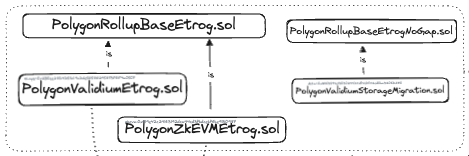
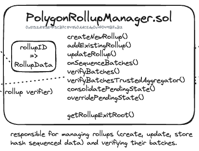
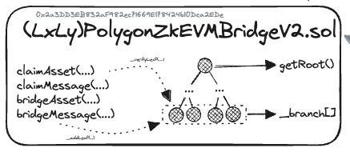
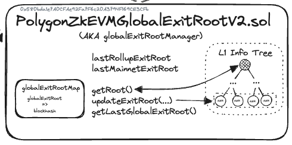
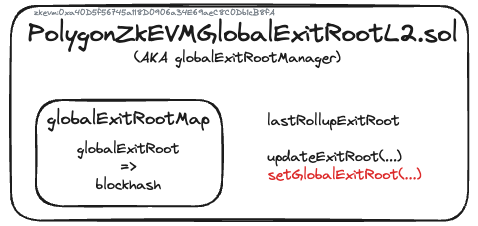

## Consensus contracts

The following contracts manage consensus mechanisms. They deal with sequencing and verifying transaction batches across the L1 and L2 networks.

### `PolygonRollupBaseEtrog.sol`

[PolygonRollupBaseEtrog.sol](https://github.com/0xPolygonHermez/zkevm-contracts/blob/main/contracts/v2/lib/PolygonRollupBaseEtrog.sol) is the base contract for rollups and validiums.

### `PolygonZkEVMEtrog.sol`

[PolygonZkEVMEtrog.sol](https://github.com/0xPolygonHermez/zkevm-contracts/blob/main/contracts/v2/consensus/zkEVM/PolygonZkEVMEtrog.sol) is the rollup contract inherited from the base contract.

This contract calls the `onSequenceBatches(...)` function on the `PolygonRollupManager.sol` contract to trigger the verification mechanism after successful sequencing through the `sequenceBatches(...)` call.

### `PolygonValidiumEtrog.sol`

[PolygonValidiumEtrog.sol](https://github.com/0xPolygonHermez/zkevm-contracts/blob/main/contracts/v2/consensus/validium/PolygonValidiumEtrog.sol) is the validium contract inherited from the base contract.

This contract calls the `onSequenceBatches(...)` function on the `PolygonRollupManager.sol` contract to trigger the verification mechanism after successful sequencing through the `sequenceBatchesValidium(...)` call.

!!! info
    - Custom chain contracts also exist at the consensus level and extend from common consensus base contracts.

## Rollup manager

### `PolygonRollupManager.sol`

The [PolygonRollupManager.sol](https://github.com/0xPolygonHermez/zkevm-contracts/blob/main/contracts/v2/PolygonRollupManager.sol) contract is responsible for managing rollups. It verifies batches, and also creates and updates rollup stacks by storing hash-sequenced data as newly sequenced batches arrive.

It is responsible for the verification workflow by supplying updated exit root data to the [PolygonZkEVMGlobalExitRootV2.sol](https://github.com/0xPolygonHermez/zkevm-contracts/blob/main/contracts/v2/PolygonZkEVMGlobalExitRootV2.sol) contract.

{ width=80% }

#### Key functionality

- Defining and adding rollup types which contains consensus implementation details and compatibility checks.
- Defining the [`RollupData`](https://github.com/0xPolygonHermez/zkevm-contracts/blob/main/contracts/v2/PolygonRollupManager.sol#L70s) struct.
- Initializes the trusted aggregator process for verifying multiple batches.
- Getting exit root data by computing all local exit roots of all rollups.
- Calculating batch rewards.

## Bridge

### `PolygonZkEVMBridgeV2.sol`

The [PolygonZkEVMBridgeV2.sol](https://github.com/0xPolygonHermez/zkevm-contracts/blob/main/contracts/v2/PolygonZkEVMBridgeV2.sol) is the main communication mechanism between the L1 and L2 realms. It manages bridging and claiming of assets and messages across environments.

{ width=80% }

#### Key functionality

- Bridging assets with the `bridgeAsset(...)` function.
- Bridging messages with a choice of `bridgeMessage(...)` functions for various scenarios.
- Claiming assets with the `claimAsset(..)` function.
- Claiming messages with the `claimMessage(...)` function.
- Verifying state and updating the global exit root with state changes.
- Providing access to the global exit root manager via the `IBasePolygonZkEVMGlobalExitRoot`.
- Interacting with the `PolygonZkEVMGlobalExitRootL2.sol` contract which exists in the L2 space as part of the bridge functionality.

## Exit roots

### `PolygonZkEVMGlobalExitRootV2.sol`

The [PolygonZkEVMGlobalExitRootV2.sol](https://github.com/0xPolygonHermez/zkevm-contracts/blob/main/contracts/v2/PolygonZkEVMGlobalExitRootV2.sol) contract manages the L1 info tree that represents the current state of the system by updating global exit roots on state changes. It does this task across multiple networks and layers.

#### Key functionality

- Updating the L1 info tree by emitting the `UpdateL1InfoTree(...)` event.
- Updating exit roots.
- Retrieving latest exit roots and leaf values.

{ width=60% }

### `PolygonZkEVMGlobalExitRootL2.sol`

The [PolygonZkEVMGlobalExitRootL2.sol](https://github.com/0xPolygonHermez/zkevm-contracts/blob/feature/etrog/contracts/PolygonZkEVMGlobalExitRootL2.sol) contract manages the L2 rollup info trees. 

It is a lighter-weight version of the global exit root contract mentioned previously.

#### Key functionality

- Stores every global exit root in the `globalExitRootMap` where keys are global exit roots and values are timestamps.
- Updates the `lastRollupExitRoot` on any bridge call.
- Updates the L2 network and global exit root with the `updateExitRoot(...)` function.

{ width=60% }

