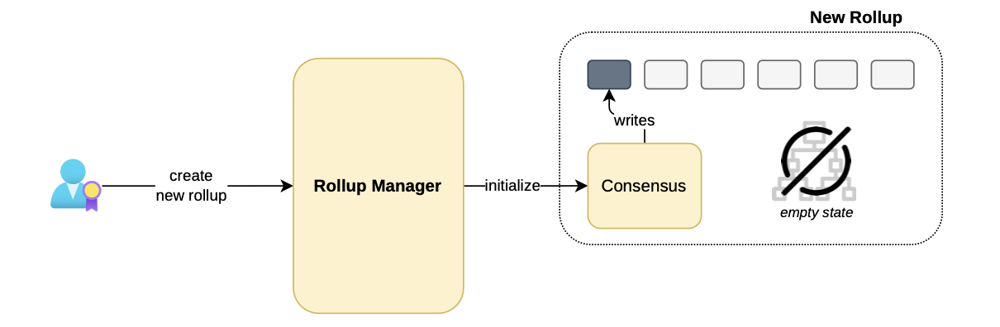
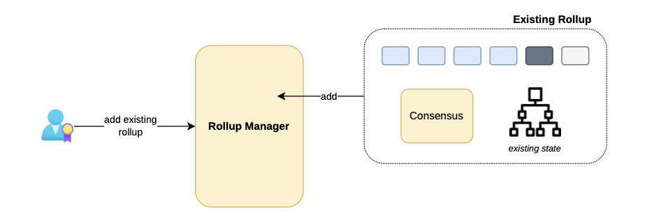
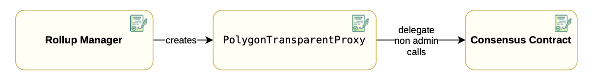

The [rollup manager contract](https://github.com/0xPolygonHermez/zkevm-contracts/blob/feature/etrog/contracts/v2/PolygonRollupManager.sol) creates rollups and verifies their batches. 

Rollup creation means one of the following: 

- Creating and initializing a brand new rollup.
- Incorporating an existing rollup under the management of the `RollupManager.sol`

## Creating new rollups

The first scenario involves newly created rollups, which have not yet been initialized, and therefore have an empty state.

When a user triggers the rollup manager's function to create a new rollup, the `RollupManager` contract:

- Populates the configuration parameters.
- Initializes the rollup by generating and writing the genesis block. 
- Sequences transactions for initializing the bridge contract attached to the rollup.

The figure below depicts the process of creating and initializing a new rollup instance. Observe that the state tree is empty in this situation.



## Incorporating existing rollups

When an operational rollup is already present on the Ethereum network, a user with the necessary rights can add it to the `RollupManager` for centralized management.

In this scenario, the consensus needs no initialization because the rollup, its genesis block, and corresponding bridge, have already been established.

The diagram below depicts the integration of an existing and operational rollup into the `RollupManager`. In this case, the state tree has information which is added to the manager.



## Rollup types

Each new rollup has a `RollupType` struct:

```solidity
/**
* @notice Struct which to store the rollup type data
* @param consensusImplementation Consensus implementation ( contains the consensus logic for the transaparent proxy)
* @param verifier verifier
* @param forkID fork ID
* @param rollupCompatibilityID Rollup compatibility ID, to check upgradability between rollup types
* @param obsolete Indicates if the rollup type is obsolete
* @param genesis Genesis block of the rollup, note that will only be used on creating new rollups, not upgrade them
*/
struct RollupType {
    address consensusImplementation;
    IVerifierRollup verifier;
    uint64 forkID;
    uint8 rollupCompatibilityID;
    bool obsolete;
    bytes32 genesis;
}
```

- The consensus implementation address is the address of the consensus contract responsible for sequencing batches.
- The `IVerifierRollup` enables verification of each proof sent by the aggregator.
- The `forkID` tracks changes in rollup processing.
- The rollup compatibility identifier is used to prevent compatibility errors when the rollup needs an upgrade.
- The obsolete flag indicates whether the rollup is obsolete or not.
- The genesis block is the rollup's initial block and can include a small initial state.

!!! note
    - Several rollups can have the same `RollupType`​.
    - This means they share consensus and batch verification smart contracts.

### `addNewRollupType` function

The [`addNewRollupType(...)`](https://github.com/0xPolygonHermez/zkevm-contracts/blob/b2a62e6af5738366e7494e8312184b1d6fdf287c/contracts/v2/PolygonRollupManager.sol#L493) function adds a new rollup type.

### `obsoleteRollupType` function

The [`obsoleteRollupType(...)`](https://github.com/0xPolygonHermez/zkevm-contracts/blob/b2a62e6af5738366e7494e8312184b1d6fdf287c/contracts/v2/PolygonRollupManager.sol#L527) obsoletes an existing rollup type.

!!! tip
    - It is not possible to create a new rollup of an obsolete rollup type.

## Rollup data

Rollup state data is included in a struct called `RollupData`.

```solidity
/**
     * @notice Struct which to store the rollup data of each chain
     * @param rollupContract Rollup consensus contract, which manages everything
     * related to sequencing transactions
     * @param chainID Chain ID of the rollup
     * @param verifier Verifier contract
     * @param forkID ForkID of the rollup
     * @param batchNumToStateRoot State root mapping
     * @param sequencedBatches Queue of batches that defines the virtual state
     * @param pendingStateTransitions Pending state mapping
     * @param lastLocalExitRoot Last exit root verified, used for compute the rollupExitRoot
     * @param lastBatchSequenced Last batch sent by the consensus contract
     * @param lastVerifiedBatch Last batch verified
     * @param lastPendingState Last pending state
     * @param lastPendingStateConsolidated Last pending state consolidated
     * @param lastVerifiedBatchBeforeUpgrade Last batch verified before the last upgrade
     * @param rollupTypeID Rollup type ID, can be 0 if it was added as an existing rollup
     * @param rollupCompatibilityID Rollup ID used for compatibility checks when upgrading
     */
    struct RollupData {
        IPolygonRollupBase rollupContract;
        uint64 chainID;
        IVerifierRollup verifier;
        uint64 forkID;
        mapping(uint64 batchNum => bytes32) batchNumToStateRoot;
        mapping(uint64 batchNum => SequencedBatchData) sequencedBatches;
        mapping(uint256 pendingStateNum => PendingState) pendingStateTransitions;
        bytes32 lastLocalExitRoot;
        uint64 lastBatchSequenced;
        uint64 lastVerifiedBatch;
        uint64 lastPendingState;
        uint64 lastPendingStateConsolidated;
        uint64 lastVerifiedBatchBeforeUpgrade;
        uint64 rollupTypeID;
        uint8 rollupCompatibilityID;
    }
```

The struct contains:

- Information about the current state of the rollup (e.g., the current batch being sequenced or verified, the states root for each batch, etc.)
- Information about the bridge within the rollup, such as the current local exit root.
- Data about [forced batches](../../protocol/malfunction-resistance/sequencer-resistance.md).

## Creating a rollup

Each rollup is associated with either a single rollup type or none.

In order to create a rollup of a certain rollup type, we can use the $\texttt{createNewRollup()}$ function by specifying:

- The associated non-obsolete rollup type identifier, which should be existing.
- The $\texttt{chainID}$ of the rollup, which should be new among the Polygon network's rollup chain IDs.
- The address of the rollup admin, who is able to update several parameters of the consensus contract. For instance, setting a trusted sequencer or a force batches address.
- The address of the trusted sequencer, which is the node responsible for sending the transaction for executing the $\texttt{sequenceBatches()}$ function.
- The address of the token address used to pay gas fees, in the newly created rollup.


When creating a new rollup, OpenZeppelin's [transparent proxy pattern](https://blog.openzeppelin.com/the-transparent-proxy-pattern) is employed by generating an instance of the $\texttt{PolygonTransparentProxy}$ contract.

During this process, the consensus contract is specified by the rollup type serving as its implementation.

Since the rollup is currently not initialized, the $\texttt{RollupData}$ is partially filled, and stored in the $\texttt{rollupIDToRollupData}$​ mapping within the contract’s storage.

The rollup creation process is concluded by calling the $\texttt{initialize()}$​ function of the consensus, which is in charge of setting previously specified addresses in the consensus contract.

Below is a schematic representation of the transparent proxy pattern within the Rollup Manager context.



Proxies are frequently utilized in Ethereum for upgradability, and the exact usage of proxies in the Polygon zkEVM's upgradability is discussed [here](https://docs.polygon.technology/zkEVM/architecture/protocol/upgradability/).

!!!caution
    
    While it is technically imprecise, for the sake of simplicity, we refer to both rollups and validiums as 'rollups'.

### Updating a rollup

It is often necessary to enable upgradeability of rollups.

More specifically, a user with appropriate rights can change the consensus implementation and the type of a certain rollup. Such a user can therefore modify the sequencing or verification procedures of a rollup.

In order to change the consensus, the function $\texttt{UpdateRollup()}$ needs to change the transparent proxy implementation.

In the upgrading procedure, the $\texttt{rollupCompatibilityID}$ comes into play:

- In order to avoid errors, we can only upgrade to a rollup type having the same compatibility identifier as the original one. 

If this is not the case, the transaction is reverted, raising the $\texttt{UpdateNotCompatible}$ error.

### Adding existing rollups

Rollups that are already deployed and working, do not follow any rollup type.

Such an existing rollup can be added to the $\texttt{RollupManager}$ via the $\texttt{addExistingRollup}()$ function, by specifying its current address.

When the verifier implements the $\texttt{IVerifierRollup}$ interface, it requests only for the raw consensus contract address, as it will not be used directly but through a proxy to allow upgradeability options.

As mentioned before, rollups that are deployed and already in operation can be added to the $\texttt{RollupManager}$ in order to allow unified management.

In this case, the [$\texttt{addExistingRollup()}$](https://github.com/0xPolygonHermez/zkevm-contracts/blob/8fc03b0e83cbb143fdc6c1ecfaafa5c294c25509/contracts/v2/PolygonRollupManager.sol#L640C14-L640C31) function is called.

Since the rollup has previously been initialized, the following information needs to be provided:

- The consensus contract, implementing the [$\texttt{IPolygonRollupBase}$](https://github.com/0xPolygonHermez/zkevm-contracts/blob/develop/contracts/v2/interfaces/IPolygonRollupBase.sol) interface.
- The verifier contract, implementing the [$\texttt{IVerifierRollup}$](https://github.com/0xPolygonHermez/zkevm-contracts/blob/develop/contracts/interfaces/IVerifierRollup.sol) interface.
- The $\texttt{forkID}$ of the existent rollup.
- The $\texttt{chainID}$ of the existent rollup.
- The genesis block of the rollup.
- The $\texttt{rollupCompatibilityID}$.

Observe that most of these parameters were actually provided by the $\texttt{RollupType}$, but $\texttt{RollupData}$ of already existing rollups is constructed by hand, since they do not follow any rollup type as yet.
