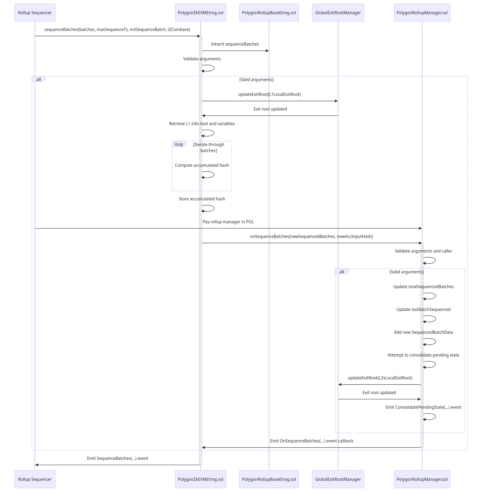

Transactions flowing through the system reach the smart contract environment after one of two contract call use cases:

- Sequence batches requests coming from the sequencer component in the node.
- Verifying batches requests coming from the aggregator component in the node.

This section focuses on the sequencing workflow. 

The diagram below shows the sequencing workflow for rollup (non-validium) stacks which calls `sequenceBatches(...)` and `onSequenceBatches(...)`. 



## `sequenceBatches()`

The `sequenceBatches()` function is called on the `PolygonZkEVMEtrog.sol` contract:

```
sequenceBatches(batches, maxSequenceTs, initSequenceBatch, l2Coinbase)
```

The rollup sequencer component calls the [`sequenceBatches`](https://github.com/0xPolygonHermez/zkevm-contracts/blob/1ad7089d04910c319a257ff4f3674ffd6fc6e64e/contracts/v2/lib/PolygonRollupBaseEtrog.sol#L425) function on the [`PolygonZkEVMEtrog.sol`](https://github.com/0xPolygonHermez/zkevm-contracts/blob/1ad7089d04910c319a257ff4f3674ffd6fc6e64e/contracts/v2/consensus/zkEVM/PolygonZkEVMEtrog.sol) contract which inherits the function from [PolygonRollupBaseEtrog.sol](https://github.com/0xPolygonHermez/zkevm-contracts/blob/1ad7089d04910c319a257ff4f3674ffd6fc6e64e/contracts/v2/lib/PolygonRollupBaseEtrog.sol).

The function takes an array of `BatchData` structs from one of the consensus contracts. Each struct contains L2 Ethereum transactions data, and some forced state information.

```solidity
struct BatchData {
    bytes transactions;
    bytes32 forcedGlobalExitRoot;
    uint64 forcedTimestamp;
    bytes32 forcedBlockHashL1;
}
```

The function validates arguments, checks and organizes the batches, and appends them in the correct sequence while computing an accumulated hash. 

Finally, the function emits a `SequenceBatches` event which sends a newly sequenced batch of transactions to the `PolygonRollupManager.sol` contract after the [`onSequenceBatches(...)`](./api/PolygonRollupManager.md/#onsequencebatches) function returns successfully. 

Stepwise, the function does the following:

1. Validates arguments.
1. Tells the bridge to update the global exit root by calling `globalExitRootManager.updateExitRoot(L1LocalExitRoot)` which creates a new global exit root with the newest L1 local exit root.
1. Gets L1 info root and other variables needed for computation.
1. Goes through the batches to compute the accumulated hash with `keccak(batch.transaction)` and `keccak(accInputHash, txHash, l1InfoRoot, maxSequenceTs, l2Coinbase, bytes32(0))`.
1. Stores the accumulated hash.
1. Caller pays the rollup manager in POL.
1. Calls the `PolygonRollupManager.onSequenceBatches(...)` function which waits for an `OnSequenceBatches(...)` event callback.
1. Emits `SequenceBatches(...)` event.

## `onSequenceBatches()`

The `onSequenceBatches()` function is called on the `PolygonRollupManager.sol` contract:

```
onSequenceBatches(newSequencedBatches, newAccInputHash)
```

It takes the sequenced batches and the accumulated hash from the calling contract, adds the batches to the correct stack, and updates the batch count.

Stepwise, the function does the following:

1. Validates the arguments and the caller contract.
1. Updates the `totalSequencedBatches` storage variable.
1. Updates the `lastBatchSequenced` and adds a new `SequencedBatchData` struct for the rollup that called `sequenceBatches`.
1. Attempts to consolidate pending state for the rollup by updating `lastVerifiedBatch`, `batchNumToStateRoot[]`, and `lastLocalExitRoot` state variables, and also by updating `globalExitRootManager.updateExitRoot(L2sLocalExitRoot)`, after which it emits a `ConsolidatePendingState(...)` event.
1. Emits an `OnSequenceBatches(...)` event back to the original `sequenceBatches(...)` call.

## `sequenceBatchesValidium()`

The `sequenceBatchesValidium()` function is called on the `PolygonValidiumEtrog.sol` contract:

```
sequenceBatchesValidium(batches, l2Coinbase, dataAvailabilityMessage)
```

!!! info
    - This function is not included in the sequence diagram above.
    - The differences, however, are minimal.


The sequencing logic is nearly the same as for the rollup `sequenceBatches(...)` function except the function takes a `ValidiumBatchData[]` array instead of `BatchData[]`. This means that, instead of passing the actual transaction data, the struct passes the hashes of the transactions.

```solidity
struct ValidiumBatchData {
    bytes32 transactionsHash;
    bytes32 forcedGlobalExitRoot;
    uint64 forcedTimestamp;
    bytes32 forcedBlockHashL1;
}
```

It also has a `dataAvailabilityMessage` parameter instead of the sequence information. This parameter contains all the ECDSA address signatures of the committee in ascending order and is used for verification.

Stepwise, the function has identical logic to the `PolygonRollupBaseEtrog.sequenceBatches(...)` function apart from the following steps:

1. `ValdiumBatchData` instead of `BatchData`.
1. Accumulates the txHash into `accumulatedNonForcedTransactionHash`.
1. Adds a validity check with `dataAvailabilityProtocol.verifyMessage(accumulatedNonForcedTransactionHash, dataAvailabilityMessage)`.
