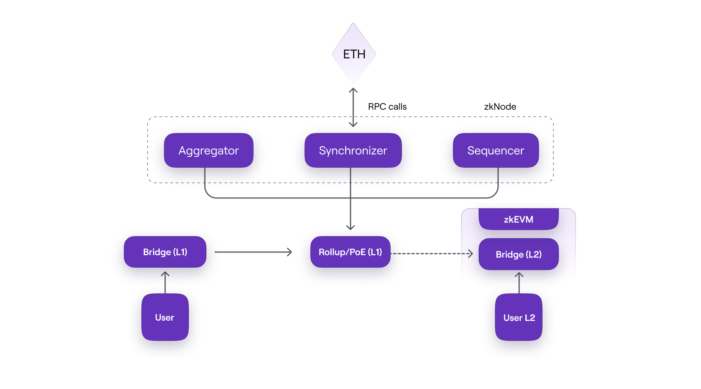
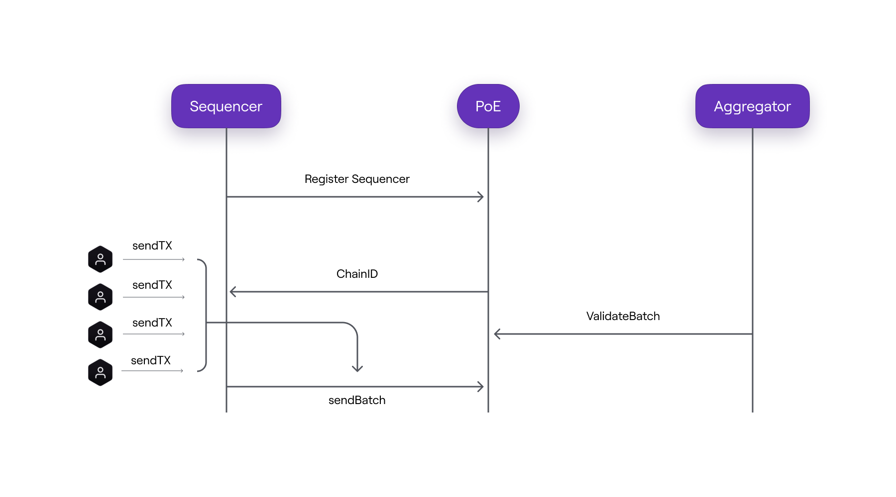

As an Ethereum Layer 2 scaling solution, Polygon zkEVM gathers transactions into batches after executing them.

Aggregated batches are then dispatched to Ethereum for verification and validation, all managed through smart contracts.

This document aims to offer a comprehensive understanding of the protocol design while delineating the currently implemented configuration.

The major components of Polygon zkEVM are:

- Consensus contract, which was initially `PolygonZkEVM.sol` has now been upgraded to `PolygonZkEVMEtrog.sol`. 

- zkNode, consisting of the synchronizer, sequencer, aggregator, and RPC.

- zkProver for generating verifiable proofs of correct transaction executions. 

- zkEVM bridge for cross-chain messaging and transferring assets.

The skeletal architecture of Polygon zkEVM is shown below:

## Consensus contract

The earlier version, Polygon Hermez 1.0, was based on the Proof of Donation (PoD) consensus mechanism. 

PoD was basically a decentralized auction conducted automatically, with participants (coordinators) bidding a certain number of tokens in order to be selected for creating batches.

The updated consensus contract is designed to build upon the insights gained from PoD in v1.0 and adds support for permissionless participation of multiple coordinators in producing L2 batches.

In the PoD mechanism, economic incentives were structured to _require_ validators to operate with high efficiency to remain competitive.

The latest version of the zkEVM consensus contract (deployed on Layer 1) is modeled after the [Proof of Efficiency](https://ethresear.ch/t/proof-of-efficiency-a-new-consensus-mechanism-for-zk-rollups/11988).

While the protocol design is intended to support permissionless participation of multiple coordinators to generate L2 batches, for security reasons and given the protocol's early development stage, only one coordinator (referred to as the Sequencer) is currently operational.
​
### Implementation model
​
Unlike the PoD, the Consensus Contract employs a simpler technique and is favoured due to its greater efficiency in resolving the challenges involved in PoD.

The strategic implementation of the contract-based consensus ensures that the network:

- Maintains its permissionless feature to produce L2 batches.
- Is highly efficient, a criterion which is key for the overall network performance.
- Attains an acceptable degree of decentralization.
- Is protected from malicious attacks, especially by validators.
- Maintains a fair balance between overall validation effort and network value.

!!!tip
    Good to Know

    Possibilities of coupling the Consensus Contract (previously called Proof of Efficiency or PoE) with a PoS (Proof of Stake) are currently being explored. A detailed description is published on the [Ethereum Research](https://ethresear.ch/t/proof-of-efficiency-a-new-consensus-mechanism-for-zk-rollups/11988) website.

### On-chain data availability
​
A full zk-rollup schema requires on-chain publication of both the transaction data (which users need to reconstruct the full state) and the validity proofs (zero-knowledge proofs).

However, given Ethereum's current framework, publishing callback data to L1 incurs high gas fees, complicating the decision between opting for a full zk-rollup or a hybrid configuration.

Under a Hybrid schema, either of the following is possible:

- Validium: Data is stored off-chain and only the validity proofs are published on-chain.
- Volition: For some transactions, both the data and the validity proofs are published on-chain, while in others, only the proofs are stored on-chain.

Unless, among other considerations, the proving module can be significantly accelerated to alleviate high costs for validators, a hybrid schema remains a viable option.
​
### `PolygonZkEVMEtrog.sol`
​
The underlying protocol in zkEVM ensures that the state transitions are correct by employing a validity proof.

In order to ensure adherence to a set of pre-determined rules for state transitions, the consensus contract deployed on L1, is utilized.
​
!!! info
    The consensus contract is currently deployed on both [Ethereum mainnet](https://etherscan.io/address/0x5132A183E9F3CB7C848b0AAC5Ae0c4f0491B7aB2) and [Cardona testnet](https://sepolia.etherscan.io/address/0xa997cfD539E703921fD1e3Cf25b4c241a27a4c7A).
​
A smart contract verifies the validity proofs to ensure that each transition is completed correctly. 

State transition verification is carried out by employing zk-SNARK circuits. 

A system of this type necessitates two processes: transaction batching and transaction validation.

Polygon zkEVM implements two participant network roles in order to carry out its procedures: A sequencer and an aggregator.

Under this two-layer model:

- The sequencer proposes transaction batches to the network upon executing them. That is, it rolls up transactions into batches and adds them to the consensus contract.
​
- The aggregator checks the validity of the transaction batches and provides validity proofs.

The smart contract, therefore, makes two calls:

- Firstly, to receive batches from the sequencer.
- Secondly to aggregators, requesting batches to be validated.
​

!!!info
    
    Although the current protocol design allows for several sequencers and aggregators, to prioritize security and given the early stage of protocol development, only one sequencer and one aggregator are currently operational.

    These are henceforth referred to as the _trusted sequencer_ and the _trusted aggregator_.

## zkNode

zkNode is the essential software for running a zkEVM node. It is a client that the network requires to implement the synchronization and govern the roles of the participants, including the trusted sequencer and the trusted aggregator.

The consensus smart contract imposes the following requirements on the trusted sequencer and the trusted aggregator.
​
### Sequencer

- The trusted sequencer must run the software necessary for a full zkEVM node.

- The trusted sequencer should pay a fee in the form of POL tokens for the right to create and process batches.

- The trusted sequencer is incentivized to propose valid batches (consisting of valid transactions) with the fees paid by the network users who initiated the transactions.

### Aggregator

A trusted aggregator receives all the transaction information from the trusted sequencer and sends it to the prover, which in turn provides a zk-proof after performing some complex computations. 

A special _verfier_ smart contract validates the validity proof.

The trusted aggregator's task is to therefore:

- Provide validity proofs for the L2 transactions proposed by the trusted sequencer.

- Run zkEVM's zkNode software and the zkProver for generating zero-knowledge validity proofs.

- For a given batch, the trusted aggregator earns the POL fees (paid by the trusted sequencer) for providing a validity proof.

- In a decentralized setting, each trusted aggregator needs to declare its intention to validate transactions, and subsequently compete to produce validity proofs based on its own strategy.

Other than the trusted sequencer and the trusted aggregator, participants in the Polygon zkEVM network can take part as nodes that seek to know the state of the network.

The zkNode architecture is modular in nature. You can dig deeper into zkNode and its components [here](zknode/index.md).

### Incentivization structure

The two permissionless participants of the zkEVM network are the trusted sequencer and the trusted aggregator.

Proper incentive structures have been devised to keep the zkEVM network fast and secure.

Below is a summary of the fee structure for the trusted sequencer and the trusted aggregator:

- Sequencer
    
    - Collects transactions from a designated pool DB and puts them in a batch.
    - Receives fees paid by users who submitted the transactions.
    - Pays L1 transaction fees + POL (depending on pending batches).
    - The POL tokens go to the trusted aggregator.
    - Profitable if: `txs fees` > `L1 call` + `POL` fee.

- Aggregator
    
    - Processes transactions published by the trusted sequencer.
    - Builds zkProof.
    - Receives POL tokens from the trusted sequencer.
    - Static cost: L1 call cost + server cost (to build a proof).
    - Profitable if: `POL fees` > `L1 call cost` + `server cost`

  See the [Effective gas price document](../architecture/effective-gas/index.md) for how users can estimate the gas price to sign transactions with.

## zkProver

zkEVM employs zero-knowledge technology to generate validity proofs.

It uses a zero-knowledge prover (zkProver), which is intended to run on a server and is being engineered to be compatible with most consumer hardware.

The trusted aggregator uses the zkProver to validate batches and provide validity proofs.

The zkProver consists of a main state machine executor, a collection of secondary state machines (some with their own executor), a STARK-proof builder, and a SNARK-proof builder.

In a nutshell, the zkEVM expresses state changes in polynomial form. 

As a result, the constraints that each state transition must fulfil are polynomial constraints or polynomial identities.

In other words, all valid batches must satisfy specific polynomial constraints. 

Check out the detailed architecture of the zkProver [here](zkprover/index.md).

## zkEVM bridge

The zkEVM bridge is a smart contract that lets users transfer their assets between two layers, LX and LY.

The L1-L2 in zkEVM is a decentralized bridge for secure deposits and withdrawal of assets.

It is a combination of two smart contracts, one deployed on one chain and the second on the other.

The L1 and L2 contracts in zkEVM are identical except for where each is deployed.

Bridge L1 contract is on the Ethereum mainnet in order to manage asset transfers between rollups, while bridge L2 contract operates in a designated rollup, managing asset transfers between mainnet and the rollup(s).

Layer 2 interoperability allows a native mechanism to migrate assets between different L2 networks. This solution is embedded in the bridge smart contract.

## Verifier

Verifier is a smart contract which is able to verify any zk-SNARK cryptographic proof. 

The SNARK verifier proves the validity of every transaction in the batch.

It is the core entity in any zk-rollup architecture as it verifies the correctness of each proof, thus ensuring the integrity of state transitions.

The verifier contract is currently deployed on the [Ethereum mainnet](https://etherscan.io/address/0x4F9A0e7FD2Bf6067db6994CF12E4495Df938E6e9) and [Cardona testnet](https://sepolia.etherscan.io/address/0x8EdA1d8c254a77a57A6A7A1C0262e9A44A7C6D6d).
