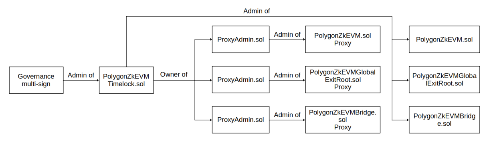

Polygon zkEVM's _Admin_ consists of three (3) developers of the Polygon team, who oversee any upgrades of the zk-rollup software.

Whenever there are bug fixes or updates to be made, the Admin uses a special _Admin Multisig Contract_ to approve the changes.

Approval by any two of the three Admin members (_2-out-of-3_) is required.

However, there's a minimum 10-day waiting period before the changes get executed.

The 10-day delay allows users to carefully assess the proposed changes and decide whether to exit or not.

Another smart contract called _Timelock Contract_ is responsible for enabling the 10-day delay.

An outline of the _upgrade process_ is outlined [here](upgrade-process.md).

## Admin contract in detail

The Admin owns the Ethereum account that controls the Consensus contract, and it is
the only account that can call the following functions;

- `setTrustedSequencer`
- `setForceBatchAllowed`
- `setTrustedSequencerURL`
- `setTrustedAggregator`
- `setTrustedAggregatorTimeout`
- `setPendingStateTimeout`
- `setMultiplierBatchFee`
- `setVeryBatchTimeTarget`
- `setAdmin`
- `deactivateEmergencyState`

All **ProxyAdmin.sol** instances that can upgrade the contract implementations of the zkEVM Protocol belong to the Admin account.

Moreover, all proxies are owned by the Admin account, making it the only account (other than the Security Council Multisig) authorized to make modifications to the contracts used to implement the zkEVM Protocol.

## Timelock controller

!!!tip
     What is Timelock Controller

     Timelock Controller is a smart contract that enables setting up a delay to provide users some time to leave before applying potentially risky maintenance procedures.

The **Timelock Controller** has been added to the zkEVM Protocol in order to improve user security and confidence.

The Admin can schedule and commit maintenance operations transactions in L1 using a Timelock Controller, and the timelock can be activated to carry out the transactions when a specified `minDelay` time has passed.

**The Polygon zkEVM team has decided to use the [OpenZeppelin's TimelockController.sol contract](https://github.com/OpenZeppelin/openzeppelin-contracts/blob/master/contracts/governance/TimelockController.sol) to inherit security as well to avoid the lengthy and complicated audit process**. We have changed the `getMinDelay` method in the contract and this modified implementation is named **PolygonZkEVMTimelock.sol** contract.

In the event that the zkEVM contract system is in [Emergency Mode](malfunction-resistance/emergency-state.md), the new `getMinDelay` will set the time `minDelay` to 0. This is when the Security Council Multisig takes control.

The zKEVM Protocol’s Admin role is set to an instance of **PolygonZkEVMTimelock.sol** contract address since the deployment of the zk-rollup.

## Governance of zKEVM contracts

The Admin carries significant and critical responsibility, which is why it is composed of three (3) members as opposed to just one person. For this reason, the Admin Ethereum account of a `PolygonZkEVMTimelock.sol` contract instance is assigned to a multisig contract that acts as a governance tool for the zkEVM Protocol, therefore achieving some degree of overall decentralization.

Below figure shows the governance tree of Polygon zkEVM L1 contracts.

Protocol maintenance operations can only be performed by following these steps:

!!!info
    Due to the governance chain among protocol contracts, all transactions generally follow the below steps.

1. Maintenance operations transactions are proposed and stored into governance multisig contract. Polygon team reaches a consensus on whether or not to apply these operations. Voting inherits security from L1.

2. **Once a decision has been reached**, and the results are favorable to perform maintenance operations, **the governance multisig can be triggered to schedule the transactions to be executed** but only when the 10-day time delay has passed.

3. Once a time delay has passed, the Timelock Contract dubbed **PolygonZkEVMTimelock.sol** executes the scheduled transactions.
