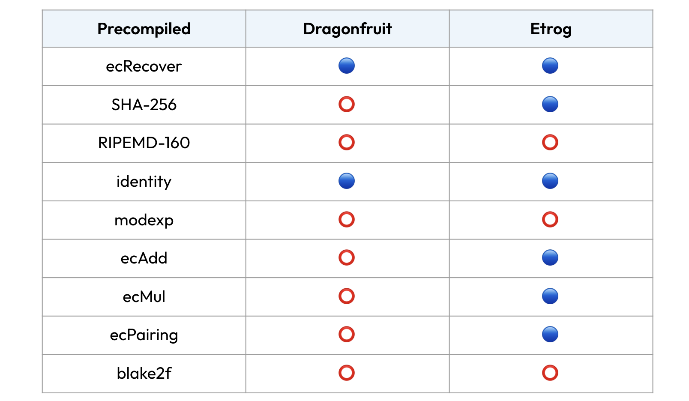
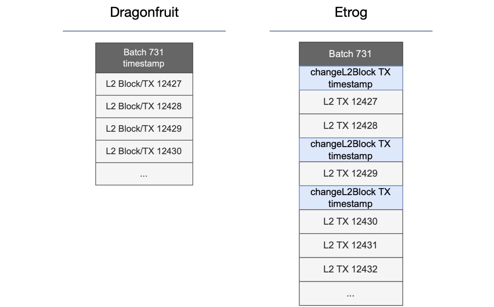
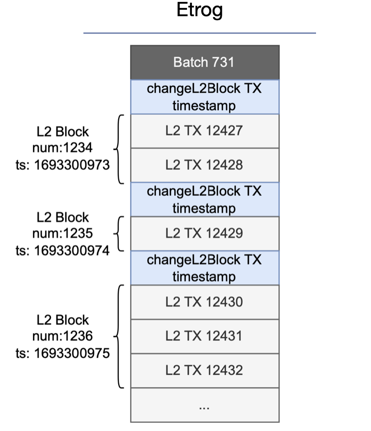

# Etrog upgrade

This document provides details of the Etrog upgrade, which is Polygon zkEVM's upgrade that succeeds the dragonfruit upgrade.

Although the Dragonfruit upgrade had some advantages over previous zkEVM versions, it has its own pain points. We take a look at what these pain points are, and how the Etrog upgrade resolves them.

Before discussing all these, we present the newly launched testnet that coincides with the Etrog upgrade.

## Cardona testnet

In addition to the Goërli testnet, a second testnet is launched on Sepolia and it is dubbed Cardona.

Due to the looming deprecation of the Goërli testnet, the Polygon team had to put in place a second testnet. This ensures that the zkEVM can continue running even beyond the Goërli's discontinuation.

Cardona testnet is ready for developers and users to connect wallets, and begin testing the Etrog upgrade of Polygon zkEVM.

Use the following details to connect wallets to Cardona:

- Network Name: Polygon zkEVM Cardona Testnet

- Bridge UI: https://bridge-ui.cardona.zkevm-rpc.com

- New RPC URL: https://rpc.cardona.zkevm-rpc.com

- Chain ID: 2442

- Currency symbol: ETH

- Block Explorer: https://explorer-ui.cardona.zkevm-rpc.com

We use the same faucet for testnet tokens, here: https://faucet.polygon.technology/

## zkEVM is type-2

The Etrog upgrade comes with support for most of the EVM's [precompiled contracts](https://www.evm.codes/precompiled?fork=shanghai); ecRecover, SHA-256, identity, modexp, ecAdd, ecMul, and ecPairing. This only leaves out the barely used RIPEMD-160 and blake2f.

Owing to this fact, the Etrog upgrade therefore helps Polygon zkEVM reach one of its major milestones, becoming a type-2 zkEVM.

The below table displays Polygon zkEVM's precompiled status.

## Dragonfruit issues

Dragonfruit upgrade inherited from its predecessors, the configuration that each block in the zkEVM is equivalent to one L2 transaction.

The justification for the _one block per transaction_ configuration was that it achieves minimum delay when creating blocks.

It however results in a few issues when blocks are processed.

The first issue is that it generates a lot of data in the database due to the huge amount of L2 blocks being created. 

The second being, the approach lacks a way to provide different timestamps for blocks within a batch. So, all blocks in a batch have the same timestamp.

However, attaching one timestamp to several blocks causes breaks in dApps that rely on timestamps for proper timing of smart contracts' actions.

The crucial alterations made in the Etrog upgrade are therefore on; the _one block per transaction_ approach, and the _one timestamp for many blocks_ problem.

## Etrog Blocks

Up until the dragonfruit upgrade, each L2 block contains a single transaction. The same approach taken by Optimism.

Since a block is formed when the sequencer decides to include a transaction in a batch, prior to the Etrog upgrade, every batch contained as many blocks as transactions. As mentioned above, this resulted in bloated databases.

Due to this problem, blocks in the Etrog upgrade have been reconstructed to contain more than one transaction.

Blocks with several transactions are achieved by using a small timeout of a few seconds, or a number of milliseconds, when creating the block and waiting for transactions to be added.

The below figure displays blocks of the Etrog upgrade vis-à-vis those of the Dragonfruit upgrade.

## Etrog Timestamps

In order to circumvent the above-mentioned issue related to the _one timestamp for many blocks_ problem, each block in the Etrog upgrade's batch receives its own unique timestamp. This is in addition to allowing more than one transaction per block.

The solution is achieved by enabling the sequencer to change the timestamp for different blocks within a batch. To do so, a special transaction or marker called `changeL2Block`, is introduced within a batch to mark whenever there is a block change.

The below figure shows how `changeL2Block` is used to change the timestamp whenever a new block is formed.

## Conclusion

The Etrog upgrade comes with groundbreaking amendments aimed at improving UX and developer experience. The most important additions with this upgrade are the two adjustments that solve the two issues mentioned-above:

- Being able to add multiple transactions to one block.
- Allowing granularity on the timestamp within a batch.

Attaining the Type-2 status is remarkable.
