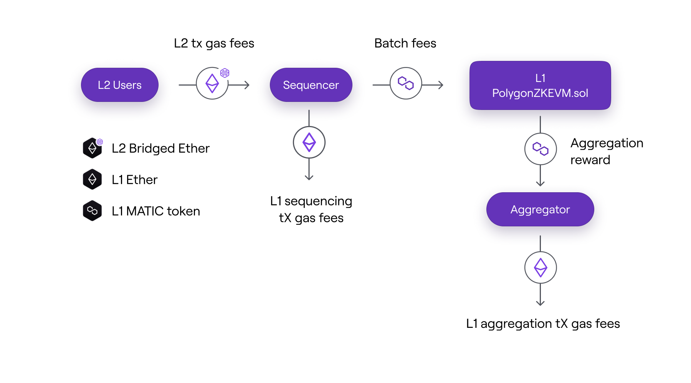
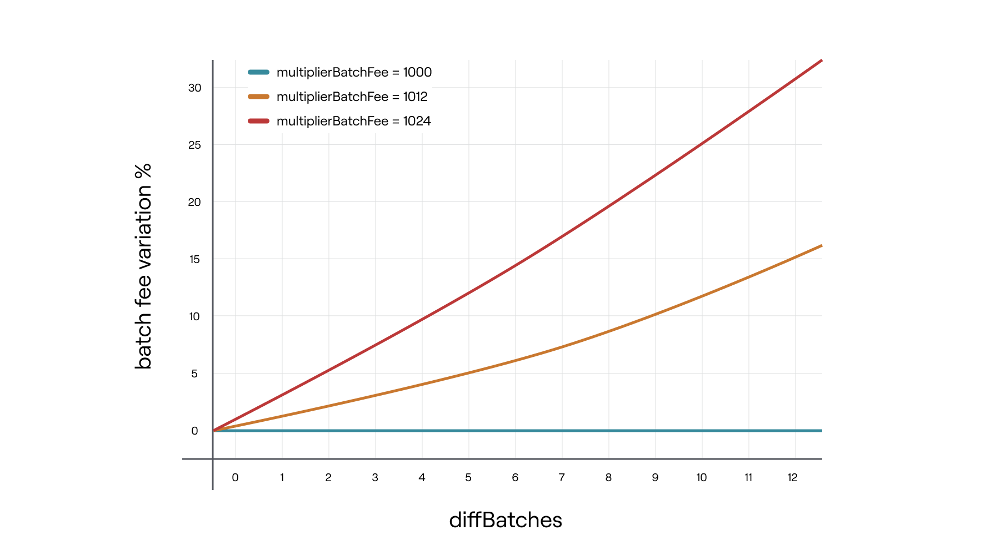
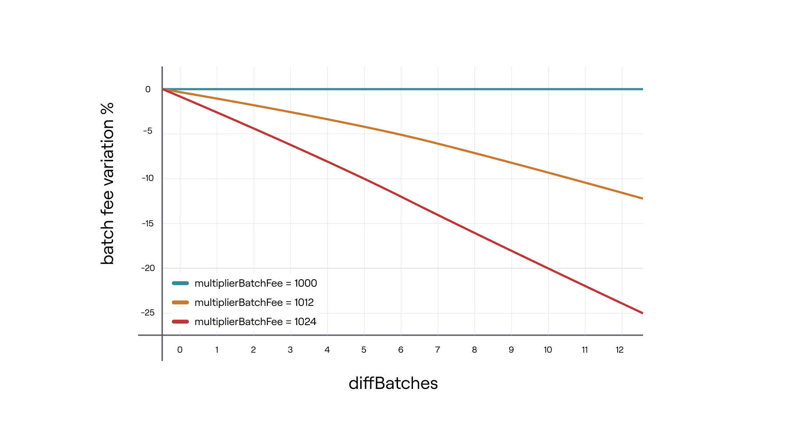

In order to ensure the system's sustainability, actors must be compensated for correctly performing their roles and giving the protocol finality.

Unless otherwise specified, the measures and rules presented here apply to cases in which the Sequencer and Aggregator roles are decentralised (i.e., when there are no Trusted Sequencer and no Trusted Aggregator).

## L2 transaction fees and sequencing fees

The **native currency used in L2 is `Bridged Ether`**, which originates from L1. This is the currency that is used to pay L2 transaction fees. **It can be transferred at a 1:1 exchange ratio from L1 to L2 and vice versa**.

The Sequencer earns the transaction fees paid by L2 users for submitting transactions, and thus gets paid directly in `Bridged Ether`. The amount of fees paid depends on the gas price, which is set by users based on how much they are willing to pay for the execution of their transactions.

To incentivize the Aggregator for each batch sequenced, the Sequencer must lock a number of MATIC tokens in the L1 `PolygonZkEVM.sol` Contract proportional to the number of batches in the sequence. The number of MATIC tokens locked per batch sequenced is saved in the variable `batchFee`.

The below diagram depicts the various fees and rewards earned by the protocol's actors.



To maximize its income, **the Sequencer prioritizes transactions with higher gas prices**. Furthermore, there is a threshold below which it is unprofitable for the Sequencer to execute transactions because the fees earned from L2 users are less than the fees paid for sequencing fees (plus L1 sequencing transaction fee).

Users must ensure that their transaction fees are greater than this **threshold** in order for the Sequencer to be incentivized to process their transactions.

The net Ether value earned by the Sequencer for sequencing a batch sequence is represented by the following expression:

$$
\textit{`` }\mathtt{Sequencer\ net\ Ether\ income}\text{'' } \mathtt{ =\ totalL2TxGasFee − (L1SeqTxGasFees + \frac{batchFee ∗ nBatches}{MATIC/ETH})}
$$

where:

- `totalL2TxGasFees` is the total sum of fees gathered from all L2 transactions included in the sequence of batches,
- `L1SeqTxGasFee` is the Sequencing transaction gas fee paid in L1,
- `batchFee` is the storage variable in **PolygonZkEVM.sol** contract,
- `nBatches` is the number of batches in the sequence,
- `MATIC/ETH` is the price of MATIC token expressed in ETH.

## Aggregation reward

The Aggregator also needs compensation for correctly fulfilling its role.

The **number of MATIC tokens earned** by the Aggregator each time it aggregates a sequence, denoted by `batchReward`, is determined by the **total contract MATIC balance** and the **number of batches aggregated**.

The MATIC earned per batch aggregated is calculated by the L1 `PolygonZkEVM.sol` contract prior to sequence aggregation using the following expression:

$$
    \mathtt{batchReward} =  { \dfrac{ \textit{``}contract\ MATIC\ balance\textit{''}}{\textit{``}Quantity\ of\ batches\ not\ aggregated\ yet \textit{''}}}
$$

The following expression represents **the total amount of ETH value that the Aggregator will earn for the aggregation of a sequence of batches**:

$$
\mathtt{\textit{`` }Aggregator net Ether income\textit{''}= \frac{batchReward ∗ nBatches}{MATIC/ETH} − L1AggTxGasFee}
$$

where:

- `L1AggTxGasFee` is the Aggregation transaction gas fee paid in L1,
- `batchReward` is the quantity of MATIC earned per batch aggregated,
- `nBatches` is the number of batches in the sequence,
- `MATIC/ETH` is the price of MATIC token expressed in ETH.

## Variable batchFee re-adjustments

The `batchFee` is automatically adjusted with every aggregation of a sequence by an independent Aggregator.

This happens when the Trusted Aggregator isn't working properly and the `batchFee` variable needs to be changed to encourage aggregation. Further information on the Trusted Aggregator's inactivity or malfunctioning is provided in upcoming sections.

An internal method called `_updateBatchFee`, is used to adjust `batchFee` storage variable.

```pil
function _updateBatchFee(uint64 newLastVerifiedBatch) internal
```

The admin defines two storage variables that are used to **tune the fee adjustment function**:

- `veryBatchTimeTarget`: it is **the targeted time of the verification of a batch**, so the `batchFee` variable will be updated to achieve this target, and
- `multiplierBatchFee`: it is the batch fee multiplier, with 3 decimals that **ranges from 1000 to 1024**.

The function `_updateBatchFee` first determines how many of the aggregated batches are late. That is, those who are in the sequence but have not yet been aggregated.

Second, how much time has passed, as indicated by `veryBatchTimeTarget`.

The `diffBatches` variable represents the difference between late batches and those below the target, and its value is limited by a constant called `MAX BATCH MULTIPLIER`, which is set to 12.

### Case 1

If there are more late batches than early batches in the sequence being aggregated, the following formula will be applied to the `batchFee` storage variable:

$$
\textit{`` }\mathtt{
new\ batch\ fee}\textit{” } \ \mathtt{ =\ } \textit{`` } \mathtt{ old\ batch\ fee \textit{” } \cdot \big( \frac{multiplierBatchFee^{diffBatches}}{10^{3\ diff Batches}} \big) }
$$

The graph below shows the percentage variation of the 'batchFee' variable depending on the 'diffBatches' value for different values of'multiplierBatchFee' when late batches dominate the sequence.

It should be noted that the goal is to increase the aggregation reward in order to incentivize aggregators.



### Case 2

If the early batches outnumber the late ones, the following formula is applied to the storage variable 'batchFee':

$$
\mathtt{ "new\ batch\ fee" = "old\ batch\ fee" \cdot \big( \frac{10^{3\ diffBatches}}{multiplierBatchFee^{diffBatches}} \big) }
$$

The graph below shows the percentage variation of the `batchFee` variable depending on the `diffBatches` value for different values of `multiplierBatchFee` when batches below the time target dominate the sequence. It should be noted that the goal is to **reduce the aggregation reward**.



To summarize, the admin can tune the reaction of `batchFee` variable re-adjustments by adjusting `veryBatchTimeTarget` and `multiplierBatchFee`. The values set during the contract's initialization are listed below:

- `batchFee` = 1018 (1 MATIC).
- `veryBatchTimeTarget` = 30 minutes.
- `multiplierBatchFee` = 1002.
