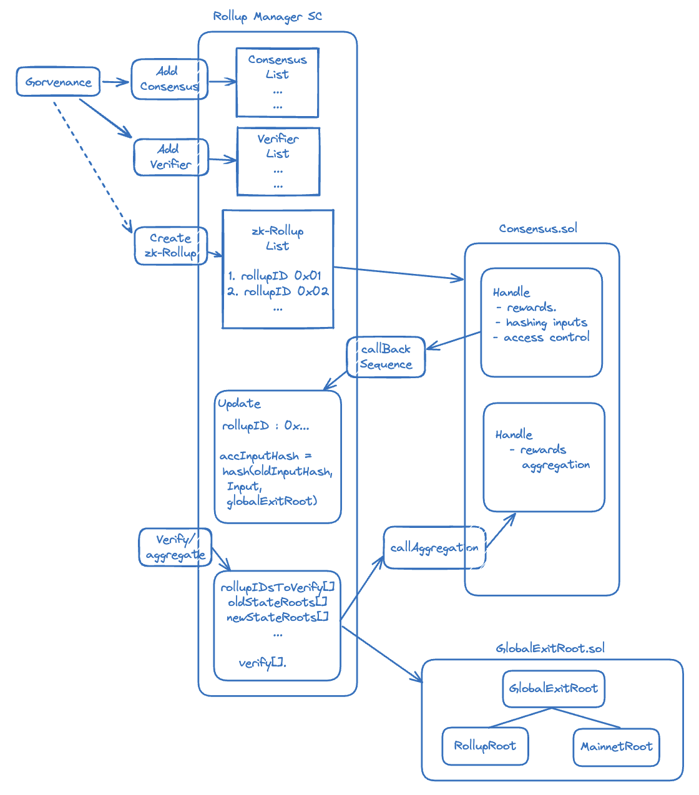

## Introduction (in-development)

The LXLY Bridge is an interoperability solution aimed at enabling cross-chain communication among Polygon chains. It will enable communication between two L2 chains or between an L2 chain and Ethereum as the L1.

The LXLY Bridge SC (or [PolygonZkEVMBridgeV2](https://github.com/0xPolygonHermez/zkevm-contracts/blob/feature/v2ForkID5/contracts/v2/PolygonZkEVMBridgeV2.sol)) is an improved and a more robust version of the [zkEVM Bridge](https://github.com/0xPolygonHermez/zkevm-contracts/blob/feature/v2ForkID5/contracts/PolygonZkEVMBridge.sol) deployed in the Polygon zkEVM mainnet_beta version_.

Its modular design capacitates projects to deploy their own rollups and connect them to the Polygon ecosystem.

## Ideal attributes

The LXLY Bridge is deployed in the Polygon ecosystem so as to attain the following features and functionalities;

- **Accessibility**: Projects can request creation of a rollup and connect it to the Polygon ecosystem.
- **Unified Liquidity**: All rollups can connect through the same bridge, enabling L2 to L2 bridges.
- **Polygon CDK**: All the rollups can use the same stack.
- **Rollup-Project Oriented**: Every project can have its own rollup.
- **Cross-Rollup Communication**: All the rollups can communicate using the LxLy bridge.
- **Rollup Upgradability**: All the deployed rollups should be upgradeable in accordance with its own governance mechanism.

These functionalities are accomplished by modifying a few key components in the architecture of the zkEVM Bridge Version-1.

## zkEVM Bridge Version-1

Here is a brief review of the zkEVM Bridge's architecture.

Version-1 consists mainly of three (3) smart contracts;

- the Bridge contract ([PolygonZkEVMBridge.sol](https://github.com/0xPolygonHermez/zkevm-contracts/blob/feature/v2ForkID5/contracts/PolygonZkEVMBridge.sol)), which handles transfer of assets and messages between networks.
- the Global Exit Root manager contract ([PolygonZkEVMGlobalExitRoot.sol](https://github.com/0xPolygonHermez/zkevm-contracts/blob/feature/v2ForkID5/contracts/PolygonZkEVMGlobalExitRoot.sol)), which facillitates synchronization of state-info between the L2 and the L1.
- the Polygon zkEVM Consensus contract ([PolygonZkEVM.sol](https://github.com/0xPolygonHermez/zkevm-contracts/blob/feature/v2ForkID5/contracts/PolygonZkEVM.sol)), which handles the sequencing and verification of transactions in the form of batches.

Interaction of these three contracts has been detailed [here](zkevm-bridge/flow-of-assets.md).

### Global exit trees Review

Critical to the design of the LXLY Bridge are Exit Trees and the Global Exit Tree.

Each chain has a Merkle Tree called an _Exit Tree_, to which a leaf containing data of each asset-transfer is appended. Since such a leaf records data of the asset exiting the chain, it is called an _Exit Leaf_.

Another Merkle Tree whose leaves are roots of the various Exit Trees is formed, and it is called the _Global Exit Tree_.

The root of the Global Exit Tree is the single source of state-truth communicated between rollups.

It is the Global Exit Root Manager contract's responsibility to update the Global Exit Tree Root and acts as a custodian for the Global Exit Tree's history.

A complete transfer of assets in Version-1 involves three smart contracts; the PolygonZkEVM.sol, the PolygonZkEVMBridge.sol and the PolygonZkEVMGlobalExitRoot.sol.

The below figure depicts a _bridge_ of assets and a _claim_ of assets;


Observe, in the above figure, that the Consensus Contract (PolygonZkEVM.sol) is able to;

- Retrieve the Global Exit Root from the mainnet, and make it available in L2, and
- Update the Exit Tree Root in the Global Exit Tree Root manager.

## LXLY bridge version-2 design

Multiple zk-rollups such as zkEVMs, zk-Validiums or zk-VMs, can be created and connected through the same LXLY Bridge.

Thanks to the introduction of an additional smart contract called the [_Rollup Manager_ SC](https://github.com/0xPolygonHermez/zkevm-contracts/blob/feature/v2ForkID5/contracts/v2/PolygonRollupManager.sol).

Although the logic for _bridging_ or _claiming_ assets from one network to another remains the same, individual L2 Consensus SC no longer handle verification of their own network's sequenced batches.

In the LXLY Bridge context, the _Rollup Manager_ SC verifies sequenced batches from various networks.

In addition to verification of sequenced batches, the _Rollup Manager_ SC also creates consensus contracts for networks connecting via the LXLY Bridge.

### What remains unchanged from version-1?

The strategy to separate the _Bridge logic_ from the _Global Exit Root logic_ remains intact. This is key to achieving interoperability.

Consensus contracts of each connected network handle the sequencing of their own batches, but send the Batch Data to the _Rollup Manager_ SC for verification.

The _Rollup Manager_ SC stores the information of the sequenced batches in the form of a so-called _Accumulated Input Hash_, as in the Version-1 of the zkEVM Bridge.

Once sequenced batches have been verified, the _Global Exit Tree_ gets updated, in an approach similar to the zkEVM Bridge Version-1.


### Rollup manager's role

The Rollup Manager manages the following lists of availability;

- Rollup consensus mechanisms. The list may consists of Consensus contracts such as PolygonZkEVM.sol or zkValidium.sol.
- Verifier contracts. For example, the PolygonZkEVM.sol uses the _Verifier.sol_ SC for verification of batches.

Governance SC oversees Consensus mechanisms and Verifiers that can be added to the respective lists.

The [Rollup Manager SC](https://github.com/0xPolygonHermez/zkevm-contracts/blob/feature/v2ForkID5/contracts/v2/PolygonRollupManager.sol) has the relevant function for adding a new rollup;

```bash
 function addNewRollupType(
        address consensusImplementation,
        IVerifierRollup verifier,
        uint64 forkID,
        bytes32 genesis,
        uint8 rollupCompatibilityID,
        string memory description
    ) ...
```

- In order for a rollup to be created and connected to the LXLY Bridge,

  - The developer selects the Consensus and Verifier for the required rollup amongst those available in the Rollup Manager's lists,
  - Requests creation of a rollup with the selected specifications,
  - Governance SC invokes the Rollup Manager's `AddNewRollupType()` function,
  - Once, a rollup is created, the transfer of assets can be processed in the usual manner.

### Overall flow of events

The below diagram captures the following flow of events, most of which are handled by the Rollup Manager SC;

- Updating Rollup Manager's lists,
- Creating rollups,
- Sequencing of batches,
- Aggregation or proving of batches,
- Verification of batches,
- Updating the Global Exit Root.



## Conclusion

Although the LXLY Bridge is still a work in progress, it is designed to be Polygon's talisman for accomplishing multi-chain interoperability.

The LXLY Bridge currently works with the Polygon zkEVM as the L2 and the Ethereum network as L1.

The next step is to enable developers wishing to create a zk-rollup to choose between a zkEVM and a zkValidium rollup.

The idea of handling verification of several networks in a single contract, is a pre-cursor to the ultimate and envisaged _interop layer_ for the Polygon ecosystem.

The Code for the LXLY Bridge Version-2 can be found [here](https://github.com/0xPolygonHermez/zkevm-contracts/tree/feature/v2ForkID5/contracts/v2).
