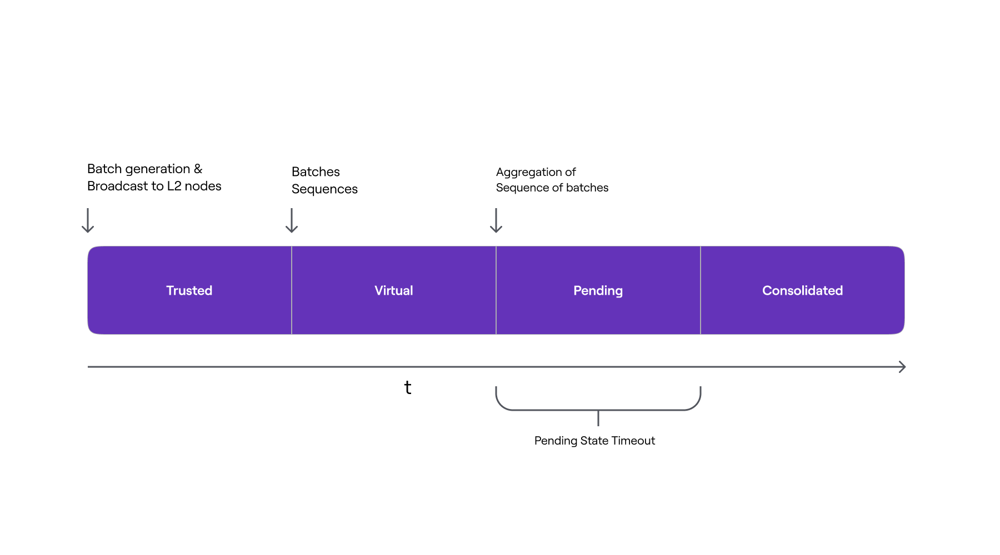

In the same way that the system cannot reach L2 State finality without an active and well-functioning Sequencer, there can be no finality without an active and well-functioning Aggregator.

The absence or failure of the Trusted Aggregator means that the L2 State transitions are never updated in L1. For this reason, L1 `PolygonZkEVM.sol` contract has a function named `verifyBatches` that allows anyone to aggregate sequences of batches.

```pil
function verifyBatches(
    uint64 pendingStateNum,
    uint64 initNumBatch,
    uint64 finalNewBatch,
    bytes32 newLocalExitRoot,
    bytes32 newStateRoot,
    uint256 [2] calldata proofA,
    uint256 [2] [2] calldata proofB,
    uint256 [2] calldata proofC,
) public ifNotEmergencyState
```

As previously stated, the `verifyBatches` function accepts the same arguments as the `trustedVerifyBatches` function. However, the `verifyBatches` function adds two additional constraints for a sequence to be aggregated, as well as a new L2 State stage called Pending State.

Along with the conditions required in the `trustedVerifyBatches` function, the following conditions must also be met in `verifyBatches`:

- The contract must not be in an emergency state
- A `trustedAggregatorTimeout` storage variable delay from the timestamp of the last batch in the sequence (when the batch was sequenced) must have been passed. The contract administrator configures the `trustedAggregatorTimeout` variable.

The function verifies the Zero-Knowledge proof of computational integrity if all of the conditions are met. However, unlike the `trustedVerifyBatches` function case, if verification is successful, the sequence is not aggregated immediately. Rather, the verified sequence is added to the `pendingStateTransitions` mapping, where it will be aggregated after a time delay determined by the `pendingStateTimeout`.

```
// pendingStateNumber --> PendingState

mapping(uint256 => PendingState) public pendingStateTransitions;
```

The struct used looks like this:

```
struct PendingState {
  uint64 timestamp;
  uint64 lastVerifiedBatch;
  bytes32 exitRoot;
  bytes32 stateRoot;
}
```

Verified batch sequences remain in an intermediate state known as Pending state, where their state transition has not yet been consolidated. While in this state, neither the new L2 State root nor the bridge's new `GlobalExitRoot` have been added to the `batchNumToStateRoot` mapping.

The `lastPendingState` storage variable is used to keep track of the number of pending state transitions that need to be consolidated and serves as the mapping's key of entry. The Aggregator will receive the aggregation reward once the Zero-Knowledge proof has been verified.

The below figure shows the L2 Stages timeline from a batch perspective, and the actions that triggers its inclusion in the next L2 State stage, when a batch sequence is Aggregated through the `verifyBatches` function.



The presence of batch sequences in pending state has no effect on the correct and proper functioning of the protocol. Non-forced batch sequences are verified before pending ones, and not all sequences enter the pending state.

The storage variable `lastVerifiedBatch` keeps track of the index of the most recently verified and aggregated batch. As a result, even if a batch sequence is pretentiously verified, the index of the last verified batch will be queried via a function called `getLastVerifiedBatch`.

If there are any pending state transitions, this function returns the index of the last batch in that state; otherwise, it returns the `lastVerifiedBatch`.

```
function getLastVerifiedBatch() public view returns (uint64)
```

When the `sequenceBatches` function is called, an attempt is made to consolidate the pending state by calling the internal function `_tryConsolidatePendingState`. If the `pendingStateTimeout` has elapsed since the pending batches verification, this function will consolidate the pending state transitions. There is no need to check the Zero-Knowledge proof again because it has already been verified.

This mechanism is designed to help in the detection of any soundness vulnerabilities that could otherwise be exploited in the Zero-Knowledge proof verification system, thereby protecting assets from being bridged out to the L2 by malicious actors.
