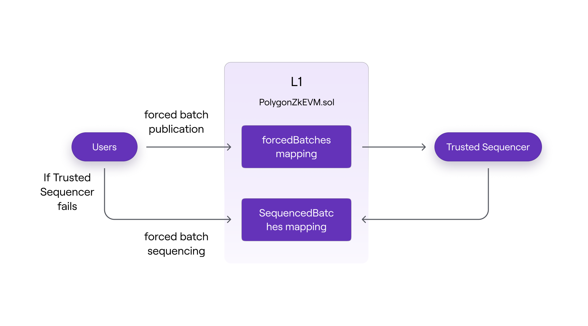
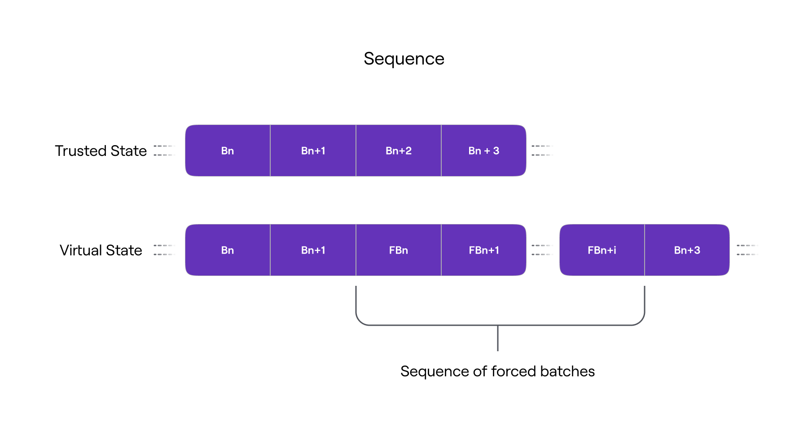

Users must rely on a Trusted Sequencer for their transactions to be executed in the L2. However, users can include their transactions in a forced batch if they are unable to execute them through the Trusted Sequencer.

A forced batch is a collection of L2 transactions that users can commit to L1 to publicly declare their intent to execute those transactions.



The `PolygonZkEVM.sol` contract has a `forcedBatches` mapping, as shown in the above figure, in which users can submit transaction batches to be forced. The `forcedBatches` mapping serves as an immutable notice board where forced batches are timestamped and published before being included in a sequence.

```
// ForceBatchNum --> hashedForcedBatchData

mapping(uint64 => bytes32) public forcedBatches;
```

!!!caution
    The Trusted Sequencer will include these forced batches in future sequences to maintain its status as a trusted entity. Otherwise, users will be able to demonstrate that they are being censored, and the Trusted Sequencer's trusted status will be revoked.

Although the Trusted Sequencer is incentivized to sequence the forced batches published in the `forcedBatches` mapping, this does not guarantee finality of the transactions' execution in those batches.

In order to ensure finality in the case of Trusted Sequencer's malfunction, the L1 `PolygonZkEVM.sol` contract has an alternative batch sequencing function called `sequenceForceBatches`. This function allows anyone to sequence forced batches that have been published in the `multiplierBatchFee` mapping for a time period, specified by the public constant `FORCE_BATCH_TIMEOUT`, yet they have not been sequenced. The timeout is set to 5 days.

Any user can publish a batch to be forced by directly calling `forceBatch` function:

```
function forceBatch(
 bytes memory transactions ,
 uint256 maticAmount
) public ifNotEmergencyState isForceBatchAllowed
```

​where,

- `transactions` is the byte array containing the concatenated batch transactions (same as the normal batch transactions format)
- `maticAmount` is the maximum amount of MATIC tokens the user is willing to pay as a forced batch publication fee. The fee for publishing a forced batch is the same as the fee for sequencing, and it is therefore set in the `batchFee` storage variable. Since the fee is paid when a forced batch is published, it will not be paid again when the batch is sequenced.

In order to successfully publish forced batch to the `forcedBatches` mapping, the following conditions must be met, otherwise the transaction will revert;

- The contract must not be in emergency state,
- The force batches must be allowed,
- The `maticAmount` argument must be higher than the MATIC fee per batch,
- The length of the transactions byte array must be less than the value of `MAX_TRANSACTIONS_BYTE_LENGTH` constant (which is set at 300000).

The forced batch is entered in `forcedBatches` mapping keyed by its force batch index.

```
struct ForcedBatchData {
    bytes transactions;
    bytes32 globalExitRoot;
    uint64 minForcedTimestamp;
}
```

The `lastForceBatch` storage variable, which is incremented for each forced batch published, serves as a forced batch counter and thus provides a specific index number. The value entered is a hash digest of the ABI-encoded packed struct fields from the `lastForceBatch`.

```
keccak256(
 abi.encodePacked(
  keccak256(bytes transactions),
  bytes32 globalExitRoot,
  unint64 minTimestamp
 )
);
```

Storage slots (mapping entries) are only used to store a commitment of the forced batch for storage usage optimization reasons. Data availability is ensured because it can be recovered from transaction calldata.

The contract sets the `minTimestamp` to the L1 block timestamp, at which point the forced batch is published.

In the extremely unlikely event that the Trusted Sequencer fails, any user can use the `sequenceForceBatches` function to sequence forced batches:

```
function sequenceForceBatches(
 ForcedBatchData[] memory batches
) public ifNotEmergencyState isForceBatchAllowed
```

The `sequenceForceBatches` function is similar to the `sequenceBatches` function, but it can be called by anyone if batch forcing is enabled.

The `sequenceForceBatches` function determines whether each batch in the submitted sequence has been published to the `forcedBatches` mapping for a period of time greater than the `FORCE BATCH TIMEOUT`.

Because the MATIC batch fee was paid at the time of publication, it will not be required to be paid again.

If the sequence of forced batches meets all of the sequence conditions, it will be added to the `sequencedBatches` mapping as a regular one. As a result, a `sequenceForceBatches` event will be generated.

```
event SequenceForceBatches(uint64 indexed numBatch);
```

Note that since the sequences of forced batches sequenced using the `sequenceForceBatches` function will never be in a trusted state, there will be a divergence between the node’s local trusted L2 State and the virtual L2 State committed in the L1 PolygonZkEVM.sol contract.

This situation has been detected and handled by the node software. It will reorganise its local L2 State instance based on the L2 State retrieved from L1. The diagram below depicts the distinctions between trusted and virtual L2 states that occur when a forced batch sequence is executed.


