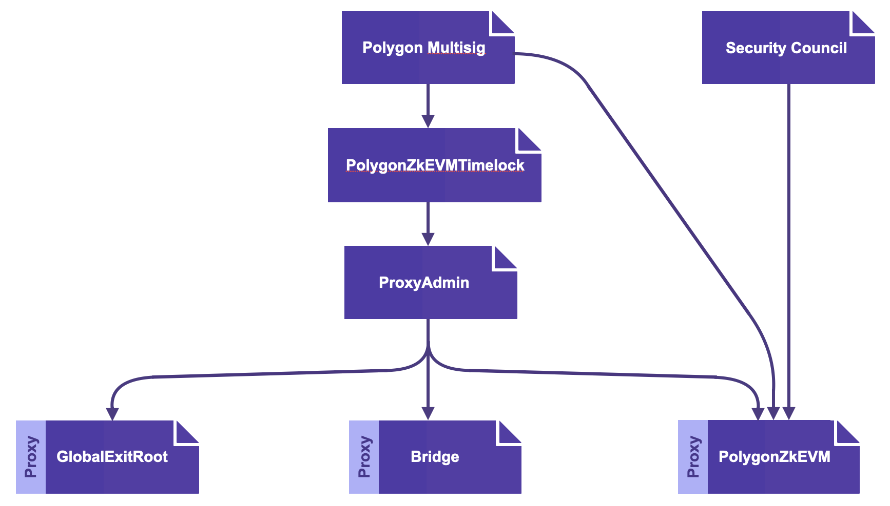

In addition to the previously mentioned governance issues and security measures, one more component was essential, especially to a young L2 system such as the Polygon zkEVM. That component is, the _Security Council Multisig_.

Since critical bugs or other security issues may occur, and hence warrant instant upgrades, it is good security practice to allow for emergency upgrades.

That is, instead of employing the 2-out-of-3 _Admin Multisig Contract_ and waiting for the time-delay imposed by the _Timelock Contract_, these contracts get bypassed by deploying a so-called _Security Council Multisig_.

It is crucial, however, to emphasise that the _Security Council Multisig_ is a temporary measure, and will ultimately be phased-out once the Polygon zkEVM has been sufficiently battle-tested.
z

## Understanding security council multisig

The _security council_ is a committee that oversees the security of the Polygon zkEVM during its initial phase.

The _security council_ of a rollup has a two-fold responsibility,

- Seeing to it that the system is timeously halted in case of the [_emergency state_](malfunction-resistance/emergency-state.md), and
- Ensuring that _emergency upgrades_ are implemented as soon as it is practically possible.

The _security council_ therefore utilises a special _multisig_ contract that overrides the usual _Admin Multisig Contract_ and the _Timelock Contract_.

### Security council composition

Security councils generally consist of a certain number of reputable community members, who are typically, individuals or representatives of public organizations who may remain anonymous.

These are individuals or organizations with vested interest in the welfare of the Ethereum ecosystem, and are normally selected from among well-known Ethereum developers and researchers.

The Polygon zkEVM's Security Council is constituted of eight (8) members, four of whom are internal to the Polygon team, while the rest of the members must be from outside Polygon.

The minimum requirement, even as mentioned in the L2Beat report downloadable [here](https://l2beat.com/multisig-report), is for these individuals to be adequately _knowledgeable and competent enough to make the best judgment about the actions approved by the multisig_.

These members are not completely anonymous as their addresses are publicly known. Their addresses can be checked in Etherscan.

Here is a list of the 8 addresses of the Polygon zkEVM's Security Council;

- [0xFe45…2e4b](https://etherscan.io/address/0xFe45baf0F18c207152A807c1b05926583CFE2e4b)
- [0xaF46…261D](https://etherscan.io/address/0xaF46a0ddf80DFFB49C87656625E65A37499B261D#code)
- [0xBDc2…FEFf](https://etherscan.io/address/0xBDc235cC9d6Baa641c5ae306bc83962475A5FEFf#code)
- [0x4c16…8891](https://etherscan.io/address/0x4c1665d6651ecEfa59B9B3041951608468b18891#code)
- [0x3ab9…D622](https://etherscan.io/address/0x3ab9f4b964eE665F7CDf1d65f1cEEc6196B0D622#code)
- [0x49c1…0E86](https://etherscan.io/address/0x49c15936864690bCd6af0ecaca8E874adFF30E86#code)
- [0x9F7d…86A0](https://etherscan.io/address/0x9F7dfAb2222A473284205cdDF08a677726d786A0#code)
- [0x2188…1C28](https://etherscan.io/address/0x21887c89368bf918346c62460e0c339113801C28#code)

### Security council multisig?

The Security Council Multisig is a _multisig contract_ deployed by the Polygon zkEVM Security Council when either an _emergency state_ is triggered or an _emergency upgrade_ needs to be executed.

The _multisig contract_ is a _6-out-of-8_ multisig, which requires six (6) signatures of the Security Council to be attached for the contract to be successfully deployed.

There is a further stipulation that a minimum of 2 out of the 6 attached signatures must be from among the 4 members who are external to Polygon.

## Conclusion

Although the ultimate goal is to move towards a totally decentralized Polygon zkEVM, employing a security council multisig is inevitable for the early stages of the zkRollup.

It is a trade-off between security and decentralization. So then, for the sake of long-term security, it is a deliberate decision to have more centralized early stages of development, in order to attain more decentralized later stages.

Although there is always a possibility for the members of Security Council to go rogue and collude, the 75% threshold together with the minimum 33% of external members’ signatures significantly reduces the risk.
