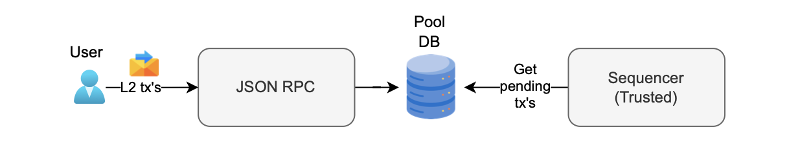
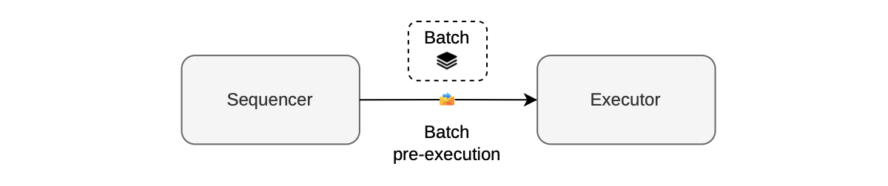
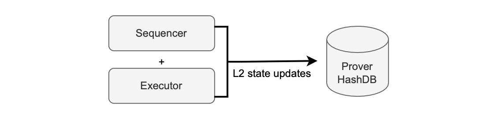
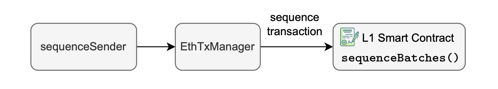
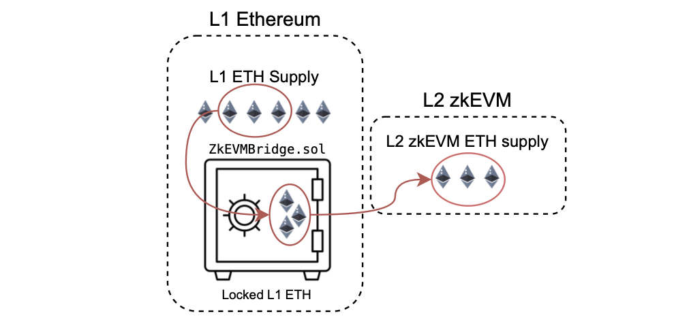
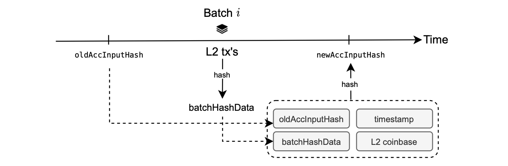

The central entity responsible for assembling batches for sequencing is the trusted sequencer, which is built and managed by Polygon.

This sequencer may omit Layer 2 transactions therefore we have implemented [anti-censorship mechanism](https://docs.polygon.technology/zkEVM/architecture/protocol/malfunction-resistance/sequencer-resistance/).

The diagram below shows the sequencing workflow.

1. L2 transactions via JSON RPC.
2. Transactions stored in the pool DB.
3. Trusted sequencer selects transactions from pool DB.
4. Trusted sequencer batches and sequences transactions.

## Batch pre-execution

The initial step in creating a batch involves verifying whether the chosen transactions align with execution parameters and do not surpass the gas limit. This step is known as _batch pre-execution_.

It is carried out by the sequencer through an executor, as depicted in the figure below.

While no proof is generated during the pre-execution stage, batch pre-execution ensures that the prover's subsequent proof generation is successful, and expedites batch sequencing overall.

A fast executor is used for batch pre-execution. This is a _single-computation_ executor, capable of executing within blocktime.

The sequencer communicates with the executor for swift batch pre-execution.

Once the executor successfully completes batch pre-execution, the sequencer records the batch in the node’s StateDB as a _closed batch_.

A closed batch means one of the following conditions has been fulfilled:

- The execution trace reaches the maximum number of rows. 
- The gas used attains maximum gas limit. 
- The allocated time expires.

During batch pre-execution, and for batch closure, the sequencer and the executor update the Merkle tree of the zkEVM with L2 state changes and store them in the prover's hash DB. This is illustrated in the figure below:

The zkEVM's throughput depends on the speed at which we are able to close batches, which is directly impacted by the batch pre-execution process.

Performance problems can occur here because of excessive and inefficient interaction with the hash DB.

Optimizing this process may mean reducing the time spent on frequent updates during transaction processing by accumulating all state changes caused by a transaction and only updating the database at the end of a transaction's pre-execution.

## Sending batches to L1

The next step is to send a call to the smart contract to sequence batches.

Once a batch is closed, the sequencer stores the data of the batch in the node’s state DB.

Then, the $\texttt{sequenceSender}$ looks for closed batches and sends them to the [L1 smart contract](https://github.com/0xPolygonHermez/zkevm-contracts/blob/main/contracts/PolygonZkEVM.sol) via the $\texttt{EthTxManager}$ which makes sure the transaction is included in a batch.

This process is depicted in the figure below.

In order to sequence a batch, the sequencer calls the $\texttt{sequenceBatches()}$ function in the L1 smart contract which can sequence one or multiple batches at once.

The calldata for the L1 $\texttt{sequenceBatches()}$​ function needs to include the following information:

- The L2 transactions data, which is an array containing data for each batch. It includes all transactions within the batch along with a timestamp indicating its closure time. 
- Additionally, the L2 coinbase address, representing the Ethereum address for receiving user fees.
- Lastly, a timestamp indicating when the L2 transactions were sequenced.

The L2 coinbase address serves as a critical destination for rewards earned by the sequencer in the Layer 2 environment.

The sequencer is responsible for paying for data availability in layer 1 using L1 Ether.

The sequencer receives a reward for successfully closing a batch and executing transactions. This reward, denominated in L2 Ether, is routed to the L2 coinbase address.

The L2 coinbase address is situated within layer 2 because users compensate the sequencer with L2 Ether. 

This L2 Ether, representing the reward, is a mapping of the Ether in L1 that users have previously transferred to L2 through transactions via the bridge.

There is a direct and fixed one-to-one correspondence between L1 ETH and L2 ETH, as we can observe in the figure below.

## Accumulated input hash pointers

When the smart contract receives a transaction for sequencing into batches, it creates a cryptographic pointer for each batch.

These pointers identify a batch and specify its position.

Subsequently, provers utilize these pointers as references during the proving process, allowing them to precisely identify the batch being proved and retrieve its associated data.

The use of cryptographic pointers ensures a robust and unambiguous link between the sequencing operation and the corresponding batch data for subsequent verification.

The pointers are constructed with previous hashes and information from the batches.

The procedural steps for this process are illustrated in the figure below:

Pointers are generated by executing the KECCAK hash function on:

- The preceding pointer.
- The transactions encompassed within the L2 batch.
- The batch timestamp. 
- The L2 coinbase.

A pointer is referred to as an *accumulated input hash* or $\texttt{accInputHash}$.

Such a construction, where previous pointers are linked to the current pointer, guarantees that batch data is proved in the correct and sequential order.

When the sequencing process completes, the batch enters a _virtual state_.
