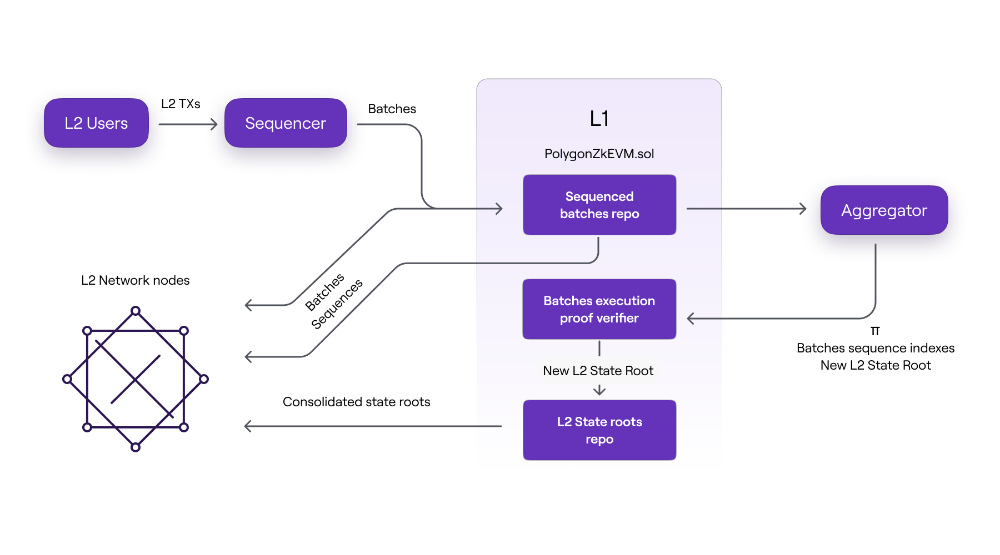
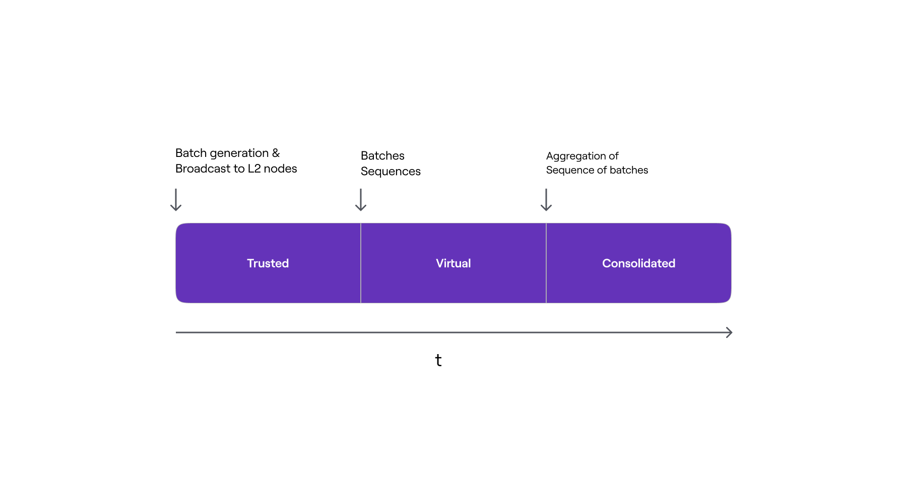

This document aims to explain how the Polygon zkEVM protocol manages the L2 rollup's states while providing state transition verifiability and security.

## Trustless L2 state management

The trusted sequencer generates batches, but in order to achieve fast finality of L2 transactions and avoid the need to wait for the next L1 block, they are shared with L2 network nodes via a broadcasting channel. Each node will run the batches to compute the resulting L2 state locally.

Once the trusted sequencer has committed the sequences of batches fetched directly from L1, L2 network nodes will execute them again, and they will no longer have to trust it.

The off-chain execution of the batches will eventually be verified on-chain via a zero-knowledge proof, and the resulting L2 state root will be committed. As the zkEVM protocol progresses, new L2 state roots will be synchronized directly from L1 by L2 network nodes.

!!!info
    Both data availability and verification of transaction execution rely only on L1 security assumptions and at the final stage of the protocol, the nodes will only rely on data present in L1 to stay synchronized with each L2 state transition.

As shown in the above figure, L2 nodes can receive batch data in three different ways:

1. Directly from the trusted sequencer before the batches are committed to L1.
2. Straight from L1 after the batches have been sequenced.
3. Only after correctness of execution has been proved by the aggregator and verified by the `PolygonZkEVM.sol` contract.

It is worth noting that the three batch data formats are received by L2 nodes in the chronological order listed above.

## Three L2 states

There are three stages of the L2 state, each corresponding to the three different ways in which L2 nodes can update their state. All three cases depend on the format of batch data used to update the L2 state.

In the first instance, the update is informed solely by the information (i.e., Batches consisting of ordered transactions) coming directly from the trusted sequencer, before any data availability on L1. The resulting L2 state is called the trusted state.

In the second case, the update is based on information retrieved from the L1 network by L2 nodes. That is, after the batches have been sequenced and data has been made available on L1. The L2 state is referred to as the virtual state at this point.

The information used to update the L2 state in the last case includes verified zero-knowledge proofs of computational integrity. That is, after the zero-knowledge proof has been successfully verified in L1, L2 nodes synchronize their local L2 state root with the one committed in L1 by the trusted aggregator. As a result, such an L2 state is known as the consolidated state.

The figure below depicts the timeline of L2 State stages from a batch perspective, as well as the actions that trigger progression from one stage to the next.

